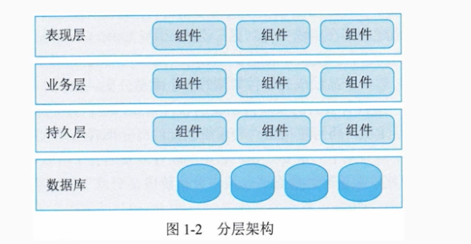
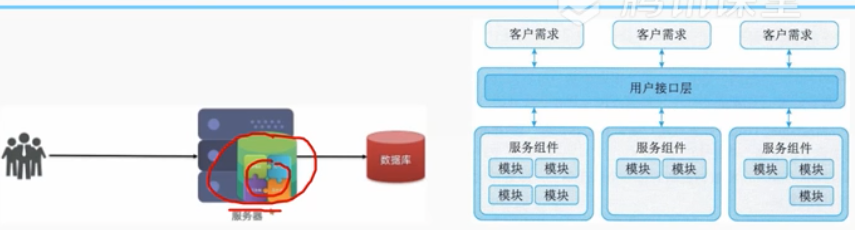
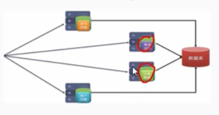
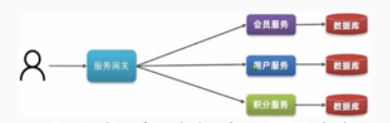

# 1 系统架构
系统架构是一种整体的高层次的结构表示。是系统的骨架和根基，支撑和链接各个部分，包括组件、连接件、余数规范以及指导这些内容设计与演化的原理，是刻画系统整体抽象结构的一种手段。架构设计决定了系统的健壮性和生命周期的长短.

## 1 架构设计作用包括：

   - 解决相对复杂的需求分析问题
   - 解决非功能属性在系统占据重要位置的设计问题
   - 解决生命周期长、扩展性需求高的系统整体结构问题
   - 解决系统基于组件需要的集成问题
   - 解决业务流程再造难的问题

架构设计师成熟系统开发过程中的一个重要环节，它不仅是连接用户需求和系统进一步设计与实现的桥梁，也是系统早起阶段质量保证的关键步骤。
## 2 发展历程
基础研究阶段 68-94
概念体系和核心技术形成阶段 
理论体系完善和发展阶段 96至今
普及应用阶段 2000至今

# 二、软件架构的常用分类及建模方法
## 1 软件架构的常用分类
### 1.1 分层架构
 将软件分成若干个水平层，层与层通过接口通信

### 1.2 时间驱动架构
事件驱动架构是通过时间进行软件通信的软件架构，分布式异步架构模式，松散耦合。
事件队列：接受事件的入口
分发器:将不同的时间分发到不同的业务逻辑单元
事件通道：分发器
### 1.3 微核架构
又称为插件架构，面相功能进行拆分的可扩展性架构，软件功能相对较小，主要功能和业务逻辑通过插件实现。

- 核心系统：负责和具体业务无关的通用功能，例如模块加载、通信等。
- 插件模块：负责实现具体的业务逻辑，插件是相互独立的（例如手机上的sim卡），避免相互依赖。
### 1.4 微服务架构

- 单体架构

将所有功能集中在一个项目，达成一个包部署

- 分布式架构

业务个功能相对系统进行拆分，每个业务模块独立于项目开发，成为一个服务

- 微服务架构

每个服务就是一个独立的部署单元，这些单元都是分布式相互解耦的，通过远程通信协议联系。

- 云架构

 	指的是构成云系统的各种技术组件的组合。通常涉及将多种技术和资源一起通过网络共享。云架构主要解决扩展性和并发问题。是最容易的扩展的架构。
处理单元：实现业务逻辑
虚拟中间件：负责通信、会话控制、数据复制、分布式处理和处理单元的部署
## 2 系统架构的常用模型：
### 2.1 结构模型
以架构的`构件``连接件`和其它概念来刻画结构。 通过结构来反映系统的重要语义内容。机构模型核心是架构描述语言。
### 2.2 框架模型
更侧重整体的结构
### 2.3 动态模型
研究系统的"大颗粒"行为的性质，描述系统的重新配置和演化。
### 2.4 过程模型
研究构建系统的步骤和过程，结构是遵循某些过程脚本的结果。
### 2.5 总结：
> 这4中模型并不是完全独立的，通过有机的结合形成一个完整的模型来刻画软件架构。

