# 13.1 层次式架构-层次是体系结构概述

## 1. 信息系统架构的定义

        层次式体系结构设计将系统组成一个层次结构，每一层为上层服务，并作为下层客户。内部的层接口只对相邻的层可见，每一层最多只影响两层，只要给相邻层提供相同的接口，允许每层用不司的方法实现，为软件重用提供了强大的支持。
        层次式架构也称N层架构模式，分成表现层(展示层)、中间层(业务层)、数据访问层(持久层) 和数据层

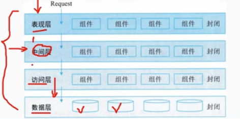

        分层架构的一个特性就是关注分离。该层中的组件只负责本层的逻辑，组件的划分很容易明确组件的角色和职责，也比较容易开发、测试、管理和维护。
        层次式体系结构是一个可靠的通用的架构，对很多应用来说，如果不确定哪种架构适合，可以用层次式架构作为一个初始架构。

        但设计时要注意以下两点
        (1)要注意污水池反模式
        污水池反模式，就是请求流简单地穿过几个层，每层里面基本没有做任何业务逻辑，或者做了很少的业务逻辑如果请求超过20%，则应该考虑让一些层变成开放的.
        (2)需要考虑的是分层架构可能会让你的应用变得庞大,即使你的表现层和中间层可以独立发布，但它的确会带来一些潜在的问题，比如:分布模式复杂、健壮性下降、可靠性和性能的不足，以及代码规模的膨胀等.

# 13.2 层次式架构-表现层框架设计

## 1. 表现成设计模式

### 1.1 MVC 模式

        MVC 强制地把一个应用的输入、处理、输出流程按照视图、控制模型的方式进行分离，形成了控制器、模型、视图三个核心模块。
        (1)视图(View): 用户看到并与之交互的界面。视图向用户显示相关的数据，并接收用户输入的数据，但是它并不进行任何实际的业务处理(挖制架)选择视图业各外理接爱用户请业

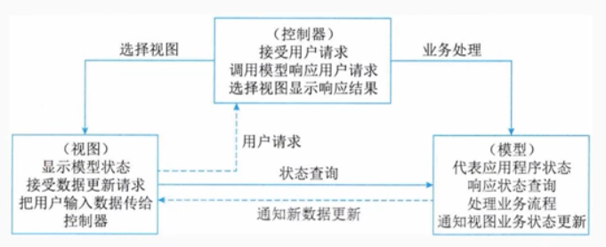

        2.控制器(Controller)

        接受用户的输入并调用模型和视图去完成用户的需求。该部分是用户界面与模型的接口。一方面它解释来自于视图的输入，将其解释成为系统能够理解的对象，同时它也识别用户动作，并将其解释为对模型特定方法的调用;另一方面，它处理来自于模型的事件和模型逻辑执行的结果，调用适当的视图为用户提供反馈。

        3.模型（Model）

        应用程序的主体部分。模型表示业务数据和业务逻辑。一个模型能为多个视图提供数据。
        由于同一个模型可以被多人视图重用所以提高了应用的可重用性.

### 1.2 MVP模式

        MVP模式中Model提供数据，View负责显示，Presenter/Controller负责逻辑的处理。
        MVP与MVC 有一些显著的区别，MVC模式中允许 View 和 Model直接进行"交流”，在Mvp 模式中是不允许的。在MV 中 View 并不直接使用 Model，它们之间的通信是通过 Presenter(MVC中的Controller)来进行的，所有的交互都发生在 Presenter 内部，而在MVC中View会直接从Model 中读取数据而不是通过 Controller。

### 1.3 MVVM模式

        MVVM模式正是为解决MVP中QI种类变多，接口也会不断增加的问题而提出的。MVVM模式全称是模型视图-视图模型(Model-View-ViewModel)，它和MVC、MVP类似，主要目的都是为了实现视图和模型的分离，不同的是 MVVM 中，View 与Model 的交互通过 ViewModel来实现。ViewModel是MVVM的核心，它通过DataBinding实现 View 与Model之间的双向绑定，其内容包括数据状态处理、数据绑定及数据转换。例如，View 中某处的状态和Model中某部分数据绑定在一起，这部分数据一旦变化将会反映到 View 层。而这个机制通过 ViewModel来实现。

        ViewModel，即视图模型，是一个专门用于数据转换的控制器它可以把对象信息转换为视图信息，将命令从视图携带到对象View和ViewModel之间使用DataBinding及其事件进行通信。View的用户接口事件仍然由 View自身处理，并把相关事性映射到ViewModel，以实现view中的对象与视图模型内容的同步，且可通过双向数据绑绑定进行更新。

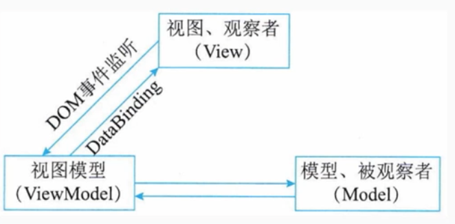

## 2. 表现层UIP设计思想

        UIP是微软社区开发的众多Application Block 中的其中之一，它是开源的。UIP 提供了一个扩展的框架，用于简化用户界面与商业逻辑代码的分离的方法，可以用它来写复杂的用户界面导航和工作流处理，并且它能够复用在不同的场景并可以随着应用的增加而进行扩展。

        UIP框架把表现层分为了以下二层
        - User Interface Components: 这个组件就是原来的表现层，用户看到的和进行交互都是这个组件，它负责获取用门的数据并目返回结果。
        - User Interface Process Components: 这个组件用于协调用户奥面的各部分，使其配合后台的活动，例如导航和工作流控制，以及状态和视图的管理

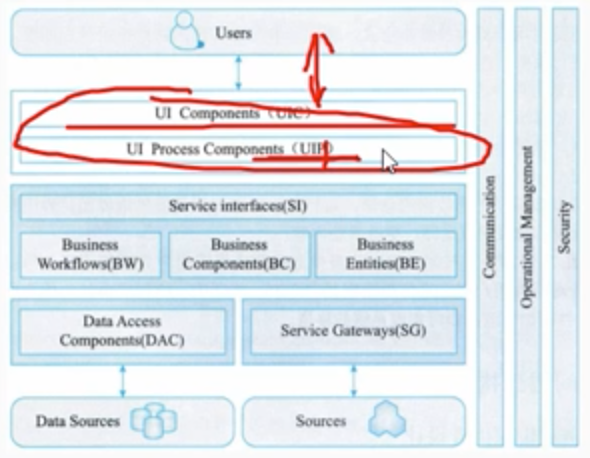

## 3. 表现层动态生成设计思想

        基于XML的界面管理技术可实现灵活的界面配置、界面动态生成和界面定制。其思路是用XML 生成配置文件及界面所需的元数据按不同需求生成界面元素及软件界面。
        基于XML 只面管理技术，包括界面配置、界面动态生成和界面定制三部分。

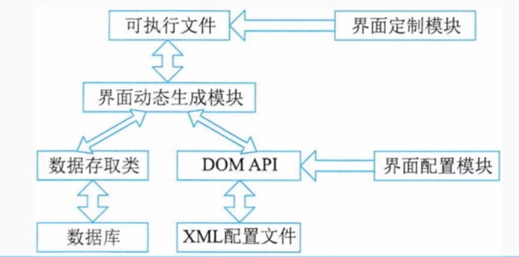

        - 界面配置是对用户界面的静态定义，通过读取配置文件的初始值对界面配置。由界面配置对软件功能进行裁剪、重组和扩充以实现特殊需求
        - 果面定制是对用户界面的动态修改过程，在软件运行过程中用户可按需求和使用习惯对界面元素(如菜单、工具栏、键盘命令) 的属性(如文字、图标、大小和位置等) 进行修改。软件运行结束，界面定制的结果被保存。

# 13.3 层次式架构-中间层框架设计

## 1. 业务逻辑层框架
        
        业务逻辑层负责定义业务逻辑 (规则、工作流、据完整性等)接收来自表示层的数据请求，逻辑判断后，向数据访问层提交请求，并传递数据访问结果，起着承上启下的作用。

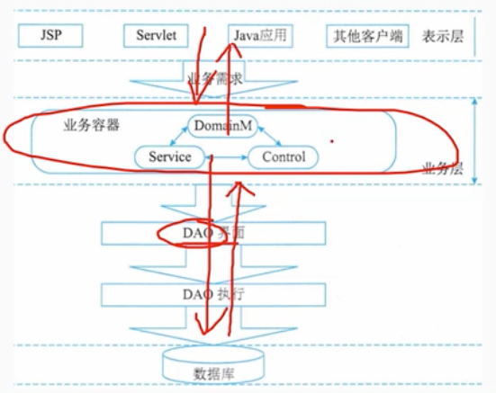

        业务逻辑的内容包括四部分：
        领域实体:定义了业务中的对象，对象有属性和行为
        业务规则:定义了需要完成一个动作，必须满足的条件数据
        完整性:某些数据不可少
        工作流:业务流程的全部或部分自动化，在此过程中，文档信息或任务按照一定的过程规则流转，实现组织成员间的协调工作以达到业务的整体目标。

# 13.4 层次式架构-数据访问层框架设计

## 1. 5中数据访问方式

### 1.1 在线访问
        
        在线访问是最基本的数据访问模式。在线访问模式会占用一个数据库连接，读取数据，每个数据库操作都会通过这个连接不断地与后台的数据源进行交互

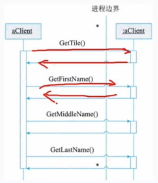

        优点
        - 可以处理复杂的 Select 语句
        - 性能比直接的 SQL要优越一些在线访问方式的
        缺点:
        - 业务对象和数据访问代码完全耦合在一起，代码混乱
        - 修改维护上相对困难
        - 开发程序员必须能看懂SQL语句

### 1.2 DataAccess Object

        DAO(数据访问对象)模式是标准J2EE 设计模式之一，开发人员常常用这种模式将底层数据访问操作与高层业务逻辑分离开业务对象应该关注的是业务逻辑，不应该关心数据存取的细节
        DAO组件只对他的客户端暴露一些非常简单的DAO外部接口，而将数据源的实现细节对客户端完全的隐藏起来

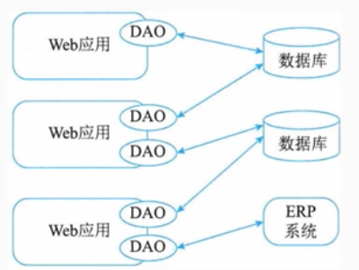

        DAO提供了访问关系型数据库所需操作的接口，将数据访问和业务逻辑分离，对上层提供面向对象的数据访问接口。优点: DAO设计模式可以减少代码量，增强程序的可移植性，提DAO设让模式高代码的可读性。

        典型的 DAO实现包括以下组件:
        - 一个DAO 工厂类
        - 一个DAO 接口
        - 一个实现了 DAO 接口的具体类
        - 数据传输对象

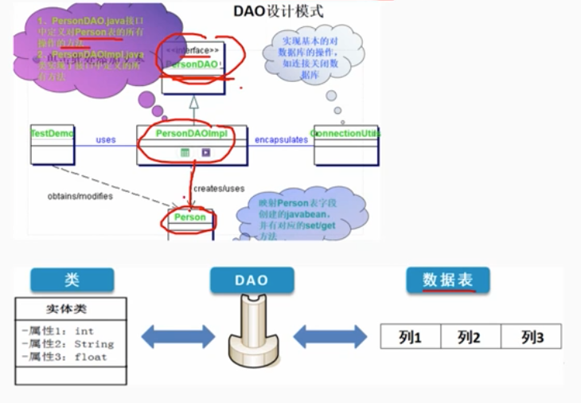

### 1.3.Data Transfer Object

        DTO(数据传输对象)是这样一组对象或是数据的容器，它需要跨不同的进程或是网络的边界来传输数据。这类对象本身应该不包含具体的业务逻辑，与业务逻辑解耦

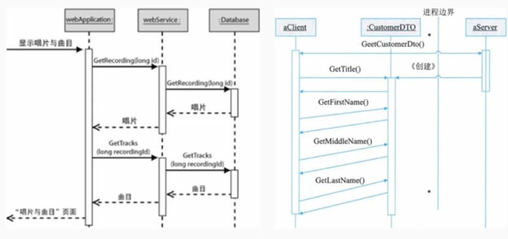

### 1.4 离线数据模式
        
        离线数据模式是以数据为中心，数据从数据源获取之后，将按照某种预定义的结构存放在系统中，成为应用的中心。
        离线，对数据的各种操作独立于各和与后合数据源之间的连接或是事务
        XML集成，数据可以方便地与XML 格式的文档之间互相转换，独立于数据源，离线数据模式的不同实现定义了数据的冬异的存放结构和规则，这些都是独立于具体的某种数据源的。

### 1.5 对象/关系映射(O/R Mapping)
        
        对象/关系映射的基本思想来源于这样一种现实: 
        多数应用的数据都是存在关系型数据库中，而这些应用程序中的数据在开发或是运行时是以对象的形式组织起来的，那么对象/关系映射就提供了这样一种工具或平台，能够将应用程序中的数据转换成关系型数据库中的记录，或是将关系数据库中的记录转换成应用程序中代码便于操作的对象。

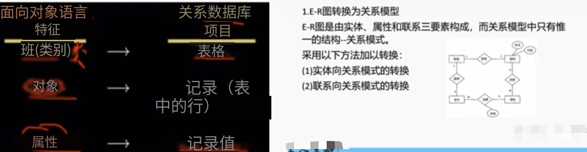

# 13.5 层次式架构-数据架构规划与设计

## 1. 数据库设计与XML

        设计融合XML文档分为两类
        - 以数据为中心的文档，这种文档在结构上是规则的，在内容上是同构的，具有较少的混合内容和嵌套层次，只关心文档中的数据而并不关心数据元素的存放顺序，这种文档简称为数据文档，常用来存储和传输 Web 数据。如XML文档包含销售数据、餐馆菜单
        - 以文档为中心的文档，这种文档的结构不规则，内容比较零散具有较多的混合内容，并且元素之间的顺序是有关的，这种文档常用来在网页上发布描述性信息、产品性能介绍和 E-mail信高级项目经理息等

        XML文档的存储方式有两种:
        (1) 基于文件的存储方式。基于文件的存储方式是指将 XML 文档按其原始文本形式存储。这种存储方式需维护某和类型的附加索引，以建立文件之间的层次结构。基于文件的存储方式的特点:
        - 无法获取 XML 文档中的结构化数据
        - 通过附加索引可以定位具有某些关键字的 XML 文档，一目关键字不确定，将很难定位:
        - 查询时只能以原始文档的形式返回，即不能获取文档内部信息
        - 文件管理存在容量大、管理难的缺点

        (2) 数据库存储方式。
        数据库在数据管理方面具有管理方便、存储占用空间小、检索速度快、修改效率高和安全性好等优点。采用数据库对 XML文档进行存取和操作，这样可以利用相对成熟的数据库技术处理XML文档内部的
        数据数据库存储方式的特点
        - 能够管理结构化和半结构化数据
        - 具有管理和控制整个文档集合本身的能力
        - 可以对文档内部的数据进行操作
        - 具有数据库技术的特性，如多用户、并发控制和一致性约束等易级项经理
        - 管理方便，易于操作。

# 13.6 层次式架构-物联网层次架构

## 1.  物联网层次架构

        - 应用层
        - 网络层
        - 感知层

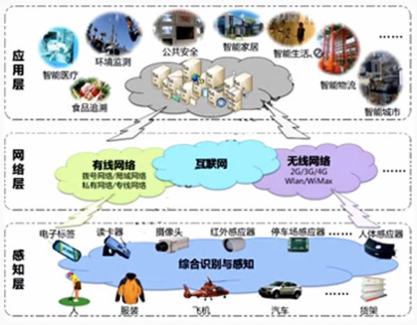

## 1.1 感知层

        感知层用于识别物体、采集信息。感知层包括二维码标签和识读器、RFID 标签和读写器、摄像头、GPS、传感器、M2M 终端、传感器网关等
        主要功能是识别对象、采集信息。
        感知层解决的是数据获取问题。
        它首先通过传感器、数码相机等设备，采集外部物理世界的数据，然后通过 RFID、条码、工业现场总线、蓝牙、红外等短距离传输技术传递数据。
        感知层的关键技术包括检测技术、短距离无线通信技术等。

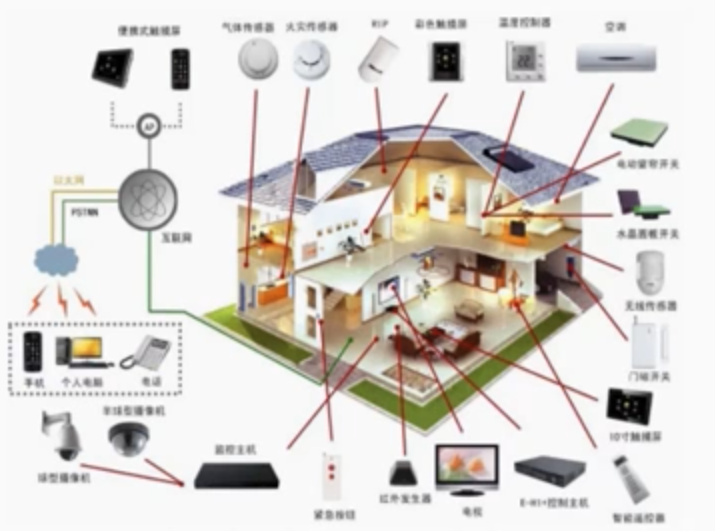

## 1.2 网络层

        网络层将感知层获取的信息进行传递和处理，数据可以通过移动通信网、互联网、企业内部网、各类专网、小型局域网进行传输物联网的
        网络层是建立在现有的移动通信网和互联网基础上的。
        网络层的关键技术包括长距离有线和无线通信技术、网终技术等

## 1.3 应用层

        应用层解决的是信息处理和人机交互问题。网络层传输来的数据在这一层进入各类信息系统进行处理并通过各种设备与人进行KDP交互。
        应用层分为两个子层:
        - 应用程序层，进行数据处理，涵盖了国民经济和社会的每一领域，包括电力、医疗银行、交通、环保、物流、工业、农业、城市管理、家居生活等，是物联网作为深度信息化的重要体现终端
        - 设备层，提供人机接口
