# 14.1 云原生架构-云原生架构内涵

## 1. 云原生架构定义
        
        从技术的角度，云原生架构是基于云原生技术的一组架构原则和设计模式的集合，旨在将云应用中的非业务代码部分进行最大化的剥离，从而让云设施接管应用中原有的大量非功能特性(如弹性韧性、安全、可观测性、灰度等)，使业务不再有非功能性业务中新闲扰的同时，具备轻量、敏捷、高度自动化的特点。

        软件架构的目的是帮助开发团队将关注点聚焦在业务代码的实现上。通常，开发软件系统，代码包含三部分内容: 处理业务逻辑的代码、第三方依赖、处理非功能特性的代码。这三部分中只有业务代码真正产生业务价值，另外两个部分都只算附属物。软件规模越大、非功能特性要求越复杂，非业务代码开发量越大，复杂度越高，系统迭代会越来越缓慢，成本越来越高。所以，在软件规模较大、功能复杂的情况下又要保证敏捷迭代，就需要将非业务代码尽可能剥离出来，利用可靠的第三方托管服务来提升升发效率和系统质量。云平台提供了丰富的用于处理非功能需求的服务和组件，利用云原生架构充分利用云平台上的各类资源，回以很好的解决这方面的问题。

## 2、云原生架构原则

        1.服务化原则
        2.弹性原则
        3.可观测原则
        4.性原则
        5.所有过程自动化原则
        6.零信任原则
        7.架构持续演进原则

### 2.1 服务化原则

        当代码规模超出小团队的合作范围时，就有必要进行服务化拆分了，包括拆分为微服务架构、小服务(MiniService) 架构，通过服务化架构把不同生命周期的模块分离出来，分别进行业务迭代避免迭代频繁的模块被慢速模块拖慢，从而加快整体的进度和稳定性。同时服务化架构以面向接口编程，服务内部的功能高度内聚，模块间通过公共功能模块的提取增加软件的复用程度。

### 2.2 弹性原则

        
        弹性原则是指系统的部署规模可以随着业务量的变化而自动伸缩无须根据事先的容量规划固定的硬件和软件资源。好的弹性能力不仅缩短了从采购到上线的时间，让企业不用操心额外软硬件资源的成本支出(闲置成本)，降低了企业的IT 成本，更关键的是当业务规模面临海量突发性扩张的时候，不再因为平时软硬件资源储备不足而“说不”，保障了企业收益，

### 2.3 可观测原则

        企业的软件规模在不断增长，原来单机可以对应用做完所有调试但在分布式环境下需要对多个主机上的信息做关联，才可能回答清楚服务为什么宕机、目前的故障影响哪些用户等问题，这些都要求系统具备更强的可观测能力。可观测性是在分布式系统中，主动通过日志、链路跟踪和度量等手段，让一次点击背后的多次服务调用的耗时、返回值和参数都清晰可见，甚至下钻到每次三方软件调用SQL请求、节点拓扑、网络响应等，这样的能力可以使运维、开发和业务人员实时掌握软件运行情况，并结合多个维度的数据指标s获得前所未有的关联分析能力，不断对业务健康度和用户体验进行数字化衡量和持续优化。

### 2.4 韧性原则

        业务上线后，最不能接受的就是业务不可用，影响体验和收入韧性代表了当软件所依赖的软硬件组件出现异常时，软件表现出来的抵御能力，这些异常通常包括硬件故障、硬件资源知颈(CPU/网卡带宽耗尽)、业务流量超出软件设计能力、影响机房工作的故障和灾难、软件bug、黑客攻击等对业务不可用带来致命影响的因素。韧性从多个维度诠释了软件持续提供业务服务的能力，核心目标是降低软件的 MTBF。从架构设计上，韧性包括服务异步化能力、重试/限流/降级/熔断/反压、主从模式、集群模式、AZ 内的高可用、单元化、跨region容灾、异地多活容灾等.

### 2.5 所有过程自动化原则

        容器、微服务、DevOps、大量第三方组件的使用，在降低分布式复杂性和提升迭代速度的同时，因为整体增大了软件技术栈的复杂度和组件规模，所以不可避免地带来了软件交付的复杂性，如果这里控制不当，应用就无法体会到云原生技术的优势。通过laCGitOps、 OAM、KubernetesOperator 和大量自动化交付工具在 CICD 流水线中的实践，一方面标准化企业内部的软件交付过程另一方面在标准化的基础上进行自动化，通过配置数据自描述和面向终态的交付过程让自动化工具理解交付目标和环境差异，实现整个软件交付和运维的自动化。

### 2.6 零信任原则

        零信任安全核心思想是，默认情况下不应该信任网络内部和外部的任何人/设备/系统，需要基于认证和授权重构访问控制的信任基础，诸如IP 地址、主机、地理位置、所处网终等均不能作为可信的凭证。零信任引导安全体系架构从“网终中心化”走向“身份中心化”，其本质诉求是以身份为中心进行访问控制。零信任第一个核心问题就是身份，赋予不同的实体不同的身份，解决是谁在什么环境下访问某个具体的资源的问题。在研发、测试和运维微服务场景下，身份及其相关策略不仅是安全的基础，更是众多(资源、服务、环境)隔离机制的基础。

### 2.7 架构持续演进原则

        云原生架构本身也必须是一个具备持续演进能力的架构，而不是个封闭式架构。除了增量迭代、目标选取等因素外，还需要考虑组织(例如架构控制委员会)层面的架构治理和风险控制，特别是在业务高速迭代情况下的架构、业务、实现平衡关系云原生架构对于新建应用而言的架构控制策略相对容易选择(选择弹性、敏捷、成本的维度)，但对于存量应用向云原生架构迁移则需要从架构上考虑遗留应用的迁出成本/风险和到云上的迁入成本/风险，以及技术上通过微服务/应用网关、应用集成、适配器、服务网格、数据迁移、在线灰度等应用和流量进行细颗粒度控制。

## 3. 主要架构模式

### 3.1 服务化架构模式

        服务化架构是云时代构建云原生应用的标准架构模式，要求以应用模块为颗粒度划分一个软件，以接口契约(例如IDL) 定义彼此业务关系，以标准协议(HTTP、gRPC 等)确保彼此的互联通，结合DDD(领域模型驱动)、TDD(测试动开发)、容器化部署提升每个接口的代码质量和迭代速度服务化架构的典型模式是微服务和小服务模式，其中小服务可以看作是一组关系非常密切的服务的组合，这组服务会共享数据

        小服务模式通常适用于非常人型的软件系统，避免接口的颗粒度太细而导致过多的调用损耗(特别是服务间调用和数据一致性处理和治理复杂度。通过服务化架构，把代码模块关系和部署关系进行分离，每个接口可以部署不同数量的实例，单独扩缩容，从而使得整体的部署更经济。此外，由于在进程级实现了模块的分离，每个接口都可以单独升级，从而提升了整体的迭代效率。但也需要注意，服务拆分导致要维护的模块数量增多，如果缺乏服务的自动化能力和治理能力，会让模块管理和组织技能不配，反而导致开发和运维效率的降低级

### 3.2 Mesh化架构模式
        
        Mesh 化架构是把中间件框架(如 RPC、缓存、异步消息等)从业务进程中分离，让中间性SDK 与业务代码进一步解耦，从而使得中间件升级对业务进程没有影响，其至迁移到另外一个平台的中间件也对业务透明。分离后在业务进程中只保留很"薄”的 client 部分，client 通常很少变化，只负责与 Mesh 进程通信，原来需要在SDK 中处理的流量控制、安全等逻辑由Mesh进程完成。实施Mesh化架构后，大量分布式架构模式(熔断、限流、降级重试、反压、隔仓)都由Mesh 进程完成，即使在业务代码的制品中并没有使用这些三方软件包;同时获得更好的安全性(比如零信任架构能力)、按流量进行动态环境隔离、基于流量做冒烟/回归测试等。

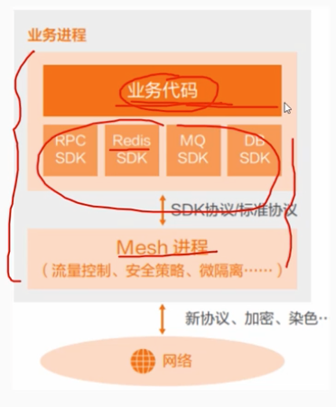

### 3.3 Serverles 模式

        Serverless将“部署”这个动作从运维中“收走”，使开发者不用关心应用运行地点、操作系统、网络配置、CPU 性能等，从架构抽象上看，当业务流量到来/业务事件发生时，云会启动或调度个已启动的业务进程进行处理，处理完成后云自动会关闭/调度业业务进程，等待下一次触发，也就是把应用的整个运行都委托给云。Serverless 并非适用任何类型的应用，因此架构决策者需要关心应用类型是否适合于serverless运算。如果应用是有状态的，由于Serverless 的调度不会帮助应用做状态同步，因此云在进行调度时可能导致上下文丢失;如果应用是长时间后台运行的密集型计算任务，会无法发挥 Serverless 的优势;如果应用涉及频繁的外部l/0(网络或者存储，以及服务间调用)，也因为繁重的!/0负担、时延大而不适合.
        Serverless 非常适合于事件驱动的数据计算任务、计算时间短的请求/响应应用、没有复杂相互调用的长周期任务

# 14.2 云原生架构-云原生架构相关技术

## 1. 容器技术

        容器作为标准化软件单元，它将应用及其所有依赖项打包，在运行的时候就不再依赖宿主机上的文件操作系统类型和配置。帮助开发者跳过设置冗杂的开发环境，不用担心不同环境下的软件运行的环境配置问题(将应用程序的配置和所有依赖打包成一个镜像在容器中)。在不同计算环境间快速、可靠地运行。

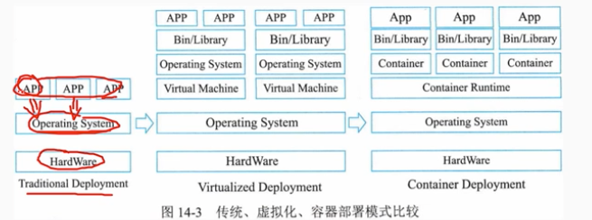

        K8s 容器编排

        Kubernetes 己经成为容器编排的事实标准，被广泛用于自动部署扩展和管理容器化应用，是一个全新的基于容器技术的分布式架构解决方案。Kubernetes 提供了分布式应用管理的核心能力。
        - 资源调度:根据应用请求的CPU、Memory资源量，或者GPU等设备资源，在集群中选择合适的节点来运行应用。
        - 应用部署与管理:支持应用的自动发布与应用的回滚，以及与应用相关的配置的管理:也可以自动化存储卷的编排，让存储卷与容器应用的生命周期相关联.
        - 自动修复: Kubernetes能监测这个集群中所有的宿主机，当宿主机或者OS出现故障，节点健康检查会自动进行应用迁移K8s也支持应用的自愈，极大简化了运维管理的复杂性。
        - 服务发现与负载均衡: Service是对一组提供相同功能的Pods的抽象，并为它们提供一个统一的入口。借助Service，应用可以方便的实现服务发现与负载均衡，并实现应用的零宕机升级。
        - 弹性伸缩: K8s可以监测业务上所承担的负载，如果这个业务本身的CPU利用率过高，或者响应时间过长，它可以对这个业务进行自动扩容

## 2. 云原生微服务

### 2.1 微服务的发展背景

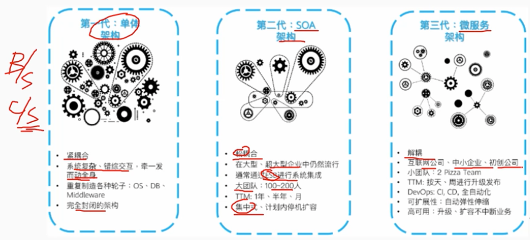
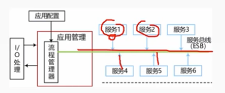

### 2.2 微服务概念

        微服务架构是一种架构模式，将单体应用划分成一组小的服务通过服务之间互相协作，共同实现系统功能。

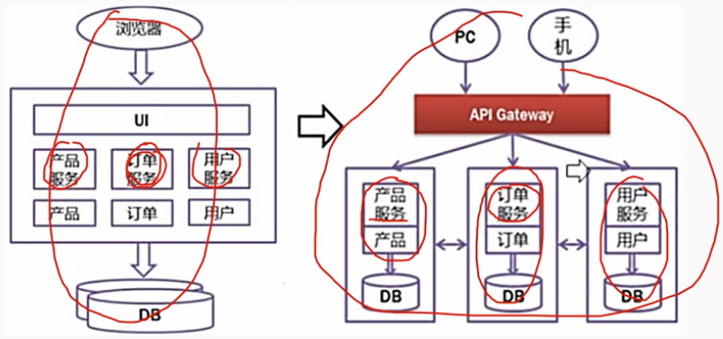
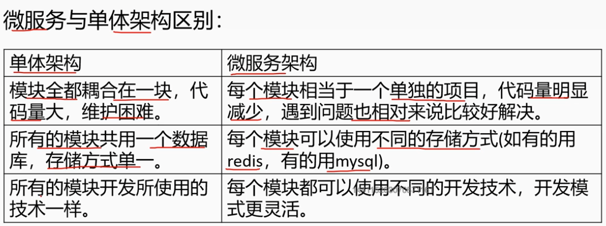

        微服务与面向服务的架构(SOA)区别:
        微服务是细粒度的SOA组件。换句话说，单个SOA组件可被拆分成多个微服务。微服务使用轻量级HTTP、REST或Thrift API进行通信.

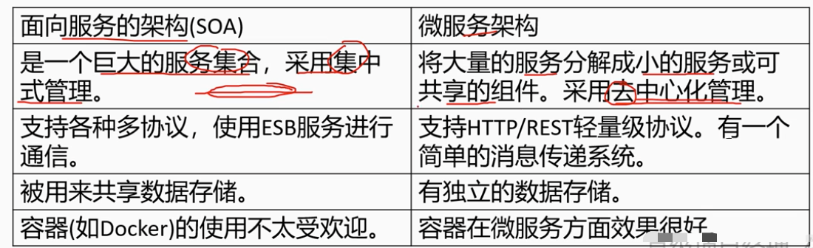

> 例题
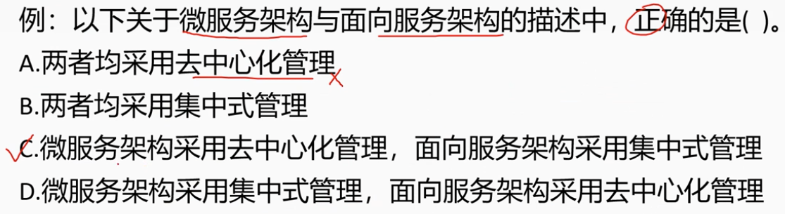

### 2.3 微服务特征

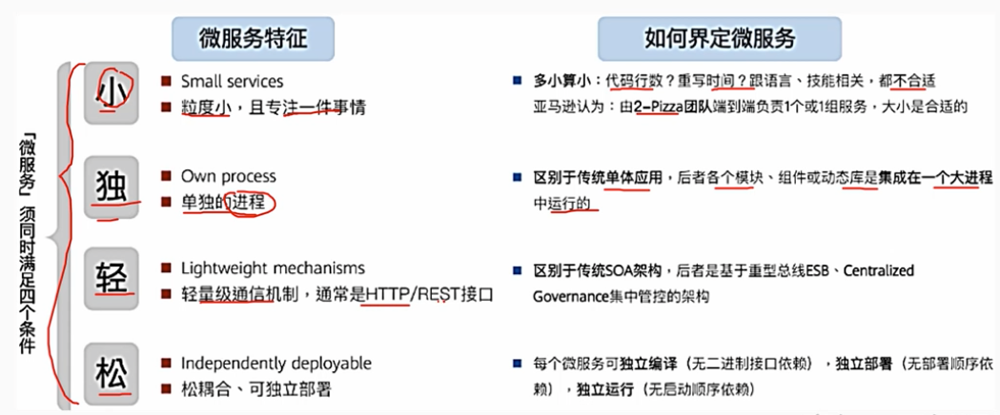

### 2.4 主要的微服务技术

        - Apache Dubbo是阿里的一款高性能、轻量级的开源服务框架提供了六大核心能力: 面向接口代理的高性能RPC调用，智能容错和负载均衡，服务自动注册和发现，高度可扩展能力，运行期流量调度，可视化的服务治理与运维。
        0 Spring cloud是一系列框架的有序集合，具有丰富的生态。它利用Spring Boot的开发便利性简化了分布式系统基础设施的开发，主要功能包括服务发现注册、配置由心、消息总线、负载里6均衡、断路器、数据监控等. 

## 3. 服务网格

        服务网格(Service Mesh)是一个专门处理服务通讯的基础设施层它的职责是在由云原生应用组成服务的复杂拓扑结构下进行可靠的请求传送。在实践中，它是一组和应用服务部署在一起的轻量级的网络代理，并且对应用服务透明。服务网格把 SDK 中的大部分能力从应用中剥离出来，拆解为独立进程，以sidecar 的模式进行部署。服务网格通过将服务通信及相关管控功能从业务程序中分离并下沉到基础设施层，使其和业务系统完全解耦，使开发人员更加专注于业务本身.

        服务网格从总体架构上来讲比较简单，不过是一堆紧挨着各项服务的用户代理，外加一组任务管理组件组成
        - 管理组件被称为控制平面(Control plane)，负责与控制平面中的代理通信，下发策略和配置。
        - 代理被称为数据平面(Data plane)，直接处理入站和出站数据包转发、路由、健康检查、负载均衡、认证、鉴权、产生监控数据等。    

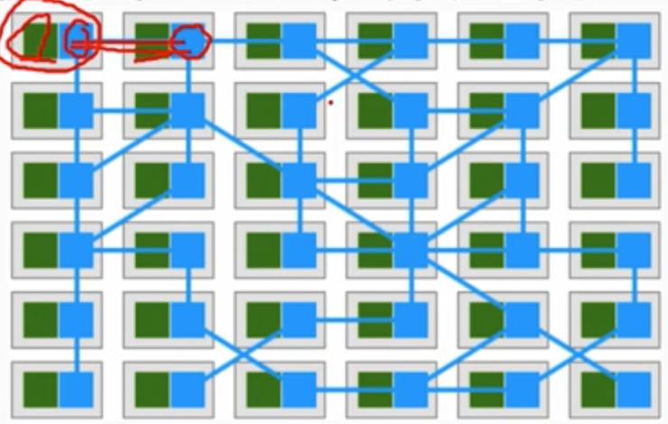

        lstio 是一个由Google和IBM等公司开源的，功能十分丰富的服务网格具体实现，也是目前业界最为流行的实现
        lstio 的架构从逻辑上分成数据平面和控制平面
        - 数据平面: 由一组和业务服务成对出现的 sidecar 代理 (Envoy)构成，主要功能是接管服务的进出流量，传递并控制服务和Mixer组件的所有网终通信.
        - 控制平面: 包括了 pilot、 Mixer、 Citadel和Galley 4 个组件，主要功能是通过配置和管理 sidecar 代理来进行流量控制，并配置Mixer 去执行策略和收集遥测数据

        pilot（领航员、飞行员）：负责管理和配置所有的Envoy代理，包括代理的路由、服务发现、负载均衡、故障恢复等。流量管理、超时配置、重试次数等。
        mixer(混合器)：负责遥测数据收集和策略执行，包括访问控制、认证、配额、限流、审计等。测流控制
        citadel(堡垒)：负责服务间的安全通信，包括证书的签发和分发、证书的轮换、身份认证、鉴权等。
        Galley(舰队)：负责将用户提交的配置转换成 Istio 内部的配置格式，并将配置分发给 Istio 的其他组件。
        
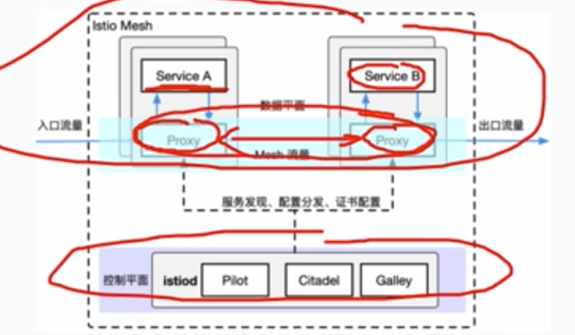

