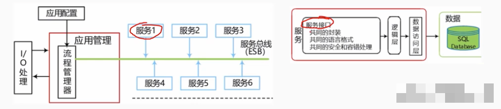
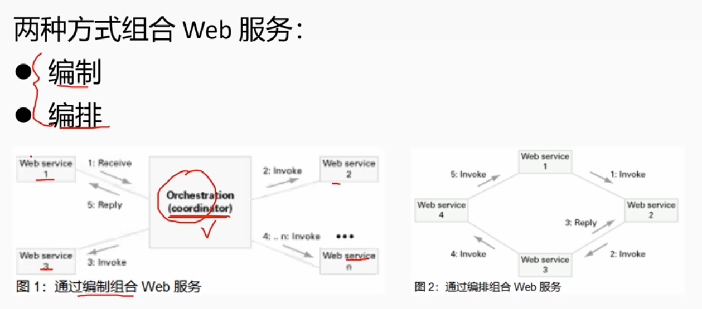
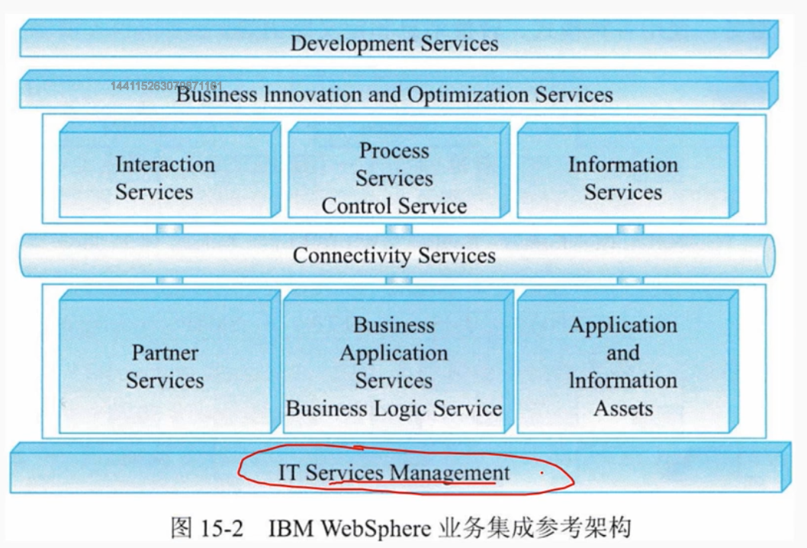
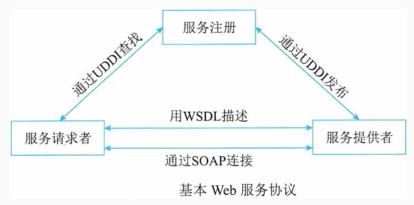
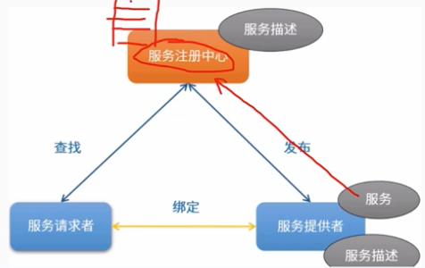
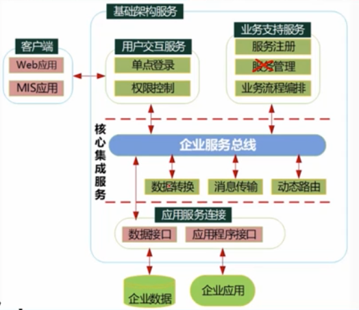
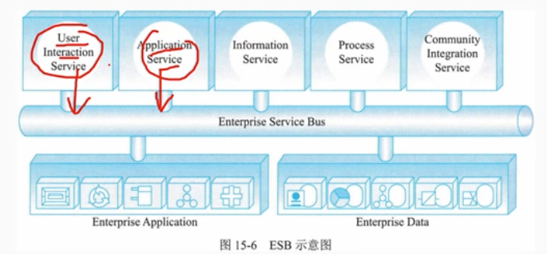
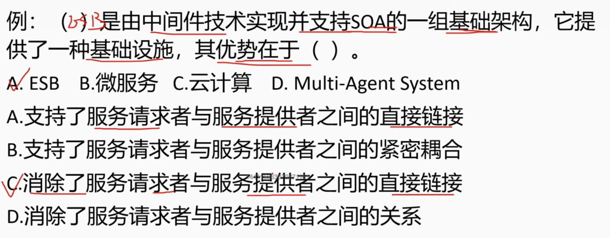

# 15.1 面向服务架构-SOA的相关概念

## 1. SOA架构定义

        SOA 是一个组件模型，它将应用程序的不同功能单元(称为服务)通过这些服务之间定义良好的接口和契约联系起来。接口是采用中立的方式进行定义的，它应该独立于实现服务的硬件平台、操作系统和编程语言。这使得构建在各种这样的系统中的服务可以以一种统和通用的方式进行交互。

        SOA是一种设计方法，其中包含了一系列的组件和服务，这些组件和服务可以被其他应用程序通过调用的方式来使用，而且是跨语言的。SOA是一种面向服务的架构，它将应用程序的不同功能单元(称为服务)通过这些服务之间定义良好的接口和契约联系起来。接口是采用中立的方式进行定义的，它应该独立于实现服务的硬件平台、操作系统和编程语言。这使得构建在各种这样的系统中的服务可以以一种统和通用的方式进行交互。

## 2. 业务流程与BPEL

        业务流程是指为了实现某种业务目的行为所进行的流程或一系列动作。在计算机领域，业务流程代表的是某一个问题在计算机系统内部得到解决的全部流程。
        BPEL(面向Web 服务的业务流程执行语言)，是一种基于XML的用来描写业务过程的编程语言，被描写的业务过程的每个单一步骤则由Web服务来实现。使用 BPEL，用户可以通过组合、编排和协调 Web 服务自上而下地实现面向服务的体系结构(SOA)。BPEL提供了一种相对简单易懂的方法，可将多个 Web 服务组合到一个新高级项目经理的复合服务(称作业务流程) 中。

# 15.2 面向服务架构-SOA的参考架构

## 1. SOA参考架构

        从服务为中心的视角来看，企业集成的架构划分为6大类：
        (1)T 服务管理(iTservice Management):支持业务系统运行的各种基础设施管理能力或服务，如安全服务、目录服务、系统管理和资源虚拟化
        (2)业务逻辑服务(Business Logic Service): 包括用于实现业务逻辑的服务和执行业务逻辑的能力，其中包括业务应用服务、业务伙伴服务以及应用和信息资产
        (3)连接服务(Connectivity Service):通过提供企业服务总线提供分布在各种架构元素服务间的连接性。
        (4)控制服务(Control Service): 包括实现人、流程和信息集成的服务，以及执行这些集成逻辑的能力
        (5)业务创新和优化服务(Business nnovation and OptimizationService):用于监控业务系统运行时服务的业务性能，并通过及时了解到的业务性能和变化，采取措施适应变化的市场.
        (6)开发服务(Development Service):贯彻整个软件开发生命周期的开发平台，从需求分析，到建模、设计、开发、测试和维护等全面的工具支持

# 15.3 面向服务架构-SOA的主要协议和规范

        Web 服务作为实现SOA 中服务的最主要手段。Web 服务最基本的协议包括UDDI、WSDL和SOAP 通过它们，可以提供直接而又简单的 Web Service 支持。

## 1. UDDI协议
        
        UDDI(统一描述、发现和集成协议)是一种用于描述、发现、集成Web Service的技术，它是Web Service协议栈的一个重要部分。通过UDDI，企业可以根据自己的需要动态查找并使用web服务，也可以将自己的web服务动态地发布到UDDI注册中心，供其他用户使用。

## 2. WSDL规范
        
        WSDL(Web 服务描述语言)，是一个用来描述 Web 服务和说明如何与 Web 服务通信的XML语言。也就是描述与目录中列出的Web服务进行交互时需要绑定的协议和信息格式。WSDL描述Web服务的公共接口。通过WSDL，可描述web 服务的三个基本属性
        (1)服务做些什么--服务所提供的操作(方法)
        (2)如何访问服务--和服务交互的数据格式以及必要协议
        (3)服务位于何处--协议相关的地址，如 URL。

        WSDL文档以端口集合的形式来描述 Web 服务，WSDL服务描述包含对一组操作和消息的一个抽象定义，绑定到这些操作和消息的个具体协议，和这个绑定的个网络端点规范
        WSDL文档被分为两种类型: 服务接口和服务实现

## 3. SOAP协议

        SOAP(简单对象访问协议)是在分散或分布式的环境中交换信息的简单协议，是一种轻量的、简单的、基于XML的协议。
        包括4部分
        - 封装(Envelop): 定义了一个框架，该框架描述了消息的内容是什么，是谁发送的，谁应当接收并处理以及如何处理它
        - 编码规则:定义了一种序列化的机制，用于表示应用程序需要使用的数据类型的实例:
        - SOAP RPC 表示:定义了用于表示远程过程调用和应答的协定
        - 绑定(Binding): 定义了SOAP使用哪种协议交换信息。HTTP/TCP4411ss3高级项目经理/UDP协议都可以

# 15.4 面向服务架构-SOA的设计原则

## 1. SOA的设计原则

        (1)无状态。避免服务请求者依赖于服务提供者的状态
        (2)单一实例。避免功能几余
        (3)明确定义的接口。服务的接口由 WSDL定义，用于指明服务的公共接口与其内部专用实现之间的界线。ws-Policy 用于描述服务规约，XML模式用于定义所交换的消息格式(即服务的公共数据)使用者依赖服务规约调用服务，所以服务定义必须长时间稳定一旦公布，不能随意更改;服务的定义应尽可能明确，减少使用者的不适当使用;不要让使用者看到服务内部的私有数据
        (4)自包含和模块化。服务封装了那些在业务上稳定、重复出现的活动和组件，实现服务的功能实体是完全独立自主的，独立进行部署、版本控制、自我管理和恢复。
        (5)粗粒度。服务数量不应该太大，依靠消息交互而不是远程过程调用(RPC)，通常消息量比较大，但是服务之间的交互频度较低。(6)服务之间的松耦合性。服务使用者看到的是服务的接口，其位置、实现技术和当前状态等对使用者是不可见的，服务私有数据对服务使用者是不可见的
        (7)重用能力。服务应该是可以重用的
        (8)互操作性、兼容和策略声明。为了确保服务规约的全面和明确策略成为一个越来越重要的方面。这可以是技术相关的内容，例如一个服务对安全性方面的要求;也可以是跟业务有关的语义方面的内容，例如需要满足的费用或者服务级别方面的要求，这些策略对于服务在交互时是非常重要的。ws-Policy 用于定义可配置的互操作语义来描述特定服务的期望、控制其行为。在设计时应该利用策略声明确保服务期望和语义兼容性方面的完整和明确

# 15.5 面向服务架构-SOA的设计模式

## 1. 服务注册表模式

        服务注册表(Service Registry)主要在 SOA设计时使用，虽然它们常常也具有运行时段的功能。注册表包括有关服务和相关软件组件的配置、遵从性和约束配置文件。任何帮助注册发现和检索服务合同、元数据和策略的信息库、数据库、目录或其他节点都可以被认为是一个注册表服务描述。

        (1)服务注册: 应用开发者，也叫服务提供者，向注册表公布他们的功能。他们公布服务合同，包括服务身份、位置、方法、绑定配置、方案和策略等描述性属性.
        (2)服务位置: 也就是服务应用开发，帮助他们查询注册服务，寻找符合自身要求的服务。注册表让服务的消费者检索服务合同。
        (3)服务绑定: 服务的消费者利用检索到的服务合同来开发代码开发的代码将与注册的服务绑定、调用注册的服务以及与它们实现互动。

## 2. 企业服务总线模式ESB

        企业服务总线(ESB)，提供一种标准的软件底层架构，各种程序组件能够以服务单元的方式“插入”到该平台上运行，并且组件之间能够以标准的消息通信方式来进行交互。

        ESB 本质上是以中间件形式支持服务单元之间进行交互的软件平台。各种程序组件以标准的方式连接在该“总线”上，并且组件之间能够以格式统一的消息通信的方式来进行交互。
        典型ESB 环境中组件间的交互过程是:首先由服务请求者触发一次交互过程，产生一个服务请求消息，并将该消息按照 ESB 的要求标准化，然后标准化的消息被发送给服务总线。ESB 根据请求消息中的服务名或者接口名进行目的组件查找，将消息转发至目的组件，并最终将处理结果逆向返回给服务请求者。这种交互过程不再是点对点的直接交互模式，而是由事件驱动的消息交互模。
        通过这种方式，ESB 最大限度上解耦了组件之间的依赖关系，降低了软件系统互连的复杂性。连接在总线上的组件无需了解其他组件和应用系统的位置及交互协议，只需要向服务总线发出请求消息即可获得所需服务
        服务总线事实上实现了组件和应用系统的位置透明和协议透明技术人员可以通过开发符合 ESB标准的组件(适配器)将外外部应用连接至服务总线，实现与其他系统的互操作。同时，ESB 以中间件的方式，提供服务容错、负载均衡、Qos 保障和可管理功能

> 例题

        ESB的核心功能:
        (1)提供位置透明的消息路由和寻址服务
        (2)提供服务注册和命名的管理功能
        (3)支持多种消息传递范型(如请求/响应、发布/订阅等).
        (4)支持多种可以广泛使用的传输协议。
        (5)支持多种数据格式及其相互转换。
        (6)提供日志和监控功能