# 16.1 通信系统架构-通信系统网络架构

## 1. 局域网的网络架构

        1.单核心架构
        2.双核心架构
        3.环形架构
        4.层次局域网架构

## 1.1 单核心架构

        优点: 网络结构简单，节省设备投资
        缺点：
        - 网络地理范围受限，要求使用局域网的部门分布较为紧凑
        - 核心网交换设备存在单点故障，容易导致网络整体或局部失效
        - 在局域网接入交换设备较多的情况下，对核心交换设备的端口密度要求高;
        - 网终扩展能力有限

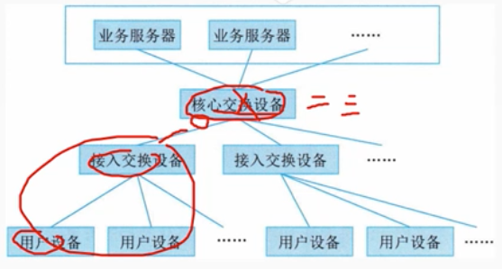

## 1.2 双核心架构

        优点: 
        - 核心交换设备之间互联，实现网关保护或负载均衡，可靠性高
        - 需要使用局域网的部门接入较为方便，直接通过接入交换设备连接至核心交换设备空闲接口即可
        - 业务服务器同时连接至两台核心交换设备为用户提供高速访问
        缺点:
        - 设备投资相比单核心局域网的高
        - 对核心交换设备的端口密度要求较高

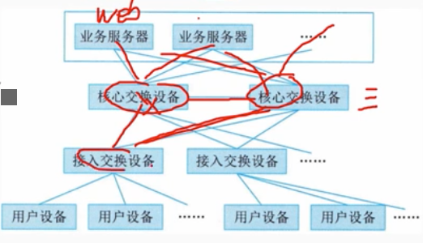

## 1.3 环形架构

        环型局域网是由多台核心交换设备连接成双RPR(动态弹性分组环)RPR具备自愈保护功能，省光纤资源，具备MAC层50ms 自愈时间的能力，提供多等级、可靠的Qos 服务，带宽公平机制和拥塞控制机制。RPR 环双向可用，RPR 利用空间重用技术，使得环上的带宽得以有效利用。
        缺点:
        - 投资比单核心局域网高
        - 核心路由几余设计实施难度较高容易形成环路

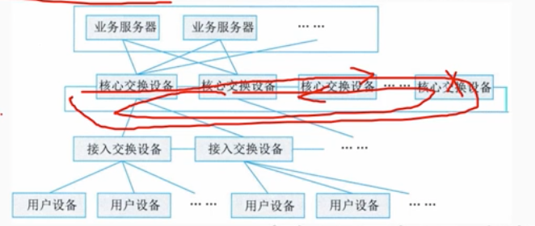

## 1.4 层次局域网架构

        层次局域网(或多层局域网)由核心层交换设备、汇聚层交换设备和接入层交换设备，以及用户设备等组成
        - 核心层设备提供高速数据转发功能汇聚层与接入层之间实现互访控制。
        - 汇聚层可提供所辖的不同接入设备(部门局域网内)业务的交换功能，减轻对核心交换设备的转发压力
        - 接入层设备实现用户设备的接入。

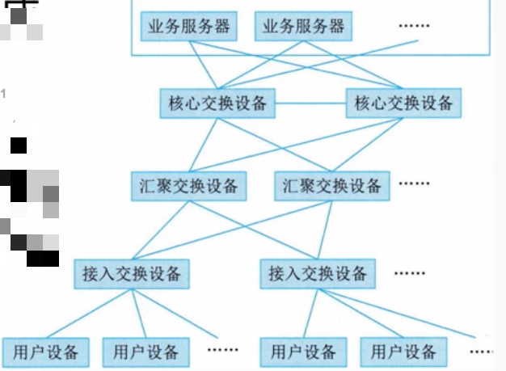

        层次局域网网络易于扩展;网络故障可分级排查，便于维护。通常，层次局域网通过与广域网的边界路由设备接入广域网，实现局域网和广域网业务互访。

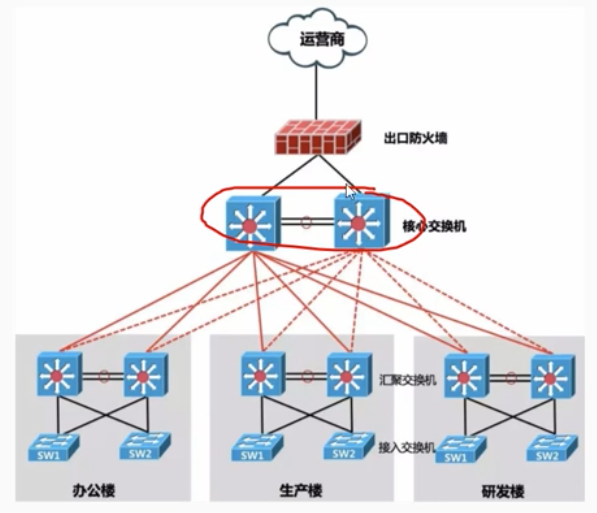

## 2. 广域网网络架构

        1. 单核心广域网

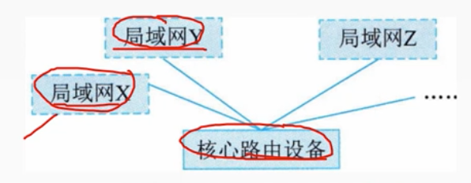

        2. 双核心广域网

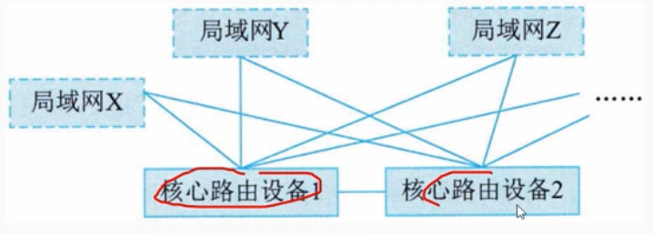

        3. 环形广域网

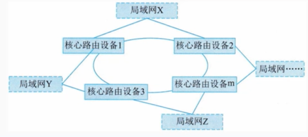

        4. 半冗余广域网/全冗余广域网

        半冗余广域网是由多台核心路由设备连接各局域网而形成的。其中任意核心路由设备至少存在两条以上连接至其他路由设备的链路。如果任何两个核心路由设备之间均存在链接，则属于半元余广域网特例，即全几余广域网。
        所有的路由存在直接连接称为全冗余广域网

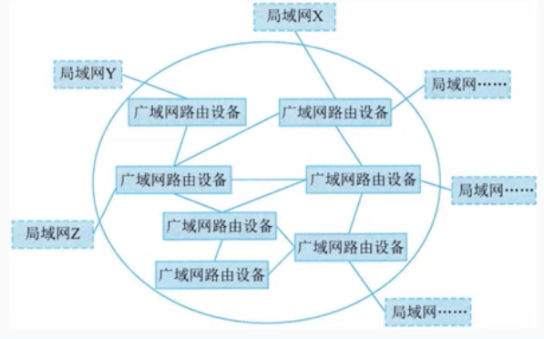

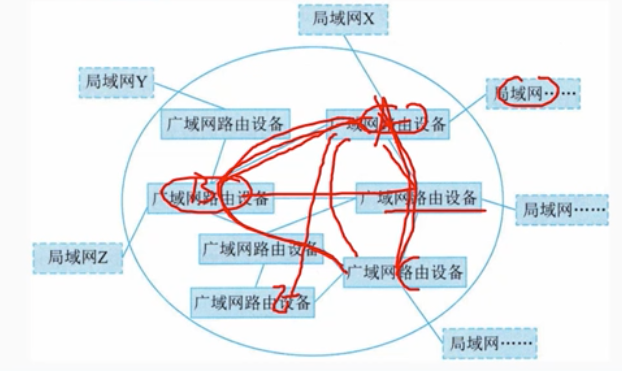

        5. 对等子域广域网

        对等子域结构是指通过将广域网的路由器划分成两个独立的子域，每个子域内路由器采用半几余方式互连。
        对等子域结构中，两个子域间通过一条或多条链路互连，对等子域结构中任何路由器都可以接入局域网络

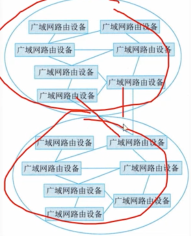

        6.层次子域广域网

        层次子域结构将大型广域网路由设备划分为多个较为独立的子域每个子域内路由器采用半几余方式互连。层次子域结构中，多个子域之间存在层次关系，高层子域连接多个低层子域。层次子域结构中任何路由器都可以接入局域网络。

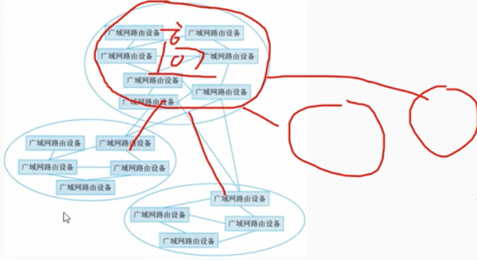

## 2. 网络存储

        目前主流的网络存储技术有三种
        1.直接附加存储(DAS)
        2.网络附加存储(NAS)
        3.存储区域网络(SAN)

### 2.1 直接附加存储(DAS)

        在直连方式存储中，存储设备是通过电缆（通常是SCS接口电缆）直接到服务器的，/0请求直接发到存储设备。
        DAS也可称为服务器附加存储(SAS)。它依赖于服务器，其本身是硬件的堆叠，不带有任何存储操作系统

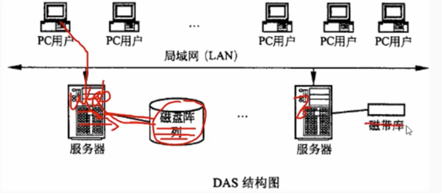

### 2.2 网络附加存储(NAS)

        NAS是一种专用的数据存储服务器。它以数据为中心，将存储设备与服务器彻底分离，集中管理数据，从而提高性能、降低总拥有成本。其成本远远低于使用服务器存储，而效率却远高于后者。

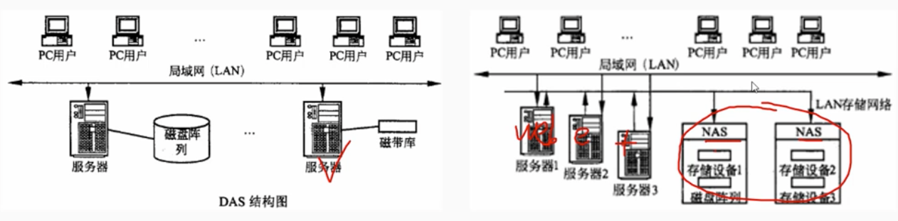

### 2.3 存储区域网络(SAN)

        SAN是通过专用高速网将一个或多个网络存储设备和服务器连接起来的专用存储系统。利用SAN，不仅可以提供大容量的存储数据，而且地域上可以分散，并缓解了大量数据传输对于局域网的影响。

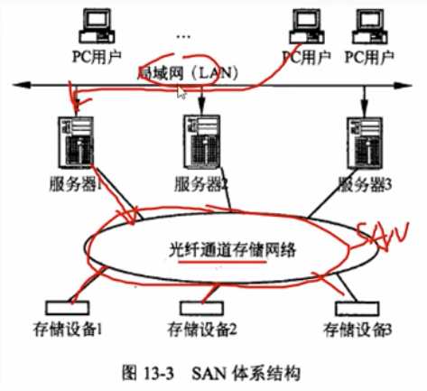

        根据数据传输过程采用的协议，划分为
        - FC SAN: FC指光纤通道，主要特征有支持热插拔、高速带宽远程连接、连接设备数量大;缺点:成本高、复杂性大。
        - IP SAN: 基于IP网络实现数据块级别存储方式的存储网络。特点: 设备成本低，配置简单，可共享和使用大容量存储空间
        - IB SAN: (IB:InfiniBand无限带宽)是一种交换结构/0技术，其设计思路是通过一套中心机构(B交换机)在远程存储器、网络以及服务器等设备之间建立一个单一的连接链路，并由IB交换机来指挥流量。特点:高效可靠、支持多个虚信道较高容错性高级项目经理支持热插拔。

## 3. 软件定义网络架构

        SDN架构中有三个层面
        - 应用平面:在网络上运行的应用及服务
        - 控制平面:SDN控制器或网络的"大脑"
        - 数据平面:交换机和路由器，以及其支撑的物理硬件

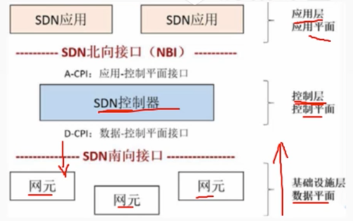

        - 控制平面与数据平面之间通过SDN控制-数据平面接口(CDPI)进行通信，它具有统一的通信标准，主要负责将控制器中的转发规则下发至转发设备，主要应用的是openFlow协议。
        - 控制平面与应用平面之间通过SDN北向接口(NBI)进行通信，而NBI并非统一标准，它允许用户根据自身需求定制开发各种风络管理应用。

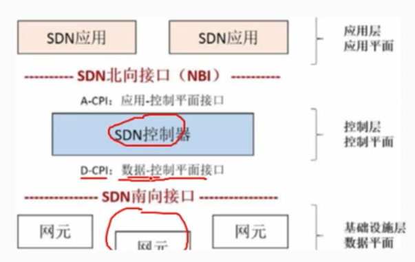

# 16.2 通信系统架构-网络构建关键技术

## 1. 网络生命周期

        一个网络系统从构思开始到最后被淘汰的过程被称为网络系统的生命周期。
        网络系统的生命周期至少包括网络系统的构思计划、分析和设计运行和维护等过程
        常见的迭代周期构成方式主要有三种
        - 四阶段周期
        - 五阶段周期
        - 六阶段周期

## 2. 网络开发过程 

        根据五阶段迭代周期的模型，网络开发过程被划分为五个阶段
        1.需求分析
        2.现有网络系统分析，即通信规范分析
        3.确定网络逻辑结构，即逻辑网络设计
        4.确定网络物理结构，即物理网络设计安
        5.装和维护

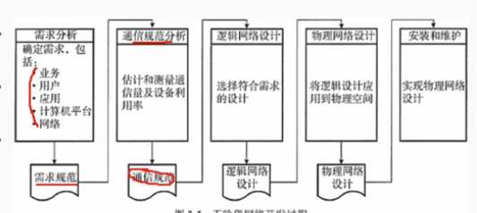

### 2.1 需求分析
        
        需求分析是开发过程最关键的阶段，在需求分析阶段应该尽量明确定义用户的需求，详细的需求描述使得最终的网终更有可能满足用户的要求。需求分析的输出是需求说明书，也就是需求规范.
        不同的用户有不同的网终需求，收集需求需要考虑:
        - 业务需求
        - 用户需求
        - 应用需求
        - 计算机平台需求
        - 网络需求

        获取用户需求的常用方法如下
        (1)访谈
        (2)观察
        (3)问卷调查
        (4)采访关键人物
        (5)建立原型以得到潜在用户的反馈

### 2.2 现有网络系统分析

        现有网络系统分析的工作目的是描述资源分布，以便在升级时尽量保护已有投资。通过该工作，使网络设计者掌握网络现在所处的状态和情况。
        此价段输出正式的通信规范说明文档
        内容如下:
        - 现有网络的逻辑拓扑图
        - 反映网络容量、网段及网络所需的通信容量和模式
        - 详细的统计数据、基本的测量值和所有其他直接反映现有网终性能的测量值;
        - Internet接口和广域网提供的服务质量(Qos)报告
        - 限制因素列表清单，例如，使用线缆和设备等

### 2.3 确定网络逻辑结构
        
        网络逻辑结构设计是体现网络设计核心思想的关键阶段，在这阶段根据需求规范和通信规范，选择一种比较适宜的网络逻辑结构，并实施后续的资源分配规划、安全规划等内容.
        网络的逻辑结构设计来自于用户需求中描述的网终行为、性能等要求，逻辑设计要根据网终用户的分类、分布，形成特定的网终结构，该网终结构大致描述了设备的互连及分布，但是不对具体的物理位置和运行环境进行确定。逻辑网络设计阶段，设计人员般更关注于网络层的连接图，涉及网络互联、地址分配、网终高级项目经理层流量等关键因素.
        此阶段最后应该得到一份逻辑网络设计文档
        输出的内容包括以下几点:
        - 逻辑网络设计图
        - IP地址方案
        - 安全方案
        - 具体的软硬件、广域网连接设备和基本的服务
        - 招聘和培训网络员工的具体说明
        - 对软硬件、服务、员工和培训的费用的初步估计

### 2.4 确定网络物理结构

        物理网络设计是对逻辑网络设计的物理实现，通过对设备的具体物理分布、运行环境等的确定，确保网络的物理连接符合逻辑连接的要求。在这一阶段，网络设计者需要确定具体的软硬件、连接设备、布线和服务。
        网络物理结构设计文档
        内容如下:
        - 网络物理结构图和布线方案
        - 设备和部件的详细列表清单
        - 软硬件和安装费用的估算
        - 安装日程表，详细说明服务的时间以及期限
        - 安装后的测试计划
        - 用户的培训计划

### 2.5 网络安装和维护

        （1）安装阶段
        是根据前面各个阶段的工程成果，实施环境准备、设备安装调试的过程。安装阶段的主要输出是网络本身。
        安装阶段应该产生的输出如下
        - 逻辑网络图和物理网络图，以便于管理人员快速掌握网络
        - 终满足规范的设备连接图、布线图等细节图，同时包括线缆连接器和设备的规范标识
        - 运营维护记录和文档，包括测试结果和新的数据流量记录
        （2）维护阶段
        网络维护又称为网络产品的售后服务。网络安装完成后，接受用户的反馈意见和监控是网终管理员的任务。
        网络投入运行后，需要做大量的故障监测和故障恢复以及网终升级和性能优化等维护工作。

## 3. 网络设计方法

        计算机网络设计通常采用自顶向 下(Top-Down)的模块化设计方法即从网终模型上层开始，直至底层，最终确定冬模块，满足应用需求。

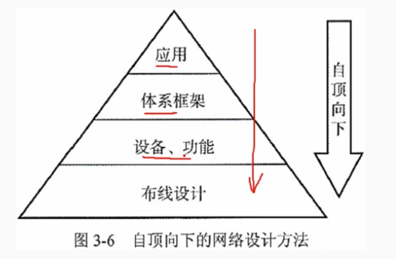

### 3.1 层次化网络设计模型
        
        层次化模型由外向内由接入层、分布层和核心层三个功能层组成
        - 接入层: 为用户提供接入网络的服务，也称为访问层
        - 分布层: 提供用户到核心层之间的连接，也称为汇聚层
        - 核心层: 高速的网终骨干

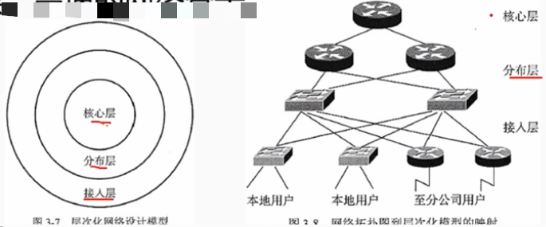

#### 3.1.1 接入层

        接入层又称访问层，是用户接入网终的地方，用户可以是本地的也可以是远程的。
        接入层可以通过集线器、交换机、网桥、路由器和无线访问点为本地用户提供接入服务，也可以通过VPN技术让远程用户经Internet接入内部网络。
        接入层往往需要有相应的策略来保证只有授权用户才可接入网络。
 
 #### 3.1.2 分布层
        
        又称汇聚层，是核心层和接入层之间的接口。分布层的功能和特性如下
        (1)通过过滤、优先级和业务排队来实现策略。
        (2)在接入层和核心层之间进行路由选择。如果在接入层和核心层使用的路由协议不同，那么分布层负责在各路由协议之间重新共享路由信息，如果有必要还需要对路由信息进行过滤
        (3)执行路由汇总。当路由被汇总后，路由器只需要在路由表中保存较少的汇总路由信息，这会使路由表变小，减少路由器查找路由表时间和对内存的需求。此外路由的更新信息也会减少，从而占用的网络带宽减少。
        (4)提供到接入设备和核心设备的余连接。
        (5)把多个低速接入的连接汇聚到高速的核心连接上，如果有必要还需要在不同的传输介质之间转换。
        
#### 3.1.3 核心层
        
        核心层提供高速的网络主干。
        核心层的功能和属性如下：
        (1)为了在骨干网上快速地传输数据，核心层应具有高速度、低延时的链路和设备
        (2)通过提供几余设备和链路使得网终不存在单点故障，从而实现高可靠的网络骨干。
        (3)使用快速收敛路由协议可以迅速适应网络变化。路由协议还口以在冗余链路上配置负载均衡，以便备份的网络资源在没有网终故障发生时也能得到利用。因为过滤往往会降低处理速度，所以般核心层不执行过滤功能，而将过滤操作放在分布层下执行。

#### 3.1.4 层次化模型的优点

        (1)三层结构减轻了内层网络主设备的负载。由于分布层的过滤和汇聚，使得核心层设备避免了处理大量细节路由信息，降低CPU开销和网终带宽消耗
        (2)降低了网络成本。按不同层次功能要求选择网终设备，可以降低不必要的功能投入花费。此外，层次化的模型结构便于网终管理，降低网络运行维护花费(3)简化了设计元素，使设计易于理解
        (4)容易变更层次结构。局部升级不会影响其他部分，扩展方便
