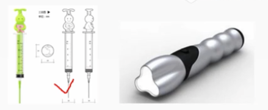

# 17.1 知识产权与法律法规-著作权法

## 1. 著作权法

        《中华人民共和国著作权法》及其实施条例，明确了保护文学、艺术和科学作品作者的著作权，以及与其相关的权益依据该法，我国不仅对文字作品，口述作品，音乐、戏剧、曲艺舞蹈作品，美术、摄影作品，电影、电视、录像作品，工程设计产品设计图纸及其说明、地图、示意图等图形作品给予保护，而且把计算机软件纳入著作权保护范围我国是世界上为数不多的明确将计算机软件作为著作权法保护客体的国家之一。

### 1.1 著作权主体

        著作权法及实施条例的主体是指著作权关系人，通常包括著作权人受让者两种。
        (1)著作权人，又称为原始著作权人: 是根据创作的事实进行确定的，依法取得著作权资格的创作、开发者。
        （2）受让者，又称为后继著作权人: 是指没有参与创作，通过著作权转移活动而享有著作权的人。

### 1.2 著作权

        (1)发表权
        (2)署名权
        (3)修改权
        (4)保护作品完整权
        (5)使用权、使用许可权和获取报酬权、转让权即以复制、表演播放、展览、发行、摄制电影、电视、录像，或者改编、翻译、注释和编辑等方式使用作品的权利，以及许可他人以上述方式使用作品，并由此获得报酬酬的权利。

        作者的署名权、修改权、保护作品完整权的保护期不受限制。公民的作品，其发表权、使用权和获得报酬权的保护期为作者终生及其死亡后50年，截止于作者死亡后第50年的12月31日;如果是合作作品，截止到最后死亡的作者死亡后第50年的12月31日。
        法人或者其他组织的作品、著作权 (署名权除外) 由法人或者其他组织享有的职务作品，其发表权、使用权和获得报酬权的保护期为50年，截止于作品首次发表后第50年的12月31日，但作品自创作完成后50年内未发表的，著作权法不再保护。

        对于出版者、表演者、录音录像制作者、广播电台、电视台而言在下列情况下使用作品，可以不经著作权人许可、不向其支付报酬但应指明作者姓名、作品名称，不得侵犯其他著作权。
        (1)为个人学习、研究或欣赏，使用他人已经发表的作品。
        (2)为介绍、评论某一个作品或说明某一个问题，在作品中适当引用他人已经发表的作品。
        (3)为报道时事新闻，在报纸、期刊、广播、电视节目或新闻纪录影片中引用已经发表的作品。
        (4)报纸、期刊、广播电台、电视台刊登或播放其他报纸、期刊、广播电台、电视台已经发表的社论、评论员文章。
        (5)报纸、期刊、广播电台、电视台刊登或者播放在公众集会上发表的讲话，但作者声明不许刊登、播放的除外。
        (6)为学校课堂教学或科学研究，翻译或者少量复制已经发表的作品，供教学或科研人员使用，但不得出版发行。
        (7)国家机关为执行公务使用已经发表的作品。
        (8)图书馆、档案馆、纪念馆、博物馆和美术馆等为陈列或保存版本的需要，复制本馆收藏的作品。
        (9)免费表演已经发表的作品(10)对设置或者陈列在室外公共场所的艺术作品进行临墓、绘画摄影及录像。
        (11)将已经发表的汉族文字作品翻译成少数民族文字在国内出版发行。
        (12)将已经发表的作品改成盲文出版。

# 17.2 知识产权与法律法规-计算机软件保护条例

        由于计算机软件也属于《中华人民共和国著作权法》保护的范围因此在具体实施时，首先适用于《计算机软件保护条例》的条文规定，若是在《计算机软件保护条例》中没有规定适用条文的情况下才依据《中华人民共和国著作权法》的原则和条文规定执行。
        对软件著作权的保护只是针对计算机软件和文档，并不包括开发软件所用的思想、处理过程、操作方法或数学概念等，并且著作权人还需在软件登记机构办理登记。

## 1.1 著作权人确定
        
        根据《计算机软件保护条例》规定，软件开发可以分为合作开发职务开发、委托开发三种形式。
        (1)合作开发
        对于由两个或两个以上的开发者或组织，合作开发的软件，著作权的归属根据合同约定确定。若无合同，则共享著作权。若合作开发的软件可以分割使用，那么开发者对自己开发的部分单独享有著作权，可以在不破坏整体著作权的基础上行使。
        (2)职务开发
        如果开发者在单位或组织中任职期间，所开发的软件符合以下条件则软件著作权应归单位或组织所有。
        - 针对本职工作中明确规定的开发目标所开发的软件
        - 开发出的软件属于从事本职工作活动的结果
        - 使用了单位或组织的资金、专用设备、未公开的信息等物质技术条件，并由单位或组织承担责任的软件。
        (3)委托开发
        如果是接受他人委托而进行开发的软件，其著作权的归属应由委托人与受托人签订书面合同约定，如果没有签订合同，或合同中未规定的，则其著作权由受托人享有。
        由国家机关下达任务开发的软件，著作权的归属由项目任务书或合同规定，若未明确规定，其著作权应归任务接受方所有。

## 1.2 软件著作权

        根据《计算机软件保护条例》规定，软件著作权人对其创作的软件产品，享有以下9种权利。
        (1)发表权:即决定软件是否公之于众的权利
        (2)署名权:即表明开发者身份，在软件上署名的权利
        (3)修改权:即对软件进行增补、删节，或者改变指令、语句顺序的权利。
        (4)复制权: 即将软件制作一份或者多份的权利
        (5)发行权: 即以出售或者赠与方式向公众提供软件的原件或复制件的权利
        (6)出租权: 即有偿许可他人临时使用软件的权利
        (7)信息网络传播权: 即以信息网络方式向公众提供软件的权利
        (8)翻译权:即将原软件从一种自然语言文字转换成另一种自然语言文字的权利
        (9)使用许可权、获得报酬权、转让权

## 1.3 软件著作权保护期

        软件著作权自软件开发完成之日起生效
        (1)著作权属于公民。著作权的保护期为作者终生及其死亡后的50年 (第50年的12月31日) 。对于合作开发的，则以最后死亡的作者为准。
        (2)著作权属于单位。著作权的保护期为50年(首次发表后的第50年的12月31日)，若50年内未发表的，不予保护。单位变更、终止后，其著作权由承受其权利义务的单位享有

        当得到软件著作权人的许可，获得了合法的计算机软件复制品后复制品的所有人享有以下权利:
        （1）根据使用的需求，将该计算机软件安装到设备中(计算机、PDA等信息设备)。
        (2)制作复制品的备份，以防止复制品损坏，但这些复制品不得通过任何方式转给其他人使用。
        (3)根据实际的应用环境，对其进行功能、性能等方面的修改。但未经软件著作权人许可，不得向任何第三方提供修改后的软件。
        如果使用者只是为了学习、研究软件中包含的设计思想、原理，而以安装、显示和存储软件等方式使用软件，可以不经软件著作权人的许可，不向其支付报酬。

# 17.3 知识产权与法律法规-其它相关知识

## 1. 专利权
        
        包括发明、实用新型和外观设计三种
        (1)发明: 是指对产品、方法或者其改进所提出的新的技术方案科学发现不属于发明范畴。
        (2)实用新型:是指对产品的形状、构造或者其结合所提出的适于实用的新的技术方案
        (3)外观设计:又称工业产品外观设计，是指对产品的形状、图案或者其结合以及色彩与形状、图案相结合所作出的富有美感并适于工业上应用的新设计。

        一份专利申请文件只能就一项发明创造提出专利申请。
        一项发明只授予一项专利，同样的发明申请专利，则按照申请时间的先后决定授予给谁。
        两个以上的申请人在同一日分别就同样的发明创造申请专利的，应当在收到国务院专利行政部门的通知后自行协商确定申请人。

        1.专利权的期限
        发明专利权的期限为20年，实用新型专利权、外观设计专利权的期限为10年，均自由请日起计算此处的申请日，是指向国务院专利行政主管部门提出专利申请之日
        2.专利权人的义务
        在保护期内，专利权人应该按时缴纳年费。在专利权保护期限内如果专利权人没有按规定缴纳年费，或者以书面声明放弃其专利权专利权可以在期满前终止

## 2. 商标权

        1.商标的概念
        商标指生产者及经营者为使自己的商品或服务与他人的商品或服务相区别，而使用在商品及其包装上或服务标记上的由文字、图形字母、数字、三维标志和颜色组合，以及上述要素的组合所构成的种可视性标志。

        作为一个商标，应满足以下三个条件
        (1)商标是用在商品或服务上的标记，与商品或服务不能分离，并依附于商品或服务。
        (2)商标是区别于他人商品或服务的标志，应具有特别显著性的区别功能，从而便于消费者识别。
        (3)商标的构成是一种艺术创造，可以是由文字、图形、字母、数字、三维标志和颜色组合，以及上述要素的组合构成的可视性标志.

        两个或者两个以上的申请人，在同一种商品或者类似商品上，分别以相同或者近似的商标在同一天申请注册的，各申请人应当自收到商标局通知之日起30日内提交其申请注册前在先使用该商标的证据
        - 同日使用或者均未使用的，各申请人可以自收到商标局通知之日起30日内自行协商，并将书面协议报送商标局
        - 不愿协商或者协商不成的，商标局通知各由请人以抽签的方式确定一个申请人，驳回其他人的注册申请。
        - 商标局已经通知但由请人未参加抽签的，视为放弃申请，商标局应当书面通知未参加抽签的申请人。

        注册商标的有效期限为10年，自核准注册之日起计算。需要继续使用的，应当在期满前6个月内申注册商标有效期满，请续展注册
        在此期间未能提出由请的，可以给予6个月的宽展期宽展期满仍未提出申请的，注销其注册商标。
        每次续展注册的有效期为10年。