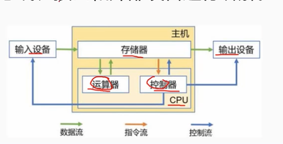
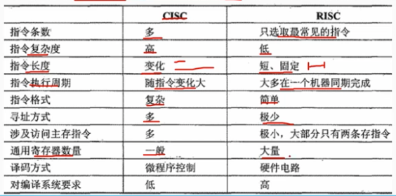
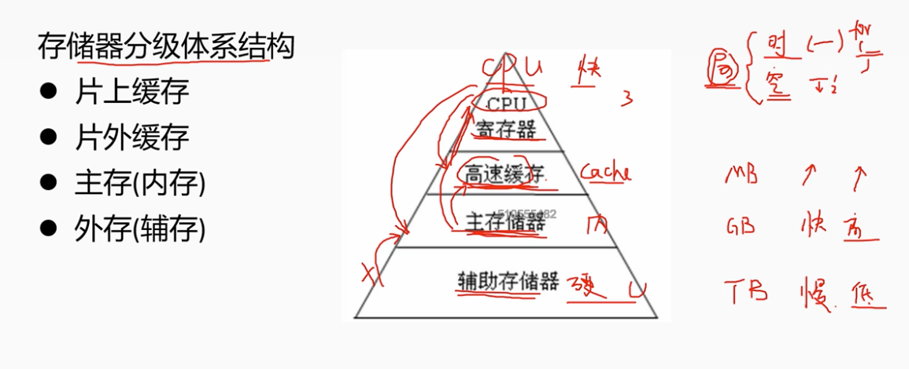
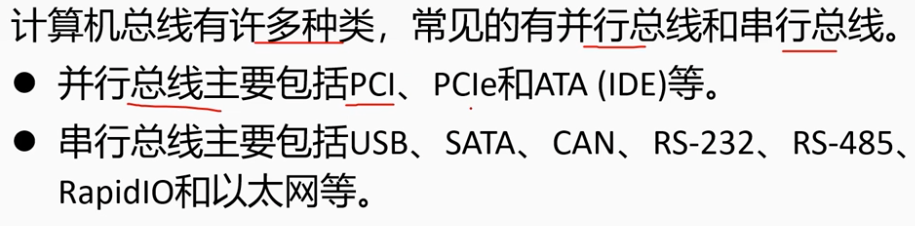

# 2.2 计算机系统-计算机硬件

## 1.计算机硬件组成
冯-诺依曼 计算机结构硬件5部分组成

按照传输过程划分为：总线、接口、外部设备。

## 1 处理器
### 1.1 控制器：是分析和执行指令的部分

- 指令寄存器 IR
- 指令译码器 ID
- 程序计数器 PC

### 1.2 运算器：负责完成算数、逻辑运算功能

- 算数逻辑单元 ALU
- 累加寄存器 AC
- 通用寄存器组

CISC 复杂指令集系统 
RISC 精简指令集系统

## 2 存储器

### 2.1RAM: 随机存储器，可读、写，只能暂存数据，断电后数据丢失

- SRAM ： 静态随机存储器，读写速度快，生产成本高。用于容量较小的告诉缓冲存储器。 Cache，Mb级别
- DRAM :  动态随机存储器，定时刷新以维持信息不丢失。读写速度慢，集成度高，成本低，用于容量较大的主存储器。内存，Gb级别
### 2.2 ROM：只读存储器，掩膜技术写入（光刻技术），常用于bios和微程序控制。
### 2.3 EPROM： 可擦除的ROM，可多次写入。
### 2.4 E2PROM: 电可擦除EPROM，可以写入，速度慢
### 2.5 闪存存储器（flash memory): 其特性介于EPROM和E2PROM之间，不能进行字节级别删除，只能删除块。
### 2.6 Disk 和磁带

## 3 总线
总线是值计算机部件间遵循一种恶性协议是吸纳数据交换的形式：

- 内总线：用于各芯片内部互连，也可成为片上总线（On-ChipBus)或片内总线
- 系统总线：值cpu/主存/io接口的总线
- 外部总线：是机板和外部设备之间，计算机系统之间互连的总线，又称为通信总线。

## 4 接口
接口是统一计算机不同功能层之间的通信规则。常见的包括：

- 显示类接口：HDMI、DVI等
- 音频输入类接口：TRS/RCA/XLR等
- 网络类接口：RJ45/FC等
- PS/2接口、USB接口、SATA接口，LPT打印接口等。
## 5 外部设备
### 5.1 常见的外部设备：键盘、鼠标、显示器、扫描仪、摄像头、麦克风、打印机、光驱、网卡、存储卡等
### 5.2 移动穿戴设备：加速剂、gps、陀螺仪、感光设备、指纹识别等。
### 5.3 工业控制、航空航天、医疗领域：测温仪、测速仪、轨迹球、操作面板、红外设备、机械臂、液压装置、驾驶杆等。