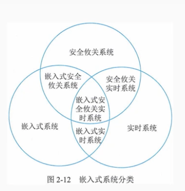
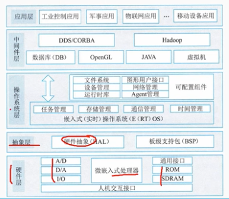
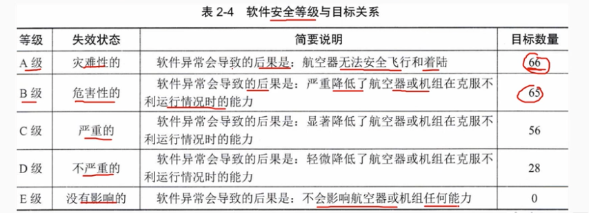

# 2.4 计算机系统-嵌入式系统及软件

## 1. 嵌入式系统组成及特点

    嵌入式系统是为特定应用而专门构建的计算机系统，将信息处理过程和物理过程紧密结合为一体。它对功能、可靠性、成本、体积、功耗、环境等性能要求非常严格。

    嵌入式软件是指可在嵌入式系统中运行的程序代码和用于开发这些软件的工具或环境软件的总称

### 1.1嵌入式系统由以下几部分组成：

- 处理器
- 支撑硬件
- 嵌入式操作系统
- 应用软件
- 支撑软件

### 1.2嵌入式系统特点：

- 专用性强
- 技术融合
- 软硬一体软件为主
- 比通用计算机资源少
- 程序代码固化在非易失存储器中
- 需专门开发工具和环境
- 体积小、价格低、工艺先进、性价高、实时性强
- 安全性和可靠性要求

## 2 嵌入式系统分类

### 2.1 从应用用途可分为

- 嵌入式实时系统

  强实时系统

  弱实时系统

- 嵌入式非实时系统

### 2.2 从安全性要求，嵌入式系统可分为：

- 安全攸关系统 safety-critical
- 非安全攸关系统

## 3. 嵌入式软件的组成及特点

- 可裁剪性
- 可配置型
- 强实时性
- 安全性
- 可靠性
- 高确定性

## 4 安全攸关软件的安全性设计

