# 2.1 计算机系统基础知识-计算机网络

# 1. 网络的基本概念
    计算机网络是利用通信线路将地理上分散的、具有独立功能的计算机系统和通信设备按不同的形式连接起来，并依靠万罗软件及通信协议实现资源共享和信息传递的系统。
    计算机网络技术涵盖通信技术、网络技术、租完技术和网络工程等4个方面。

## 1.1 计算机网络的功能

### 1.1.1 数据通信
    数据通信是计算机网络最基本的功能，它是指在两个或多个设备之间传送数据的过程。
    数据通信的基本要素：发送方、接收方、传输介质、传输规则、传输控制协议。

### 1.1.2 资源共享
    资源共享是指计算机网络中的所有资源都可以向网络中的其他用户共享。

    资源共享的基本要素：共享资源、共享方式、共享控制。
### 1.1.3 管理集中化
    管理集中化是指网络中的所有资源都可以向网络中的其他用户共享。
    管理集中化的基本要素：网络管理的内容、网络管理的方式、网络管理的对象。

### 1.1.4 分布式处理
    分布式处理是指在计算机网络中，各个计算机节点都可以进行数据处理。
    分布式处理的基本要素：分布式处理的内容、分布式处理的方式、分布式处理的对象。 

### 1.1.5 负载均衡
    负载均衡是指在计算机网络中，各个计算机节点都可以进行数据处理。
    负载均衡的基本要素：负载均衡的内容、负载均衡的方式、负载均衡的对象。

## 1.2 计算机网络性能指标

### 1.2.1 速率
    速率是指数据在网络中传送的速度，也称为数据率或比特率。
    速率的单位：比特/秒（bit/s）、千比特/秒（kbit/s）、兆比特/秒（Mbit/s）、吉比特/秒（Gbit/s）。

### 1.2.2 带宽
    
    - 信号具有的频带宽度。电话信号的标准带宽为4kHz，而计算机网络的带宽则远远大于此。
    - 带宽是指网络中某一通信线路传送数据的能力，也称为通信线路的通信能力。
    单位时间内网络中的某一通信线路所能通过的“最高数据率”。单位是比特/秒（bit/s）。
    带宽的单位：比特/秒（bit/s）、千比特/秒（kbit/s）、兆比特/秒（Mbit/s）、吉比特/秒（Gbit/s）。

### 1.2.3 吞吐量
    单位时间内通过某个网络的数据量。受网络带宽的限制，吞吐量不可能超过带宽。

### 1.2.4 时延
    时延是指数据（或信号）从网络的一端传送到另一端所需的时间。
    时延的组成部分：发送时延、传播时延、处理时延、排队时延。

### 1.2.5 往返时间
    往返时间是指发送方发送数据开始，到发送方收到接收方确认信息所经历的时间。RTT(Round-Trip Time)=2*传播时延.

### 1.2.6 信道利用率
    信道利用率是指信道有百分之多少的时间是被使用的。信道利用率越高，信道的通信效率越高。

## 1.3 计算网络非性能指标

    - 费用
    - 质量
    - 标准化
    - 可靠性
    - 可扩展性
    - 可管理性

# 2. 通信技术
    计算机网络是利用通信技术将数据从一个结点传送到另一个结点的系统。通信技术是计算机网络的基础。
    通信技术可分为物理信道和逻辑信道。
    - 物理信道：是指数据传输的媒体，如双绞线、同轴电缆、光纤等。分为有线信道和无线信道。
    - 逻辑信道：是指数据传输的逻辑路径。发送端和接收端存在一条虚拟的逻辑路径，数据沿着这条路径传输。逻辑信道以物理信道为基础，是对物理信道的一种逻辑划分。

## 2.1 香农公式
    香农公式是计算机网络中最重要的公式之一，它是计算机网络中的基本公式。
    香农公式：C = B * log2(1+S/N)
    其中
    C为信道容量，单位为比特/秒（bit/s）。
    B为信道带宽，单位为赫兹（Hz）。
    S为信号的平均功率，单位为瓦特（W）。
    N为信道的平均噪声功率，单位为瓦特（W）。
    S/N为信噪比，是信号功率与噪声功率之比。
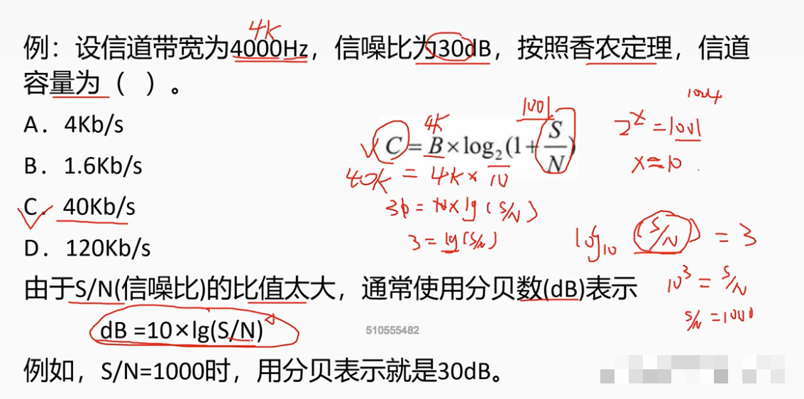
    

## 2.2 复用技术和多只技术

### 2.2.1 复用技术
    复用技术是指将多个信号合并到一个信道中进行传输的技术。
    复用技术的分类：
    - 频分复用（FDM）
    - 时分复用（TDM）
    - 波分复用（WDM）
    - 码分复用（CDM）

### 2.2.2 多址技术
    多址技术是指在同一信道上，多个用户共享信道的传输容量的技术。
    多址技术的分类：
    - 随机接入
    - 轮流接入
    - 分配接入

# 3 网络技术
    网络通畅按网络的覆盖区域通信介质可分为：
    - 广域网（WAN）
    - 城域网（MAN）
    - 局域网（LAN）
    - 无线局域网（WLAN）
    - 移动通信网（Mobile Network）

## 3.1 局域网
> 网络拓扑结构为：总线型、星型。
    局域网是指在某一区域内，由多台计算机互联成的计算机网络。
    局域网的特点：
    - 覆盖范围小
    - 传输速率高
    - 传输距离短
    - 传输介质多样
    - 网络拓扑结构简单
    - 管理简单
    - 成本低廉

### 3.1.1 以太网技术
    以太网是一种计算机局域网技术，是目前应用最广泛的局域网技术。IEEE 802.3标准规定了以太网的工作方式和协议。

### 3.1.2 以太网的拓扑结构
    以太网的拓扑结构有总线型、星型、树型、环型等。
    - 总线型：所有计算机都连接在一条总线上，总线两端分别连接终端电阻。
    - 星型：所有计算机都连接在一个集线器上，集线器的中心连接一个集线器。
    - 树型：所有计算机都连接在一个集线器上，集线器的中心连接一个集线器。
    - 环型：所有计算机都连接在一个集线器上，集线器的中心连接一个集线器。
    - 网络型：所有计算机都连接在一个集线器上，集线器的中心连接一个集线器。
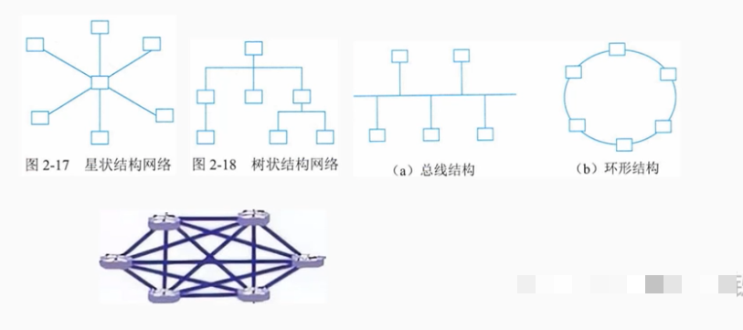

#### 3.1.3 以太网的数据结构
    最大枕长：以太网的数据帧的最大长度为1518字节。 
`最小帧长为64字节（不包括前导字段、帧起始符)`。如果不足64字节，需要填充。 帧头设有32位用于进行CRC32校验，参与校验的帧头找那个去处前导字段和帧起始符之外的部分。
    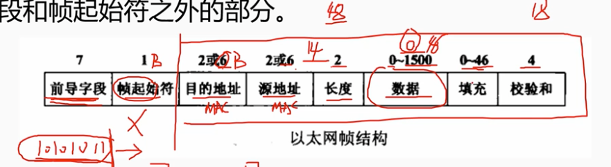

## 3.2 无线局域网
    无线局域网是指利用无线电波作为传输介质的局域网。
    架设无线局域网需要无线网卡和无线接入点AP。
    
### 3.2.1 WLAN标准
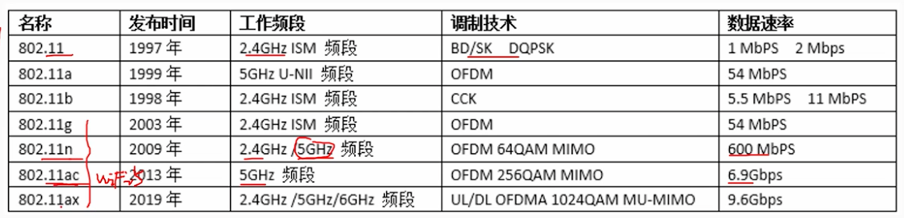

## 3.3 广域网
    广域网是一种分布于更广区域的计算机设备连接起来的网络。
    - 通信子网由通信结点设备和连接这些设备的链路组成。
    - 资源子网主要指网络资源设备，如业务服务器、用户计算机、网络存储系统、网络上运行的各种软件资源、数据资源等。

### 3.3.1 广域网特点
    - 主要提供面向数据通信的服务，支持用户使用计算机进行距离间的信息交换。
    - 覆盖范围广，通信的距离远，广域网没有固定的拓扑结构。
    - 由电信部门或公司组建、管理和维护。向全社会提供有偿服务。

## 3.4 城域网
    城域网是一种介于局域网和广域网之间的计算机网络，是一种覆盖城市范围的计算机网络。
    局域网的主要技术是DQDB（分布式队列双总线），即 IEEE 802.6标准。

## 3.5 移动通信网
    
### 3.5.1 五个发展时期
    - 第一代通信系统审核模拟通信，采用的是FDMA（频分多址)）调制技术，起频谱利用率低。
    - 第二代通信系统采用数字通信，采用的是TDMA（时分多址）调制技术，起频谱利用率高。
    - 第三代通信系统采用3G CDMA（码分多址）调制技术，起频谱利用率更高。
    - 第四代通信系统采用4G OFDMA（正交频分多址）调制技术，起频谱利用率更高。
    - 第五代通信系统采用5G MIMO（多输入多输出）调制技术，起频谱利用率更高。

### 3.5.2 第5代移动通信
    5G具有高速率、低时延和大连接的特点，可以支持更多的用户和更多的应用场景。
    5G的时延要求是1ms，而4G的时延要求是10ms。
    5G的速率要求是10Gbps，而4G的速率要求是100Mbps。
    5G的连接数要求是100万/平方公里，而4G的连接数要求是10万/平方公里。

    - 增强移动宽带eMBB，主要应用于高清视频、VR/AR、智能家居等领域。
    - 超高可靠低时延通信uRLLC，主要应用于工业控制、智能交通、智能医疗等领域。
    - 海量机器类通信mMTC，主要应用于智能家居、智能农业、智能城市等领域。

### 3.5.3 5G网络切片
    5G网络切片是指将5G网络按照不同的业务需求进行切分，为不同的业务提供不同的虚拟网络服务。
    5G网络切片的实现需要网络功能虚拟化NFV和软件定义网络SDN的支持。

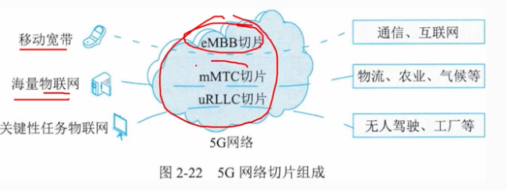

# 4 组网技术
    常见的互联设备有：中继器、集线器、网桥、交换机、路由器、防火墙。

## 4.1 中继器（Repeater）1层设备

    中继器是一种物理层设备，用于放大信号，扩大信号的传输距离。
    中继器的工作原理是：将收到的信号放大后再发送出去。
    中继器的工作过程是：收到信号，放大信号，发送信号。

## 4.2 集线器（Hub）1层设备

    集线器是一种物理层设备，用于将多个计算机连接起来，构成一个局域网。又称多端口中继器，广播发送。
    集线器的工作原理是：将收到的信号放大后再发送出去。
    集线器的工作过程是：收到信号，放大信号，发送信号。

## 4.3 网桥（Bridge）2层设备
    也称桥接器。
    网桥又称桥接器。是一种数据链路层设备，用于连接两个局域网，构成一个更大的局域网。
    网桥的工作原理是：将收到的帧解封装，查找MAC地址表，转发帧。
    网桥的工作过程是：收到帧，解封装帧，查找MAC地址表，转发帧。

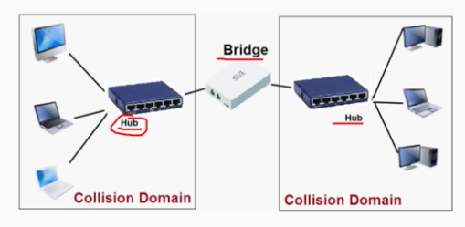

## 4.4 交换机（Switch）2层设备
    又称多端口网桥，4，16，24，48端口。
    交换机是一种数据链路层设备，用于连接多个计算机，构成一个局域网。
    交换机的工作原理是：将收到的帧解封装，查找MAC地址表，转发帧。
    交换机的工作过程是：收到帧，解封装帧，查找MAC地址表，转发帧。
    每一个端口都可视为独立的网段，连接在交换机上的计算机可以同时进行通信。独占带宽。
    例如：100Mbps交换机，每一个端口都是100Mbps。

### 4.4.1 交换原理
    - 转发路径学习：根据收到的数据帧中的原MAC地址，将其与端口号存入地址表中。
    - 数据转发。根据数据帧的目的MAC地址在地址表中查询到了，就行对应端口进行转发。

### 4.4.2 数据泛洪
    数据泛洪是指交换机在转发数据时，如果在地址表中没有找到目的MAC地址，就会将数据帧发送到所有的端口上（不包括源端口）。
    数据泛洪会导致网络拥塞，降低网络的性能。

### 4.4.4 链路地址更新
    链路地址更新是指交换机在转发数据时，如果在地址表中找到了目的MAC地址，就会更新该地址的端口号。
    地址表也会每隔一段时间自动更新（例如：300s）。

## 4.5 路由器（Router）3层设备
    路由器是一种网络层设备（3层设备），用于连接多个局域网，构成一个更大的网络。
    路由器的工作原理是：将收到的数据包解封装，查找路由表，转发数据包。
    路由器的工作过程是：收到数据包，解封装数据包，查找路由表，转发数据包。
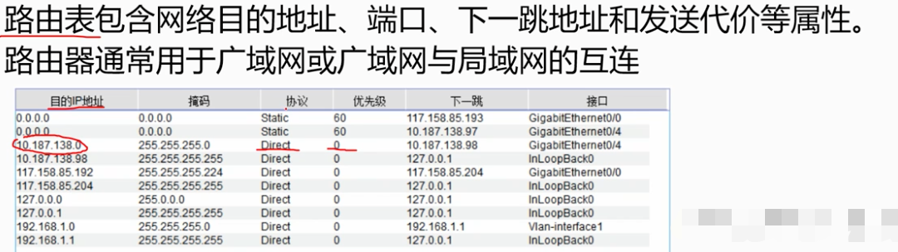

### 4.5.1 内部网关协议IGP。
    RIP-1、RIP-2（路由信息协议）基于距离矢量算法的路由协议，利用条数来作为计量标准。
    IGRP（内部网关路由协议）基于距离矢量算法的路由协议，利用带宽、延迟、可靠性、负载来作为计量标准。
    EIGRP（增强内部网关路由协议）基于距离矢量算法的路由协议，利用带宽、延迟、可靠性、负载来作为计量标准。
    IS-IS（中间系统到中间系统）基于链路状态算法的路由协议，利用带宽来作为计量标准。
    OSPF（开放最短路径优先）基于链路状态算法的路由协议，利用带宽来作为计量标准。
### 4.5.2 外部网关协议EGP目前使用的是BGP协议。

## 4.6 防火墙
    防火墙是一种应用层设备，用于保护网络安全。
    防火墙的工作原理是：根据安全策略，对数据包进行过滤。
    防火墙的工作过程是：收到数据包，根据安全策略，对数据包进行过滤。
    防火墙不能阻止内部网络的攻击。
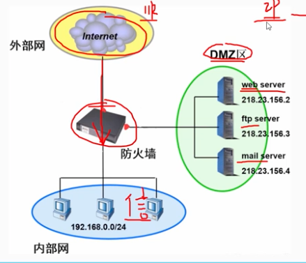

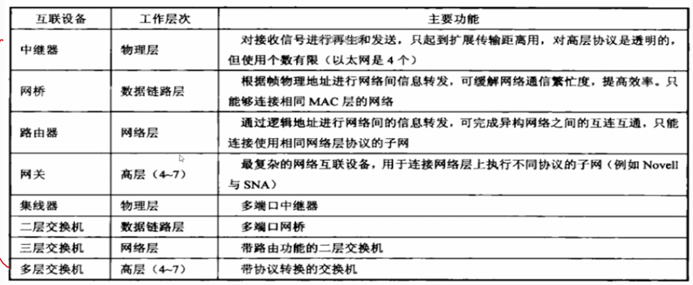

## 4.2 网络协议

### 4.2.1 开放系统互联模型 OSI
    OSI模型是一种理论模型，用于指导网络协议的设计。
    OSI模型共分为7层，分别是：物理层、数据链路层、网络层、传输层、会话层、表示层、应用层。
    OSI模型的作用是：将网络协议分为7层，便于协议的设计、实现、维护、升级。
    OSI模型的缺点是：分层过多，不利于实现。
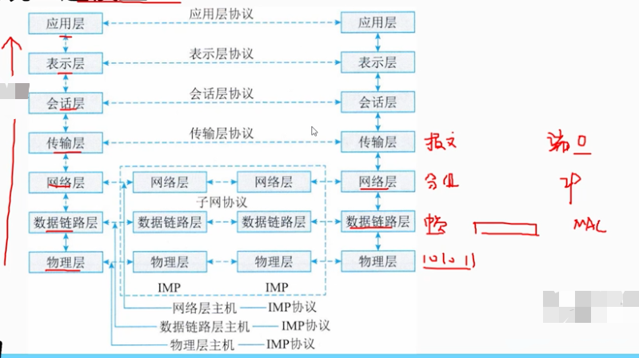

### 4.2.2 TCP/IP模型
    TCP/IP模型是一种实际模型，用于指导网络协议的设计。
    TCP/IP模型共分为4层，分别是：网络接口层、网络层、传输层、应用层。
    TCP/IP模型的作用是：将网络协议分为4层，便于协议的设计、实现、维护、升级。
    TCP/IP模型的缺点是：分层过少，不利于实现。
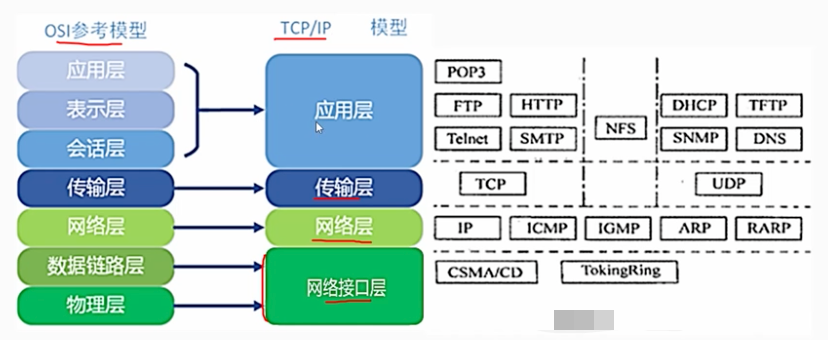

# 5 网络工程
    网络建设工程可分为：网络规划、网络设计、网络实施三个环节。
    网络规划：网络需求分析、可行性分析以及对现有网络的分析。需求为导向
    网络设计：网络总体目标确定、总体设计原则确定、子网设计、设备选型、网络完全设计。
    网络实施：设备采购、安装、调试、系统切换、用户培训等。

