# 2.6 计算机系统基础知识-计算机语言

    面向对象的分析模型主要：
    - 预层架构图
    - 用例与用例图
    - 领域概念模型构成

    设计模型则包含：
    - 以包图表示的软件体系结构图
    - 以交互图表示的用例实现图
    - 完整精确的类图
    - 针对复杂对象的状态图
    - 用以描述流程化处理过程的活动图等

## 1. 计算机语言分类
    机器语言、汇编语言、高级语言

### 1.1 机器语言
    机器语言是计算机能直接识别和执行的语言，它是用二进制代码表示的，是一系列0和1的排列组合。
    机器语言的优点：计算机能直接识别和执行，执行速度快。
    机器语言的缺点：难以理解和记忆，不便于人们使用。

### 1.2 汇编语言
    汇编语言是用助记符来代替机器语言中的0和1，是一种低级语言。需要翻译成机器语言执行。
    汇编语言的优点：比机器语言更容易理解和记忆。
    汇编语言的缺点：不便于人们使用，不同的计算机CPU有不同的汇编语言。

### 1.3 高级语言
    高级语言是一种人们能够理解和使用的计算机语言，它是一种独立于计算机硬件平台的语言。
    简单易学、编程效率高、可移植性强。
    高级语言的优点：便于人们理解和使用，不依赖于计算机硬件平台。
    高级语言的缺点：执行速度慢。

## 2. 建模语言

    UML（统一建模语言）是一种用于软件开发过程中进行软件蓝图绘制的语言。
    独立于任何具体程序设计语言，是一种通用的建模语言。支持从需求分析到系统构建的所有模型化过程。

### 2.1 UML的组成要素

    UML3个要素组成
    - UML事物
    - UML关系
    - UML图
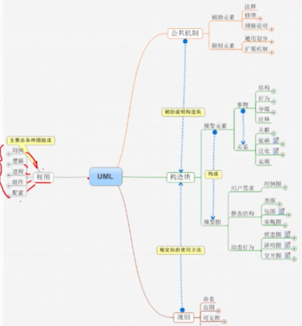

### 2.2 UML 事物

    UML有4种事物：结构事物、行为事物、群体事物、注释事物。

#### 2.2.1 结构事物
    结构事物是系统中的静态部分
    类：是对一组具有相同属性、操作、关系和语义的对象的描述。
    接口：是一组具有相同语义的操作的集合。
    节点：是一个物理元素，是一个计算资源，通常是一台计算机。
    组件：是一个物理元素，是一个可替换的模块，是一个可替换的实现单元。
    用例：是对系统功能的描述，是一个用户可以执行的一个任务或者一个用户可以执行的一个功能。
    制品：是系统的物理部分，是系统的构成元素，是系统的实现单元。
    构建：是一个物理元素，是一个部署单元，是一个可替换的实现单元。
    主动类：是一个类，是一个主动对象，是一个主动实体，是一个主动的参与者。
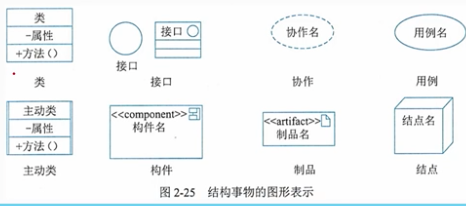

#### 2.2.2 行为事物
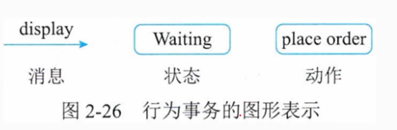

#### 2.2.3 分组实物
    
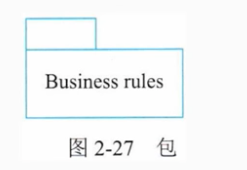

#### 2.2.4 注释事物
    注释事物是对模型的说明和解释，是对模型的补充说明。
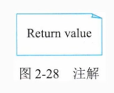

### 2.3 关系
    UML中的4种关系：依赖关系、关联关系、泛化关系、实现关系。
#### 2.3.1 依赖关系：是两个事物间的语义关系，其中一个事物的变化会影响另一个事物。
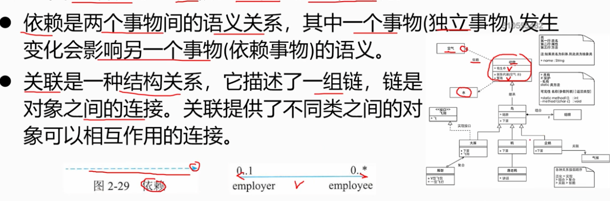
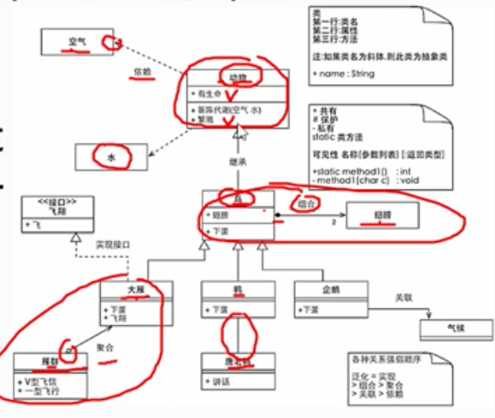

#### 2.3.2 关联关系，语义非常弱。使用直线或者带有箭头的直线表示。

    - 聚合关系：特殊的关联关系。整体和部分之间的关系，整体与部分之间是可分离的。是一种强的关联关系。
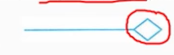
    - 组合关系：特殊的关联关系。也叫强聚合关系。整体与部分之间是不可分离的。是一种更强的关联关系。

### 2.3.3 泛化关系
    是一种继承关系，是一种父类和子类之间的关系。
    子类可以替换父类，父类不能替换子类。
    泛化关系化成带有空心三角形的直线表示，箭头指向父类。

### 2.3.4 实现关系
    是一种接口和实现类之间的关系。
    实现关系化成带有空心三角形的虚直线表示，箭头指向接口。
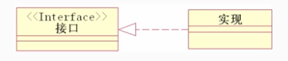

## 2.4 UML中的图
    UML提供了13中图：用例图、
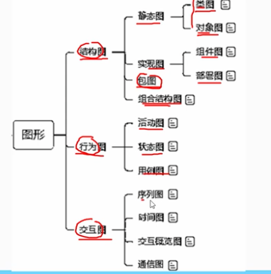
    
### 2.4.1 用例图
    use case diagram
    描述一组用例、参与者以及它们之间的关系。
    用例图是描述系统功能的图，是描述系统的外部视图。
    用例图的组成：参与者、用例、关系。
    用例图的作用：用于需求分析、用于系统设计、用于系统测试。
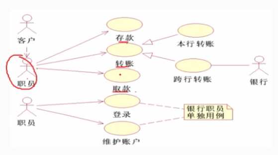

### 2.4.2 类图
    class diagram
    描述系统中的类、接口、关系以及它们之间的静态结构。
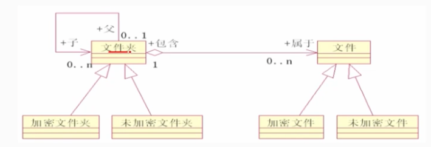

### 2.4.3 顺序图
    sequence diagram
    一种交互图，描述对象之间的动态视图，强调对象之间消息发送的时间顺序。
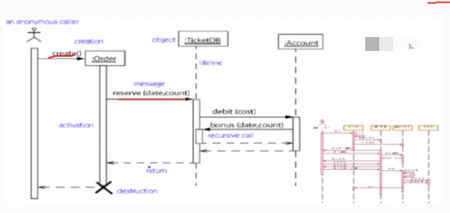

### 2.4.4 协作图
    collaboration diagram
    一种交互图，描述对象之间的动态视图，强调对象之间的结构组织。
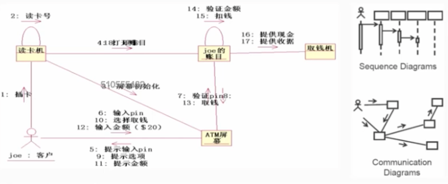
 
### 2.4.5 活动图
    activity diagram
    描述系统中的活动以及活动之间的关系。专注于系统的动态视图。
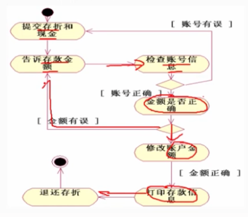

### 2.4.6 状态图
    state diagram
    描述系统中的状态以及状态之间的转换。
！

### 2.4.7 构件图
    component diagram
    描述一个封装的类和它的接口、端口，以及由内嵌的构建和连接件构成的内部结构。
    构件图是静态视图。
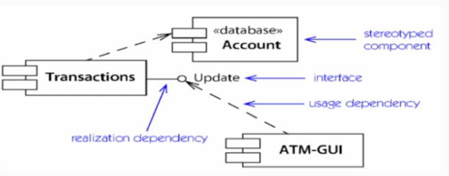

### 2.4.8 部署图
    deployment diagram
    描述系统中软件和硬件的物理架构。
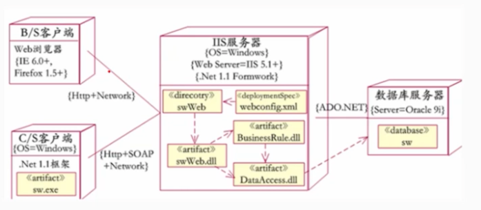

## 2.5 视图
    用例视图、逻辑视图、进程视图、实现视图、部署视图
    - 用例视图描述系统的功能需求
    - 逻辑视图描述系统概念设计和自行结构
    - 进程视图描述系统的并发性和同步的情况
    - 实现视图描述系统构件、代码、组成结构
    - 部署视图描述系统的物理架构
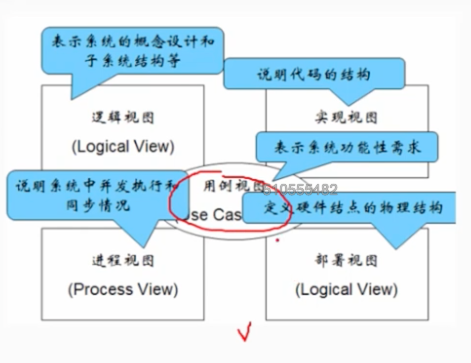