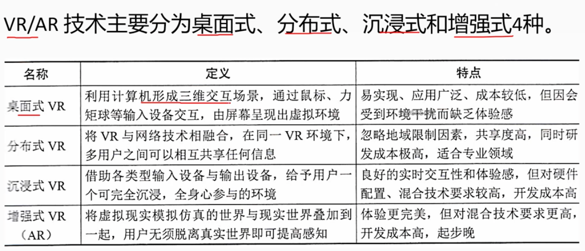

# 2.7 计算机系统基础知识-多媒体

## 1 多媒体的概述
    媒体是信息的载体，多媒体是指多种媒体的集合。

### 1.1 感觉媒体
    感觉媒体是指能够直接感觉到的媒体，如：视觉、听觉、嗅觉、味觉、触觉等。

### 1.2 表示媒体
    指信息的表示形式。如：文字、数字、图形、图像、声音、动画、视频等。
    感觉媒体装换成表示媒体后，能在计算机进行处理
    
### 1.3 表现媒体
    也称显示媒体，是指能够表现和获取信息的物理设备。
    如：鼠标、键盘、显示器、打印机等。

### 1.4 存储媒体
    指用于存储信息的媒体，如磁带、磁盘、光盘等。

### 1.5 传输媒体
    指用于传输信息的媒体，如电话线、光纤等。

## 2 多媒体关键技术

### 2.1 视音频技术

#### 2.1.1 视音频编码
    编解码器是指将模拟信号转换成数字信号的设备，也称为编码器。
    常见格式：MPEG、AVI、MOV、RM、ASF、WMV、FLV、MP4、MKV等。

#### 2.1.2 视音频压缩方法
    - 无损压缩
        无损压缩是指压缩后的数据与原始数据完全一致。
        常见格式有：WAV/PCM/TTA/FLAC/AU/APE/TAK/WAVPACK等。

    - 有损压缩
        有损压缩是指压缩后的数据与原始数据不完全一致。
        常见格式有：MP3/AAC/AC3/AMR/WMA/OGG/VQF等。

#### 2.2 数据压缩技术

    - 即时压缩和非即时压缩
    
    - 数据压缩和文件压缩

    - 无损压缩和有损压缩

#### 2.3 虚拟现实VR/增强现实AR技术
    - 虚拟现实VR
        虚拟现实是指通过计算机生成的虚拟环境，让用户感觉自己身临其境。
        VR技术包括：虚拟环境的建模、虚拟环境的渲染、虚拟环境的交互等。
    - 增强现实AR
        增强现实是指将虚拟信息与真实世界信息相结合，让用户感觉虚拟信息与真实信息融为一体。
        AR技术包括：虚拟信息的获取、虚拟信息的融合、虚拟信息的显示等。
