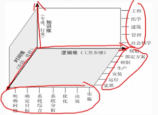

# 2.8 计算机系统基础知识-系统工程

## 1 系统工程的基本概念
    系统工程师为了更好的实现系统的目的，对系统的组成要素、组织结构、信息流、控制机构等进行分析研究的科学方法。
    钱学森在1978年提出了系统工程的定义：
    系统工程是组织管理“系统”的规划、研究、设计、制造、实验和使用的科学方法。
    是一种对所有系统都具有普遍意义的科学方法。

## 2 系统工程的方法
    系统工程的方法包括系统分析、系统设计、系统实现、系统维护等。

### 2.1 霍尔的三维结构
    霍尔的三维结构是指：时间维、逻辑维、知识维。

- 时间维
    时间维从系统活动开始到结束时间顺序排列全过程：规划、拟定方案、研究、生产、安装、运行、更新7个阶段。
- 逻辑维
    逻辑维是时间维的每个阶段内要进行的工作内容和应该遵循的思维程序。包括：明确问题、确定目标、系统综合、系统分析、优化、决策、实时7个步骤。
- 知识维
    知识维需要运用包括工程、医学、建筑、商业、法律、管理、社会科学、艺术等各种知识和技能。

### 2.2 切克兰德方法
    切克兰德方法分为7个步骤：
- 识别问题
- 根底定义
- 建立模型
- 比较及探寻
- 选择方案
- 设计与实施
- 评价与反馈

### 2.3 并行工程方法
    并行工程方法是指在系统工程的各个阶段中，各个专业的人员同时参与，同时进行，相互配合，相互影响，相互促进，以达到提高效率的目的。
    具体做法：在产品开发阶段，组织多种职能协同工作的项目组，使有关人员从一开始就获得对新产品需求的要求和信息，积极研究设计本部门的工作业务，并将响应的要求提供给设计人员，使许多问题再开发阶段就得到解决。

### 2.4 综合集成法
    1990年初，钱学森等首次把处理开放的复杂巨系统的方法命名为从定性到定量的综合集成法。系统分为简单系统和巨系统两大类。
- 简单系统：组成系统的子系统数量比较少，他们之间的关系比较简单厨的统称为简单系统，如一台测量仪器。
- 巨系统：子系统数量非常巨大，则成为巨系统。
- 简单巨系统：巨系统中子系统种类不太多，且他们之间关系比较简单，称为简单巨系统。
- 复杂巨系统：子系统数量非常巨大，且他们之间关系非常复杂，称为复杂巨系统。

### 2.5 WSR系统方法
    WSR是梳理、事理、人理方法轮的简称，它即是一种方法论，有事一种解决复杂问题的工具。
    "懂物理、明事理、通人理"就是WSR方法轮的实践准则
    包括七步：理解意图、指定目标、调查分析、构造策略、选择方案、协调关系和实现构想。
    这些步骤不严格一定依照次序，协调关系始终贯穿于整个过程。

## 3 系统工程的生命周期

### 3.1 生命周期阶段
- 探索性研究阶段
- 探索性研究阶段
- 概念阶段
- 开发阶段
- 生产阶段
- 使用阶段
- 保障阶段
- 退役阶段
- 
### 3.2 生命周期方法

#### 3.2.1 计划驱动方法
    提供一种基础的框架，位生命周期流程（需求、设计、构件、测试、部署）提供规程。
    计划却用方法的特征在于整个过程始终遵守规定流程的系统化方法。特别关注文档的完整性、需求的可追溯性以及每种表示的事后验证。

#### 3.2.2 渐进迭代式开发
    渐进迭代式开发允许位项目提供初始能力，随之提供连续交付以达到期望的系统。
    目标在于快速产生价值并提供快速响应能力。
    当需求不清晰不确定或者客户系统在系统中引入新技术时，可使用这个方法。若不满足，则新启一轮演进，并重复该流程，直到满足客户需求。
    适用于较小的、不太复杂的系统
    
#### 3.2.3 精益开发
    精益开发的目标是通过彻底消除浪费来提高开发效率。例如不一致的需求、不必要的复杂性、过度设计、不必要的代码、重复的测试、不必要的文档等。

#### 3.2.4 敏捷开发
    敏捷开发是一种以人为本的、迭代的、增量的开发方法，它能够快速响应需求的变化，同时也能够提高开发效率。
    敏捷开发的关键在于灵活性，当风险可接受时允许排除选定的事件。