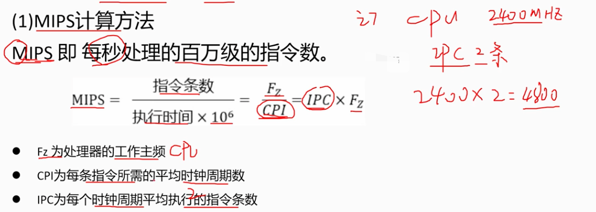
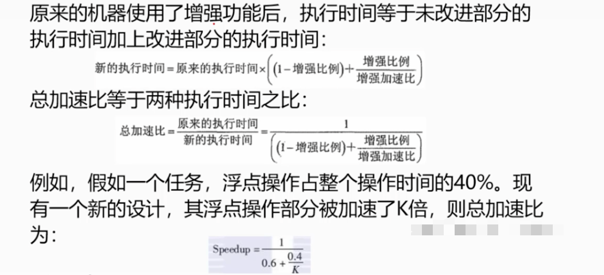

# 2.9 计算机系统基础知识-系统性能

## 1. 系统性能
    是系统提供给用户的所有性能指标的集合。
    系统性能包括性能指标、性能计算、性能设计、性能评估四个方面。

### 1.1 系统性能的指标

```text
    时钟频率、运算速度、运算精度、内存的存储容量、存储器的存取周期
    数据处理速率PDR、吞吐率、各种响应时间、各种利用率
    RASIS 特性：可靠性（Reliability）、可用性（Availability）、可维护性（Serviceability）、完整性（Integrity）、安全性（Security）
    平均故障响应时间、兼容性、可扩展性、性价比
```

### 1.2 路由器的性能指标

```text
    路由器的主要性能指标有设备吞吐量、端口吞吐量、全双工线速转发能力、背靠背恢数、路由表能力、背板能力、丢包率、时延时延抖动、
    VPN 支持能力、内部时钟精度、队列管理机制、端口硬件队列数、分类业务带宽保证、RSVP、IP Diffserv、 CAR 支持几余、
    热插拔组件、路由器几余协议、网管、基于 Web 的管理网管类型、带外网管支持、网管粒度、计费能力/协议、
    分组语音支持方式、协议支持、语音压缩能力、端口密度、信令支持
```

### 1.3 交换机的性能指标

```text
    交换机性能指标有交换机类型、配置、支持的网络类型、最大ATM 端口数、最大SONET 端口数、最大FDDI端口数、
    背板吞吐量缓冲区大小、最大 MAC 地址表大小、最大电源数、支持协议和标准、最大VLAN 数量、网管、支持网管类型、
    支持端口镜像Qos、支持基于策略的第2层交换、每端口最大优先级队列数、支持基于策略的第3 层交换、支持基于策略的应用级 QOS、
    支持最小最大带宽分配、冗余、热交换组件(管理卡、交换结构、接口模块、电源、冷却系统)、支持端口链路聚集协议、负载均衡
```

### 1.4 网络的性能指标

```text
    设备级性能指标、网络级性能指标、应用级性能指标、用户级性能指标和吞吐量
```
### 1.5 操作系统的性能指标

```text
    操作系统的性能指标有系统上下文切换、系统响应时间、系统的吞吐率、系统资源利用率、可靠性、可移植性。
```

### 1.6 数据库管理系统的性能指标

```text
    衡量数据库管理系统的主要性能指标包括数据库本身和管理系统两部分，包括数据库的大小、数据库中表的数量、
    单个表的大小表中允许的记录(行)数量、单个记录(行)的大小、表上所允许的索引数量、数据库所允许的索引数量、
    最大并发事务处理能力、负载均衡能力、最大连接数等
```

### 1.7 WEB服务器的性能指标

    最大并发连接数、响应延迟、吞吐量。

## 2 性能指标的计算
    性能指标的计算方法：
- 定义法：根据定义直接获取器理想数据
- 公式法：根据定义所衍生的负荷性能指标的计算
- 程序检测法：通过程序进行实际的测试来得到其实际值
- 仪器检测法：通过硬件一起进行测量得到其实际值。

### 2.1 常见指标计算方法：

- MIPS 计算方法
```text
MIPS 即每秒处理的百万条指令数
MIPS = 指令条数/（执行时间*10^6）=Fz/CPI=IPC*Fz

Fz 为处理器的工作主频
CPI 为每条指令的平均时钟周期数
IPC 为每个时钟周期内执行的指令条数
```



- 峰值计算
```text
衡量计算机系统性能的一个重要指标是系统的峰值性能，即系统在某种条件下的最大性能。
理论峰值是该计算机理论上每秒钟能完成浮点计算最大次数，它主要是由cpu的主频决定。
理论浮点峰值 = cpu主频 * cpu每个始终周期浮点计算次数 * cpu数量
```

- 等效指令速读法
```text
也称Gibson(吉普森）法，通过统计各类指令在程序中所占比例进行折算。

T=W1*T1+W2*T2+W3*T3+...+Wn*Tn (n为指令种类数，Wi为第i类指令所占比例，Ti为第i类指令的执行时间)
```

## 3. 性能设计

### 3.1 性能调整
    为了优化系统性能，需要对系统进行性能调整：
    收集状态、分析问题、配置系统、测试。通过折个步骤反复标间，优化系统性能指标。

### 3.2 阿姆达尔解决方案
    阿姆达尔定律定义了采用特定部件所取得的加速比。
    加速比=不使用增强部件时完成整个任务的时间/使用增强部件时完整整个任务的时间。


## 4. 性能评估
 
    性能评估是为了一个目的，按照一定的步骤，选用一定的度量项目，通过建模和实验，对系统的性能进行各项检测，测试结果做出解释。
    位性能的优化提供参考。

### 4.1 基准测试程序

    易考程序来评价机器的性能。
    
    准确度依次递减：
    真实的程序>核心程序>小型基准程序>合成基准程序。
    
    把应用程序中用得最多、最频繁的那部分核心程序作为评价计算机性能的标准程序，成为基准测试程序。
    
    有：整数基准测试程序，浮点测试程序，whetstone基准测试程序，spec基准测试，tpc基准测试

### 4.2 Web服务器的性能评估

    在Web服务器测试中，反应性能的主要指标有：
    - 最大并发连接数
    - 响应延迟
    - 吞吐量等
    
    常见Web服务器性能评测方法：
    - 基准性能测试
    - 压力测试
    - 可靠性测试

### 4.3 系统监视

    系统监视方法：

- 通过系统本身提供的命令：w,ps,last,netstat等命令进行
- 通过系统记录的文件日志
- 集成命令、文件记录和可视化技术。如：win的perfmon应用程序。