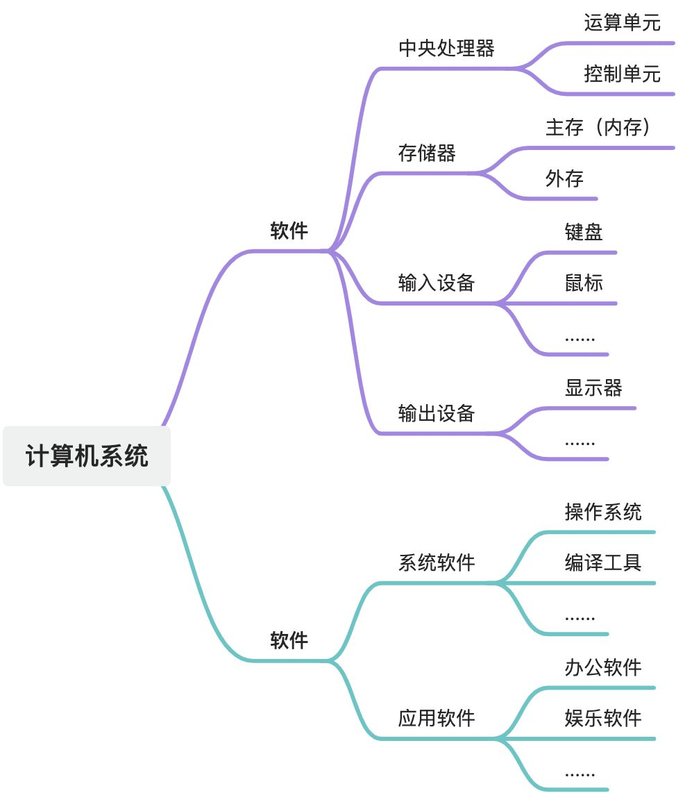
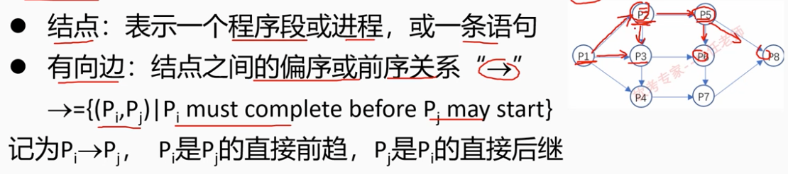
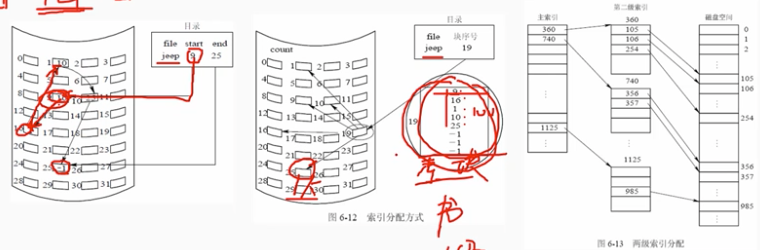
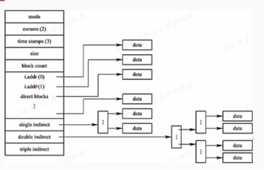
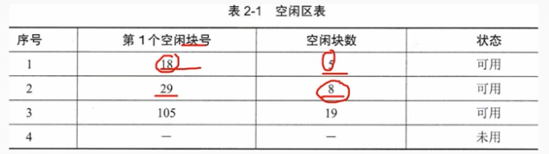
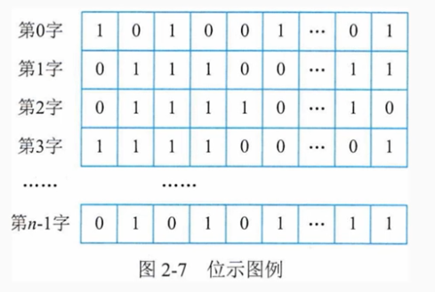
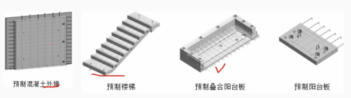
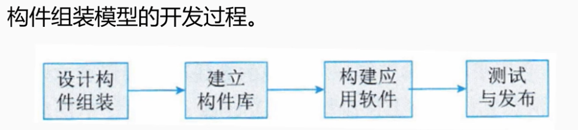
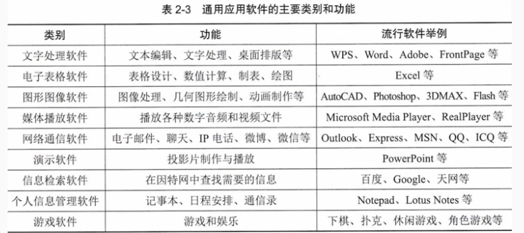

# 一、计算机系统-概述

# 二、计算机硬件
## 计算机硬件组成
冯-诺依曼 计算机结构硬件5部分组成

按照传输过程划分为：总线、接口、外部设备。

## 1 处理器
### 1.1 控制器：是分析和执行指令的部分

- 指令寄存器 IR
- 指令译码器 ID
- 程序计数器 PC

### 1.2 运算器：负责完成算数、逻辑运算功能

- 算数逻辑单元 ALU
- 累加寄存器 AC
- 通用寄存器组

CISC 复杂指令集系统 
RISC 精简指令集系统

## 2 存储器
### 2.1RAM: 随机存储器，可读、写，只能暂存数据，断电后数据丢失

- SRAM ： 静态随机存储器，读写速度快，生产成本高。用于容量较小的告诉缓冲存储器。 Cache，Mb级别
- DRAM :  动态随机存储器，定时刷新以维持信息不丢失。读写速度慢，集成度高，成本低，用于容量较大的主存储器。内存，Gb级别
### 2.2 ROM：只读存储器，掩膜技术写入（光刻技术），常用于bios和微程序控制。
### 2.3 EPROM： 可擦除的ROM，可多次写入。
### 2.4 E2PROM: 电可擦除EPROM，可以写入，速度慢
### 2.5 闪存存储器（flash memory): 其特性介于EPROM和E2PROM之间，不能进行字节级别删除，只能删除块。
### 2.6 Disk 和磁带

## 3 总线
总线是值计算机部件间遵循一种恶性协议是吸纳数据交换的形式：

- 内总线：用于各芯片内部互连，也可成为片上总线（On-ChipBus)或片内总线
- 系统总线：值cpu/主存/io接口的总线
- 外部总线：是机板和外部设备之间，计算机系统之间互连的总线，又称为通信总线。

## 4 接口
接口是统一计算机不同功能层之间的通信规则。常见的包括：

- 显示类接口：HDMI、DVI等
- 音频输入类接口：TRS/RCA/XLR等
- 网络类接口：RJ45/FC等
- PS/2接口、USB接口、SATA接口，LPT打印接口等。
## 5 外部设备
### 5.1 常见的外部设备：键盘、鼠标、显示器、扫描仪、摄像头、麦克风、打印机、光驱、网卡、存储卡等
### 5.2 移动穿戴设备：加速剂、gps、陀螺仪、感光设备、指纹识别等。
### 5.3 工业控制、航空航天、医疗领域：测温仪、测速仪、轨迹球、操作面板、红外设备、机械臂、液压装置、驾驶杆等。
# 三、计算机软件
## 1 计算机软件概述
软件系统是指在计算机硬件系统上运行的程序、相关的文档资料和数据的复合。
**系统软件**和**应用软件**两类。
系统软件包括：操作系统、程序设计语言翻译系统、中间件、数据库管理系统和网络软件等。
应用软件：如图像处理软件、财务软件。解决特定问题而设计的软件。
## 2 操作系统
是计算机系统的资源管理者。它包含对软件软、硬件资源实施管理的一组程序，通过cpu管理、存储管理、设备管理和文件管理对各种资源进行合理的分配，改善资源的共享和利用程度，最大程度法医计算机系统效率。
### 2.1 操作系统特性

- 并发性 ： 是指在一段时间内，宏观上有多少个程序同时运行，但实际上是单cpu的运行环境，每一个时刻只有一个程序在执行。
- 共享性：共享是操作系统中的资源被多个并发执行的进程共同使用，而不是一个进程锁独占。
- 虚拟性：指一个物理实体编程逻辑上的多个对应物【实体硬盘可以被虚拟出多个盘符】，或吧物理上多个实体编程逻辑上一个对应物【2个物理内存条是一个虚拟资源】。
- 不确定性：指在多道程序环境中，允许多个程序并发执行，CPU资源有限，多数情况下进程的执行不是一贯到底，走走停停。
### 2.2 操作系统分类

- 批处理操作系统，一次处理一匹数据，处理完后再响应
- 分时操作系统
- 实时操作系统
- 网络操作系统
- 分布式操作系统
- 微型计算机操作系统  win,mac 等系统
- 嵌入式操作系统
### 2.3 前驱图
前驱图是一个有向无循环图（DAG），用于描述进程之间执行的前后关系。

## 3 数据库
 	是长期存储在计算机内、有组织的、统一管理的相关数据的集合。
常见的数据库是关系型数据库和非关系型数据库。
更具数据库存储体系分类，可以分为关系型数据库、键值数据库、列存储数据库、文档数据库、搜索引擎数据库。

## 4 文件系统
文件是具有文件名和逻辑上具有相关信息的集合。现代os中通过文件系统来组织和管理计算机中存储的数据。
### 4.1 文件的结构

- 逻辑结构。两类：有结构的记录式文件 excel文件；无结构的流式文件，源程序文件。
- 物理结构。又称为文件的存储结构，是指文件在外村上的存储组织形式。与存储的存储次性能和采用的外存分配方式有关。
### 4.2 文件的物理结构（外存分配方式）

- 连续分配
- 链式分配
- 索引分配

直接索引、多级索引

混合索引

### 4.3 存储空间的管理

- 空闲区表
- 位示图
- 
- 

## 5 中间件

- 消息中间件

实现不同应用间大量的数据交换。消息队里、消息传递。

- 事务处理中间件

主要功能提供食物处理的通行、并发控制
## 6 软件构件（组件）
构件又称组件。是一个自包容、可复用的一组程序的集合，构件对外提供统一的访问接口，只能通过接口来访问构建，不能直接操作构建的内部。

## 7 应用软件

