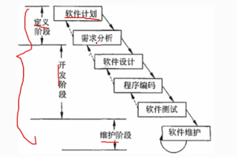
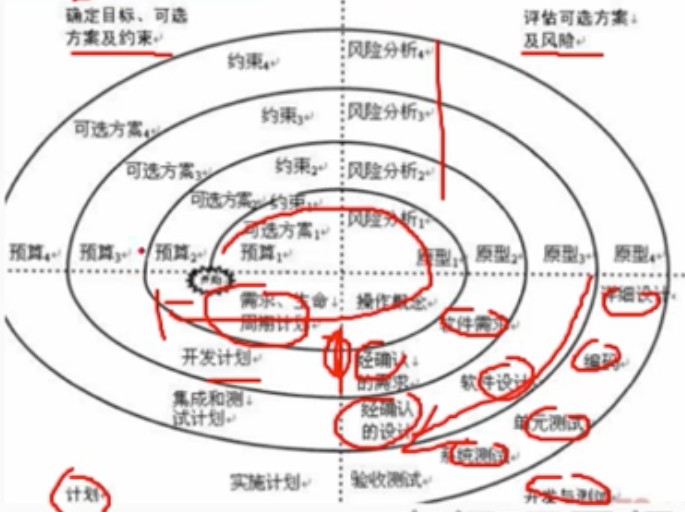
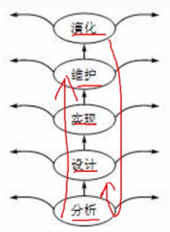
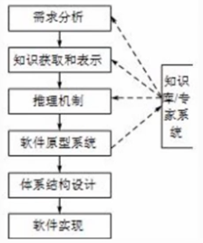

# 5.1 软件工程

> 软件危机：
    软件开发难度难以预测、软件开发成本难以控制、难以满足用户期望、质量无法保证、难以维护、缺少文档资料。
    为了解决软件违建，提出了软件工程的概念。

## 1 软件工程定义
    将系统化的、严格约束的、可量化的方法应用于软件的开发、运行和维护，即将工程化的方法应用于软件开发。
    软件要经历从需求分析、软件设计、软件开发、运行维护，直至被淘汰这样的全过程，这就是软件生命周期。
    为了是软件生命周期中个性任务有序按照规程进行，需要一定的工作模型对各项任务给予规程约束，这样的工作模型称为生命周期模型。

## 2. 软件过程模型

## 2.1 瀑布模型

    瀑布模型是一种线性的软件开发过程模型，是最早的软件开发过程模型。
    优点：每个阶段都由划分的检查点；前一个阶段完成后只需要关注后续阶段，提供了一个共同的模板，有一个共同的指导。
    缺点：（1) 产生了大量文档，增加了工作量。
        （2）开发模型是线性的，用户只能等到全部开发完成后才能看到软件，不能及时发现问题。
        （3）不适应用户需求的变化，一旦需求变化，就需要重新回到需求分析阶段。
        （4）开发前期未发现的错误，会在后期被发现，导致后期的工作量增加甚至失败。
    瀑布模型的阶段：
- 软件计划
- 需求分析
- 软件设计
- 编码
- 测试
- 运行维护

## 2.2 原型化模型

    指在获取一组基本的需求定义后，利用高级软件工具可视化的开发环境，快速建立一个目标系统的初始版本，
    并把他交给用户使用、补充和修改，在进行新的版本开发。
    反复进行这个过程，直到用户满意为止。

（1）从原型是否实现功能来分：水平原型（主要用于界面）、垂直原型（实现部分功能）
（2）从原型最终结果来分：抛弃型原型（探索型原型）、演化型原型（增量式开发）

    适用于需求不明确的情况，可以快速的建立原型，让用户参与，可以及时发现问题，减少开发成本。

## 2.3 螺旋模型

    将瀑布模型和演化型模型，综合了两者优点，并增加了风险分析。
    它以原型为基础，沿着螺线自馁向外螺旋，每旋转一圈都要经过一次完整的软件开发过程。
    制定计划、风险分析、实时工程、客户评价、发布原型的一个新版本、进入下一个螺旋。
    
    优点：
        涉及灵活、在项目各个阶段变更
        以小的分段来构建大型系统
        用户可以参与每个阶段的开发
        客户始终能够看到系统的进展，有效的反馈

    缺点：
        需要对项目的风险有很好的评估
        过多的迭代胡增加开发成本，延迟提交时间

## 2.4 喷泉模型

    是一种用户需求为动力，以对象为驱动的模型，主要用于面向对象的软件开发。
    开发过程: 自下而上，各级段相互迭代和无间隙（分析、涉及、编码不能存在明显边界）的交互，直到软件开发完成。
    

## 2.5 智能模型

    用于知识软件的开发模型，它把瀑布模型和专家系统结合在一起，利用专家系统来帮助软件开发人员的工作。
    该模型主要应用基于规则的系统，采用归约和推理机制，帮助软件开发人员完成开发工作。

## 2.6 增量模型

    瀑布和原型模型的结合。
    第一个增量式核心的产品，是一个核心产品，它包含了最基本的需求，是最小的可交付的产品。
    每一个增量都是客户对使用和评估的基础上，逐步增加的。不断重复，直到完成整个产品。

    增量模型与原型实现模型和其它演化方法一样，都是一种迭代的开发模型。
    区别：增量模型每一个增量均发布一个可操作产品。只需某个增量包的需求出来即可进行开发。

    优点：（1）人员分配灵活，初期不用太大投入
        （2）每隔一段时间就提交用户部分功能，用户可直观感受项目进展，及时使用产品功能
        （3）有利于风险把控。
        （4）功能细化，分别开发，适用于经常改变的软件开发过程。

    缺点：（1）各个构件是逐渐加入，所以加入构件不能破坏现有的系统部分。
        （2）需求的变化是不可避免的，边做边改，容易失去整体性。
        （3）增量包存在相交的情况且不容易处理，需要做全盘分析

## 2.7 迭代模型

    将每一生命周期变成若干个阶段，每一个阶段都是若干或全部流程组成。
    主要包含4个阶段：吃屎阶段、细化阶段、构建阶段、交付阶段。
    - 在迭代模型中，每一次的迭代都会产生一个可以发布的产品，这个产品可以是一个子系统，也可以是一个完整的系统。
    - 迭代模型适用于项目实现的需求不明确的情况，计划多起开发的情况。