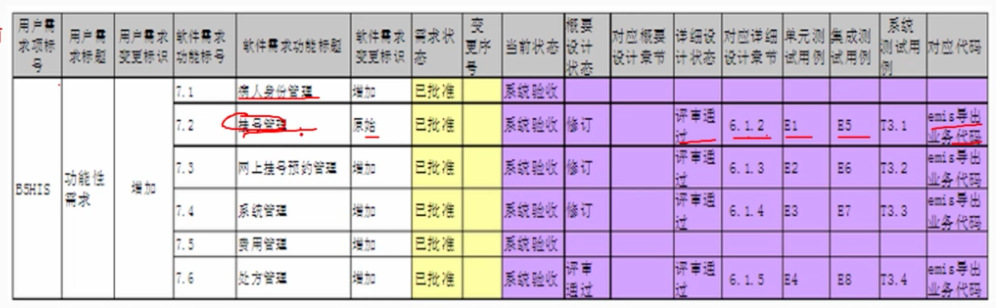

# 5.2 需求工程

    需求工程是包括创建和维护系统需求文档所必需的一切活动的过程，可分为需求开发和需求管理。

（1）需求开发

    - 需求获取
    - 需求分析
    - 需求规格说明书（需求定义）
    - 需求验证

（2）需求管理

    - 定义需求基线
    - 处理需求变更
    - 需求跟踪

    这两方面是相辅相成的，需求开发是主线，是目标；需求管理是支持，是保障。

## 1. 需求开发概述

    需求开发所要做的工作是深入描述软件的功能和性能，确定软件设计的限制和软件与其他系统元素的接口细节，第一软件的其他有效性需求，细化软件要处理的数据和数据结构，以及软件的运行环境。
    用一句话概括：需求开发主要确定开发软件的功能、性能、数据和界面等方面的需求。

### 1.1 需求的分类

    软件需求包括功能需求、非功能需求和设计约束。
（1）功能需求：描述软件应该做什么，包括输入、输出、处理和存储等方面的需求。
（2）非功能需求：是指产品必须具备的西能和品质，例如：可能性、容错性等。
（3）设计约束：也称为限制条件、补充归约，通常是对解决方案的一些约束说明。

### 1.2 三个不同层面下的需求概念

（1）业务需求：是指反映组织结构或客户对系统、产品高层次的目标要去，通常问题定义本身就是业务需求。
（2）用户需求：是指描述用户使用产品必须要完成什么任务以及怎么完成需求，是从具体用户角度考虑的需求。
（3）系统需求：是从系统的角度来说明软件的需求，它包括了用特性说明的功能需求，质量属性及其他肺功能需求，还有设计约束等。

## 2. 需求获取

    - 用户访谈
    - 需求专题讨论会
    - 用户调查
    - 现场观摩
    - 阅读历史文档：原型化方法
    - 头脑风暴法：一群人围绕业务，发散思维，产生创意的方法

### 2.1 需求获取策略

    在整个需求过程中，需求捕获、需求分析、需求定义、需求验证四个阶段不是瀑布式的发展，而是迭代式的演化过程。

    不要期望一次就将需求收集完，而是捕获需求后、分析、发现不足、再次捕获、分析、发现不足，如此循环，直到满足需求。

## 3. 需求分析

（1）结构化分析方法

（2）面向对象分析方法

（3）面向问题域的分析方法（PDOA）

## 4. 需求定义

    需求定义的过程就是形成需求规格说明书的过程，通常有两种需求定义方法：
    - 严格定义方法
    - 原型方法

### 4.1 严格定义方法

        严格定义（预先定义）是目前采用较多的一种需求定义方法。
        在采用严格定义的产痛的结构化开发方法中，各个工作阶段排列成一个理想的线性开发序列，在每一工作阶段中，都用上一阶段锁提供的完整、严格的文档作为指导文件。
    因此它本质上是一种书序行的开发方法。
        需求严格定义建立在以下假设基础之上（基本上不可能的）：
    （1）所有需求窦娥能欧倍预先定义
    （2）开发人员与用户之间能够准确而清晰地交流。
    （3）采用图形/文字可以充分体现最终系统。
        缺陷：
    （1）文档量大
    （2）可见性差，来自用户的反馈太迟。

### 4.2 原型方法

        原型画的需求定义过程是一个开发人员与用户同理合作的反复过程。从一个能满足用户基本需求的原型系统开始，允许用户在开发过程中提出更好的要求，
    根据用户的需求不断地对系统进行完善，它实质上是一种迭代循环性的开发方式。
        原型方法需注意的问题：
    （1）并非所有的需求都能子啊系统开发前被准确地说明。
    （2）项目参加者之间通产存在交流上的困难，原型提供了克服该困难的一个手段。
    （3）需要实际的、可供用户参与的系统模型。
    （4）有合适的系统开发环境。
    （5）反复是完全需求和值得提倡的，需求一旦确定，就应遵从严格的方法。

### 4.3 需求说明书
    
    需求说明书是需求开发阶段的成果。
    - 所有子系列项目规划、设计和编码的基础。
    - 软甲项目后期开发和维护的基础。
    - 系统测试和用户文档的基础
    不应该包括设计、构造、测试、工程管理的细节，也不应该包括对伏安法的详细过程描述。

## 5. 需求管理

    软件需求开发的最终文档经过评审批准后，定义了开发工作的需求基线(baseline)。
    这s个基线在用户和开发人员之间构筑了计划产品功能需求和非功能需求的一个约定(agreement),它是需求开发和需求管理之间的桥梁。

    需求管理包括：
        需求基线定义
        处理需求变更
        需求跟踪
    
    需求跟踪分为正向跟踪和逆向跟踪，合称为“双向跟踪”
    - 无论采用何种跟踪方式，都要尽力与维护需求跟踪矩阵。
    - 需求跟踪矩阵保存了需求和后续工作成果的对应关系，是需求跟踪的重要工具。

