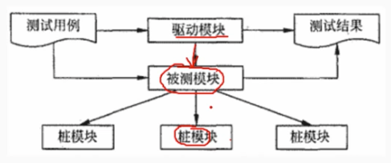

# 5.4 软件工程-系统测试

> 软件测试贯穿于软件开发周期

- 目前软件的正确性证明尚未得到根本的结局，软件测试仍是发现软件错误和缺陷的主要手段

- 软件测试的目的就是尽可能多的发现软件中的错误和缺陷

- 测试对软件质量的度量：

        （1）测试是为了发现错误而进行的活动
        （2）测试是为了证明程序有错，而不是证明程序没有错
        （3）好的测试用例是能发现错误至今未发现的错误的测试用例
        （4）成功测试是犯下了至今未发现的错误的测试。
        测试是软件质量保障的手段之一，不能单凭测试来保证软件质量。

# 1. 测试的类型

## 1.1 动态测试

        （1）黑盒测试
        黑盒测试成为功能测试或数据驱动测试。把程序看成一个黑盒子，只关心输入和输出，不关心程序内部的逻辑结构。根据程序的规格说明书，设计测试用例，使程序的输入和输出能够覆盖规格说明书中的所有要求。
        常用的黑盒测试用例的设计防范：
        - 等价类划分法
        - 边界值分析法
        - 错误推测法
        - 因果图法

        （2）白盒测试
        白盒测试又称结构测试、逻辑驱动测试或基于代码的测试。白盒测试是在程序内部进行测试，关心程序内部的逻辑结构，根据程序的逻辑结构设计测试用例，使程序的逻辑结构得到测试。
        常用的白盒测试用例的设计方法：
        - 基本路径测试
        - 循环覆盖测试
        - 逻辑覆盖测试

        逻辑覆盖测试：是一程序内部路基未基础的测试技术。
        常用的覆盖由弱到强的顺序：
        语句覆盖：每条语句至少执行一次
        判定覆盖：判定每个分支至少执行一次
        条件覆盖：每个判定的每个条件应取到各种可能得值
        条件判定覆盖：同时满足判定和条件覆盖
        条件组合覆盖：每个判定中各条件的每一种组合至少执行一次
        路径覆盖：程序中每一种可能得路径至少执行一次

        （3）灰盒测试
        结余白盒和黑盒之间的测试，它关注输出对输入的正确性，同时也关注内部表现，但这种关注不想白盒测试那样详细且完整，只是一些表征性的现象、时间及标志来判断程序内部的运行状态。

## 1.2 静态测试

        静态测试指测试程序不在机器上运行，而采用人工检测和计算机辅助静态分析的手段对程序进行检测。
        静态测试中进行人工检测的主要方法：
        - 桌前检查：程序员自己检查自己的程序
        - 代码审查：专门的代码审查小组对程序进行检查
        小组负责人提前把设计规格说明书、控制流程图、程序文本及有关要求、规范等等发给小组成员，作为评审的依据。小组成员成员充分阅读这些资料。
        召开程序审查会议，程序员主句讲解逻辑，审查小组成员提出问题，程序员回答问题，小组成员提出修改意见，程序员接受修改意见，修改程序。
        - 代码走查：
        代码走查与代码审查基本想通。过程为两步
        第一步：建立审查小组，认真研究
        第二步：审查会议时，审查小组通过阅读程序和对照错误检查表进行检查，参会者讨论程序的逻辑流程，充当计算机，记录程序踪迹公分析和讨论使用。

# 2. 测试阶段

        根据测试的目的和阶段的不同，测试分为：
        - 单元测试
        - 集成测试
        - 确认测试
        - 系统测试

## 2.1 单元测试

        单元测试又称为模块测试，是针对软甲设计的最小单位进行正确性检验的测试工作。
        目的在于检查程序单元是否能正确实现纤细设计说明书中的模块功能、接口和设计约束要求，以及发现各模块内部可能存在的各种错误。  
        - 单元测试通常由开发人员自己进行，也可以由测试人员进行。
        - 单元测试要借助驱动模块（相当于用于测试模拟的主程序）和桩模块（相当于用于测试模拟的子程序）。
        - 单元测试的计划是在软件详细设计阶段完成的。
        - 单元 测试一般使用白盒测试方法。 

## 2.2 集成测试

        集成测试：也称为组装测试、联合测试。单元测试的模块集中在一起，主要测试模块之间的协调性。
        集成测试的方法：
        - 自顶向下集成测试
        不需要驱动模块
        - 自底向上集成测试
        不需要桩模块
        - 混合集成测试
        - 集成测试是在软件设计阶段完成的。
        - 集成测试一般采用黑盒测试方法。

        模块并不是一个独立的程序，同时要考虑它和外界的联系，用一些辅助模块去模拟与被测模块箱联系的其他模块。这些模块分为两种：
        （1）驱动模块：相当于被测程序的主程序。接受测试数据，把这些数据传送给被测模块，最后输出实测结果。
        （2）桩模块：相当于被测程序的子程序。可以做少量数据操作，当不允许什么都不做。

        每个版本提交时，都需要进行“冒烟”测试，既对主程序进行功能验证。也称为冒烟测试或提交测试。

## 2.3 确认测试

        也称为有效性测试，主要包括验证软件的功能、性能以及其它特性是否与用户于要求一致。

        确认测试计划是在需求分析阶段完成的。

        根据用户的参与程度，分为4种：
        （1）内部确认测试：开发组织内部按照软件需求说明书进行测试。
        （2）Alpha测试：由用户在开发环境下测试。
        （3）Beta测试：由用户在实际使用环境下测试
        （4）验收测试：针对软件说明书，交付用户使用前的最后一次测试。

## 2.4 系统测试

        将已经确认的软件、计算机硬件、外设、网络等其他元素结合在一起，进行全面的测试，以验证软件是否满足用户的需求。 
        系统测试计划再系统分析阶段（需求分析阶段）完成。

        系统测试的包括：
        - 功能测试
        - 健壮性测试
        - 性能测试
        - 用户界面测试
        - 安全性测试
        - 安装与反安装测试

# 3. 性能测试

        性能测试是通过自动化的测试工具来模拟多种正常峰值和异常负载条件来对系统各项性能指标进行测试。
        负载测试和压力测试都是性能测试的一种。
        负载测试：确定在各种工作负载下系统的性能。
        压力测试：通过确定一个系统的瓶颈，来获得系统能提供的最大服务级别的测试

        （1）性能测试的目的：验证系统是否达到用户要求，同时发现软件系统中存在的瓶颈，并优化软件，达到优化系统目的。
        - 评估系统的能力
        - 识别体系中的弱点
        - 为系统调优提供依据
        - 检测软件中问题
        - 验证稳定性和可靠性  

        （2）性能测试类型：
        - 负载测试：数据在超负载环境中运行，程序是否能够承担。
        - 强度测试：系统资源特别低的情况下考察软件系统运行情况。
        - 容量测试：确定系统可处理的同时在线的最大用户数。 
        
        （3）负载压力测试
        是在一定的约束条件下，测试系统所能承受的最大并发用户数、运行时间、数据量，以确定系统所能承受的最大负载压力。
        - 并发用户数是负载压力的重要体现。
        - 在网络应用系统中，负载压力测试重点关注客户端、网络及服务器性能。

# 4. 测试的自动化

        为了提高软件测试效率，运用既有的测试工具或程序进行测试，称为测试自动化。

        测试自动化的优点：
        - 提高测试运行的速度
        - 提高运行效率
        - 提高测试结果的准确性
        - 连续运行测试脚本 
        - 模拟现实环境受约束情况