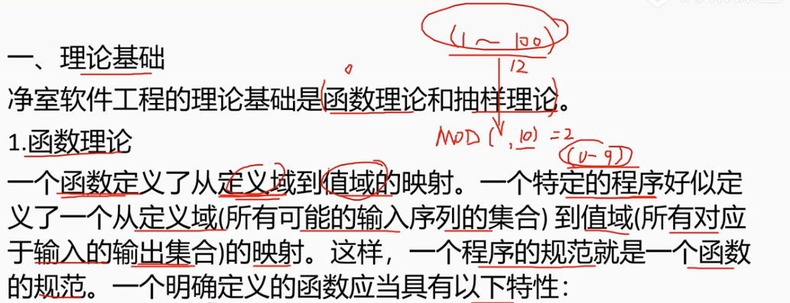
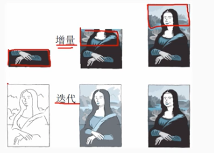

# 5.5 软件工程-净室软件工程

        净室软件工程CSE是一种应用数学与统计学理论以经济的方式生产高质量软件测工程技术，力图通过严格的工程化的软件过程达到开发中零缺陷的目标。
        净室方法要求在归约和设计中消除错误，以“净”的方式制作，可以降低软件开发中的风险，以合理的成本开发出高质量的软件。
        净室软件工程使用盒结构归约进行分析和设计建模，并且强调将正确性验证作为发信啊和消除错误的主要机制，是用统计的测试来获取交付软件是所必须的可靠性信息。 

# 1. 理论基础

        函数理论和抽样理论。

## 1.1 函数理论

        一个函数定义了从定义域到值域的映射。一个程序的规范就是一个函数的规范。

        一个明确定义的函数应当具有以下特性：
        - 完备性：对定义域中的每个元素，值域中至少有一个元素与之对应，对程序而言，每种可能得输入都必须定义，并有一个输出与之对应。
        - 一致性：在值域中最多有一个元素与定义域中的同一元素对应。对程序而言，每个输入只能对一个输出。
        - 正确性：函数的正确性可以由尚书性质判断。对程序而言，某项设计的正确性可以通过基于函数理论的推理来验证。

## 1.2 抽样理论  

        把软件所有可能的使用情况看做总体，通过统计学手段对其抽样测试，根据测试机结果分析软件的可靠性。

# 2。 技术手段

## 2.1 统计过程控制下的增量式开发

        增量开发不是把整个开发过程作为一个整体，而是将其划分为一系列较小的累积增量。
        小组成员只关注工作的一部分，无需一次考虑所有的事情。

## 2.2 基于函数的规范与设计

        盒子结构方法按照函数理论定义了三种抽象层次：行为试图（黑盒）、有限状态视图（状态盒）、过程视图（清晰盒/透明盒）。
        （1）黑盒：刻画系统或系统的某部分的行为。通过运用由激发得到反应的一组变迁规则，系统对特定的激发做出反应。
        （2）状态盒：以类似于对象的方法封装状态数据服务。在这个状态盒归约视图中，表示出状态和的输入（激发）和输出（反应）
        （3）清晰盒：定义状态盒锁蕴含的变迁功能。清晰盒包含了对状态盒的过程设计。

## 2.3 正确性验证

        正确性验证是净室软件工程的核心，正是由于采用了这一技术，净室软件项目的软件质量才有了极大的提高。

## 2.4 统计测试和软件认证

        采用统计学基本原理，即当总体太大时必须采取抽样的方法，
        首先确定使用模型来代表系统所有可能使用的总体。
        然后由使用模型产生测试用例。
        因为测试用例就是总体的一个随机样本，所以可得到系统预期操作性能的有效统计推导。

# 3. 净室软件工程的缺点

    （1）CSE太理论化，需要更多的数学知识，其正确性验证的步骤比较困难且消耗多，、
    要求采用增量式开发、盒子结构。统计测试方法，普通工程必须经过加强训练才能掌握，开发软件成本比较高昂。
    （2）CSE不进行传统的模块测试，这是不现实的。工程师可能对编程语言和开发环境还不熟悉，而且编译器或操作系统的bug也可能导致未预期的错误。
    （3）CSE毕竟脱胎于传统软件工程，不可避免地带有传统软件工程的一些弊端。

    