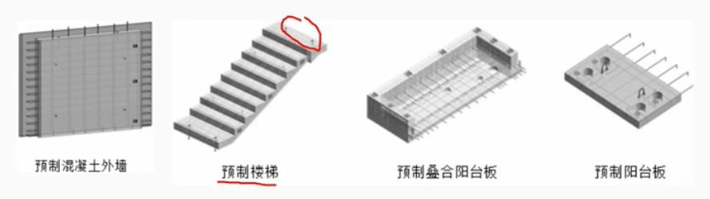
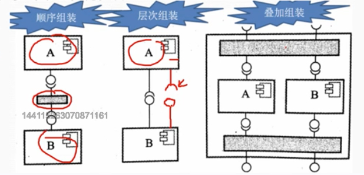

# 5.6 软件工程-基于构件的软件工程

        构件的软件工程（CBSE）是一种基于分布对象技术、强调通过可复用构件设计与构造软件系统的软件复用途径。
        基于构件的软件系统中构件可以是COTS（商用现货）构件，也可以是自行开发构件。CMSE体现了“购买而不是重新构造”的哲学，将软件开发的重点从程序编写转移到了基于已有构建的组装，一边更快的构造系统，减轻系统的维护负担，降低软甲开发的费用。

## 1. 构件和构件模型

        构件是一个独立的软件单元，可以与其他构件构成一个软件系统。

        构件的特征：

        （1）可组装：对弈个组装的构建，所有外部交互都必须通过公开定义的接口进行。
        （2）可部署：软件必须是自包含的，必须作为一个独立实体在提供其构构件模型实现的构建平台上运行。构件总是二进制形式，无需再部署前编译。
        （3）文档化：构件必须有文档，以便于用户了解其功能和使用方法。
        （4）独立性：构件必须是独立的，不依赖于其他构件。  如果依赖其它构件需要提前声明
        （5）标准化：在基于构件的开发过程中使用的构建必须符合某种标准化的构件模型。

        目前主流的构建模型有:
        WEB Service 模型
        Sun 公司的 EJB 模型
        Microsoft 公司的 .NET 模型

# 2. 基于构件的软件开发过程

        CBSE 的软件开发过程包括构件的获取、构件的开发、构件的组装和构件的部署。
        （1） 系统需求概览
        （2） 识别候选构件
        （3） 根据发现的构建修改需求
        （4） 体系架构设计
        （5） 构建定制与适配
        （6） 组装构建创建系统

# 3. 构件组装

        构件组装式值构件相互之间继承或是用专门编写的“胶水代码”整合在一起来创总一个系统或另一个构件过程。
        常见构件组装方式：
        （1）顺序组装
        通过顺序调用已存在的构建，可以用两个已经存在的构件来创建一个新的构件。
        需要特性胶水代码，用于将两个构件组装在一起。
        上一个构件的输出就是下一个构件的输入，需要相兼容。
        （2）层次组装
        这种情况发生：一个构件调用另一个构件所提供的服务时，被调用的构件为调用的构建提供所需要的服务。
        两个组件通行时，接口需要兼容，否则需要编写胶水代码。
        （3）叠加组装
        发生在两个及以上的构建组装成一个新的构件时。
        新的构件合并了原构件功能，从而对外提供了新的接口。
        外部应用可以通过新接口来调用原有构件的接口，原有构件不互相依赖，也不互相调用。

