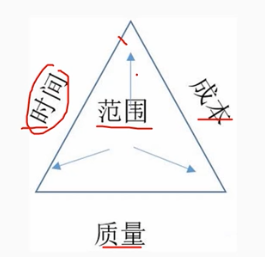
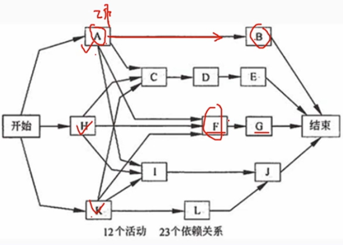
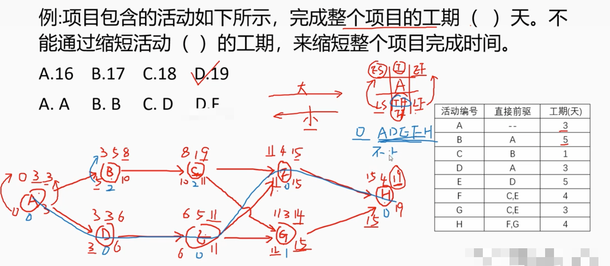
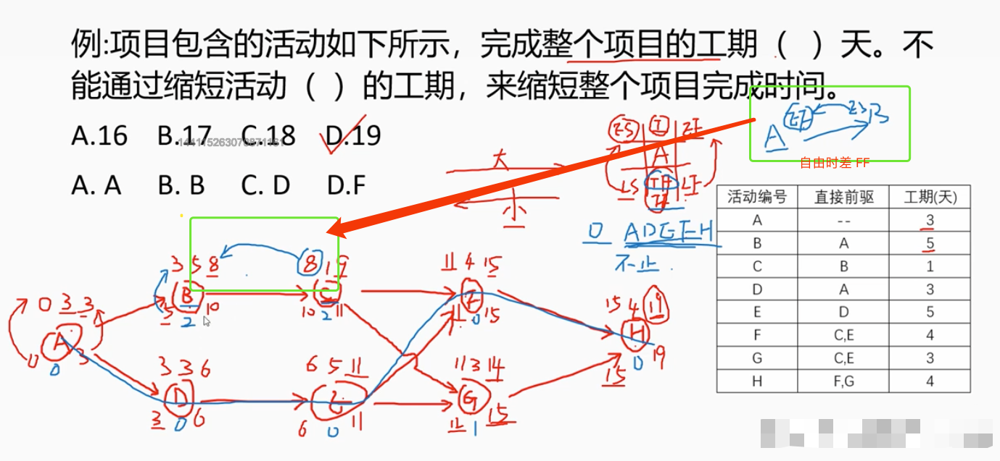
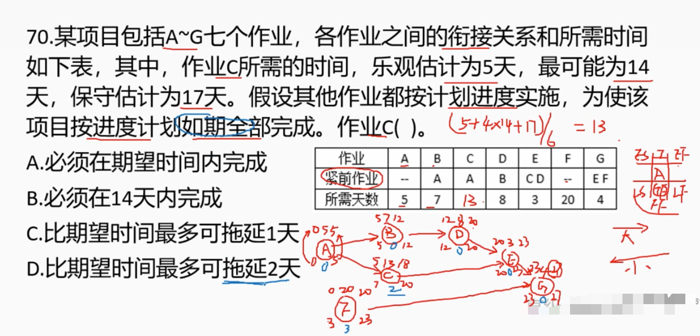
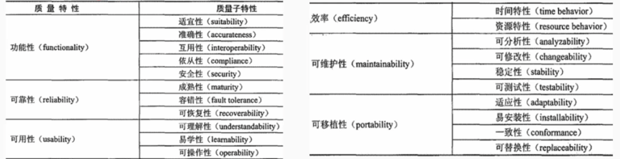

# 5.7 软件工程-软件项目管理

# 1. 项目管理概述

        软件项目管理是为了软件项目能够按照预定的成本、进度、质量顺利完成。对人员    （People）、产品（Product）、过程（Process）和项目（Project）进行分析管理的活动

# 2. 项目进度管理（时间管理）

        进度管理是为了确保项目按期完成所需要的管理过程。
        进度管理的主要活动过程：
        1. 活动有意义
        2. 活动顺序
        3. 活动资源估算
        4. 活动历史估算
        5. 指定进度计划
        6. 进度控制

## 2.1 工作分解结构

        WBS (Work Breakdown Structure) 工作分解结构划分：
        项目->任务->工作->日常活动

        工作分解基本要求：
        1. WBS的工作包是可控和可管理的，不能过于复杂。  < 8 天 || < 80小时
        2. 人不不能郭旭，WBS属性结构不能超过7层
        3. 每个工作包有一个交付成果。
        4. 每个任务必须有明确定义的完成标准。
        5. WBS必须有利于责任分配。

# 3 任务活动图

        互动定义式是指确定完成项目的各个交付成果所必须进行的各项具体活动，明确每个活动的前驱、持续时间、必须完成日期、里程碑或交付成果。
        表示方法：
        1. 前导图（单代号网路图法）
        2. 箭线图（双代号网路图法）

## 3.1 前导图

        前导图法（PDM）——单代号网路图法（AON）
        节点表示活动，箭线表示逻辑关系
         

## 3.2 箭线图

        箭线图法（ADM）——双代号网路图法
        箭线：表示工作，需要占用时间，消耗资源
        虚箭线：表示逻辑关系虚设的工作，不占用时间，不消耗资源
        节点：表示逻辑关系

## 3.3 活动的时间计算

        1. 最早开始时间（ES）：活动开始的最早时间
        2. 最早完成时间（EF）：活动完成的最早时间 EF = ES + 工期估计
        3. 最晚结束时间（LF）：为了使项目按时完成，某项工作必须完成的最晚时间
        4. 最晚开始时间（LS）：为了使项目按时完成，某项工作必须开始的最晚时间 LS = LF - 工期估计

        正向计算：推出最早完成时间（EF）。选大的往后+工期估计
        反向计算：推出最晚开始时间（LS）。选小的往前-工期估计

        TF = 总时差，不影响总工期的前提下，可以利用的机动时间
        TF = LF - EF = LS - ES
        FF = 自由时差，不影响后续活动最早开始时间的前提下，可以利用的机动时间
        FF = ES - EF 后续活动的最早开始时间 - 当前活动的最早完成时间，存在多个后续活动时，取最小值
        
        TF = 0，表示关键路径，关键路径可能有多条
 
        FF <= TF 自由时差 <= 总时差 TF

        不能缩短非关键路径的时间来缩短项目的总工期
        只能缩短关键路径的时间来缩短项目的总工期

# 4. 软件配置管理

        软件配置管理（SCM）是一种标识、组织和控制修改技术。
        配置管理标识和确定系统中配置项的过程，在系统整个生存期内就控制这些配置项的投放和变动，记录并报告配置的状态和变动要求，验证配置项的完整性和正确性。
        配置项包括：
        1. 与合同、过程和产品有关的文档和资料
        2. 源代码、目标的代码和可执行代码
        3. 相关软件工具、库内的可重用软件、外购软件

## 4.1 配置库

        配置库成为配置项库，用来存放配置项的工具
        配置库记录与配置相关的所有信息
        配置库有3类：
        1. 开发库
        2. 受控库
        3. 产品库

## 4.2 变更控制

        1. 变更控制委员会（CCB）
        也称为配置控制委员会，任务是对配置项变更做出评价、审批、监督已批准的变更的实施情况。
        CCB的主要成员：项目经理、用户代表、质量控制人员、配置控制人员、测试人员。

        2. 变更控制流程
        - 变更申请
        - 变更评估
        - 变更决策
        - 变更实施
        - 变更验证
        - 沟通存档

## 4.3 版本管理

        通常由2中版本命名方法：
        - 号码版本标识
                以数字标识，如用 1.0，2.0,1.2，2.1等
        - 符号版本标识
                以字母标识，如用 A，B，C，D等
                如 Windows 95，Windows 98，Windows 2000，Windows XP等

# 5. 质量管理

        1. 规划质量管理
        识别与项目相关的质量标准以及确定如何满足这些标准。

        2. 实施质量保证
        定期评价总体项目绩效，以树立项目满足相关质量标准的信心。

        3. 控制质量
        监控具体项目激活已确定是否符合相关的质量标准，并制定相应措施来消除导致绩效不令人满意的原因。

## 5.1 质量保证

        指为项目符合相关质量标准，而在质量系统内部实施的各项有计划的系统活动，质量保证应贯穿于项目的始终。
        质量保证分为：
        1. 内部质量保证：有项目管理团队、实施组织的管理层实施。
        2. 外部质量保证：有客户哈其他人未参与项目工作的人实施。

## 5.2 质量控制

        判断是否有符合相关质量标准，并找出如何消除不合格绩效的方法。
        对于信息系统项目，一般采用软件测试和配置管理等质量控制手段来邮箱控制信息系统产品质量，与传统制造业仓采用统计抽样、控制图等工具有很大区别。

## 5.3 软件质量管理

    质量特性包括：
        （1）功能性
        （2）可靠性
        （3）易用性
        （4）效率
        （5）可维护性
        （6）可移植性

 # 6. 软件风险管理

        项目风险是一种不确定的时间或条件，一旦发生，会对项目目标产生某种正面或负面的影响。
        风险管理的主要活动过程：
        1. 风险管理计划编制
        2. 风险识别
        3. 风险定性分析
        4. 风险定量分析
        5. 风险应对计划编制
        6. 风险监控

# 7. 软件工具

    分为软件开发工具、软件维护工具 、软件管理和软件支持工具。
    - 软件开发工具:
        需求分析工具、设计工具、编码与排错工具。
    
    - 软件维护工具:
        版本控制工具、文档分析工具、开发信息库工具、逆向工程工具、再工程工具。
    
    - 软件管理和软件支持工具:
        项目管理工具、配置管理工具、软件评价工具、软件开发工具的评价和选择

