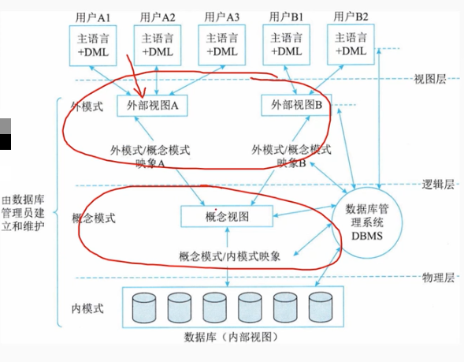
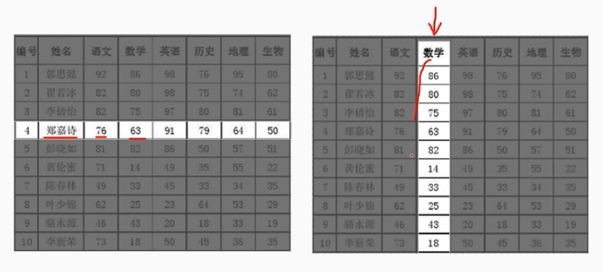
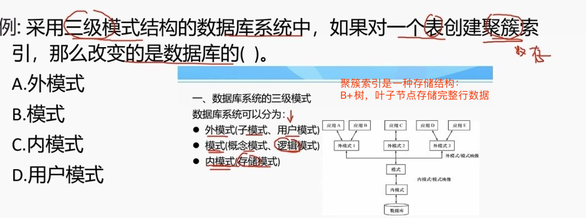

# 6.1 数据库基础知识-数据库基础概念

# 1. 数据库基础概念
## 1.1 数据

        是数据库中存储的基本对象，是描述事物的符号记录。
        数据的种类：
        文本、图形、图像、音频、视频。
        

## 2. 数据库 Database,DB
        
        数据库是统一管理的、长期存储在计算机内的，有组织的相关数据集合。
        数据库的基本特征：
        - 数据库按照一定的数据模型组织、描述和存储
        - 数据间联系密切、冗余度较小
        - 数据独立性较高
        - 易扩展
        - 可为各种用户共享

## 3. 数据库管理系统 DBMS

        DBMS 是数据库系统的核心软件，是由一组相互关联的数据集合和一组用以访问这些数据的软件组成。他是一种解决如何科学的组织和存储数据如何高效的获取和维护数据的系统软件。
        主要功能包括：
        - 数据定义功能DDL
        - 数据操纵功能DML
        - 数据库的运行管理
        - 数据库的建立维护

## 4. 数据库系统 DBS

        是由数据和管理软件组成的系统
        构成：
        - 数据库
        - 硬件平台
        - 软件平台（应用程序）
        - 数据库管理员

# 2. 数据模型

        数据模型是对现实世界数据特征的抽象，它从抽象特征上描述里系统的静态特征、动态行为和约束条件，未数据库系统的信息表示与操作提供了一个抽象的框架。
        数据模型三要素：
        - 数据结构：对象类型的集合，是对系统静态特征的描述。
        - 数据操作：对数据库中各种对象的实例允许执行的操作集合，包括操作及操作规则。如检索、插入、修改、删除等。操作规则有优先级等。
        - 数据的约束条件：一组完整性规则的集合，对具体的应用数据必须遵循特定的语义约束条件。

## 2.1 常见的数据模型：

        - 层次模型
        - 网状模型
        - 关系模型
        - 面向对象模型

# 3 数据库管理系统

        DBMS功能主要包括数据定义，数据库操作，数据库运行管理，数据组织、存储和管理。数据库的简历和维护。

        （1）数据定义功能 DDL(data definition language)
        数据定义语言DDL，用于描述数据库中的数据对象，包括数据对象的名称、结构、存储方式、存取方法、完整性约束等。
        这些定义是存储在数据字典中，是DBMS运行的基本依据。
        （2）数据库操作 DML(data manipulation language)
        DBMS向用户提供数据操纵语言（DML），实现对数据库中数据的基本操作，如检索、插入、修改和删除。
        （3）数据库运行管理 DCL(data control language)  
        DBMS提供数据库运行管理功能，包括数据库的运行控制、安全性控制、完整性控制、并发控制、故障恢复等。运行日志组织管理、事务管理、自动恢复等都是DBMS的重要组成部分。这些功能保证数据库系统的正常运行。

# 4. 数据库系统三级模式

        - 外模式（用户模式、子模式）
        - 模式（概念模式、逻辑模式）
        - 内模式（存储模式）

## 4.1 模式（概念模式、逻辑模式）

        - 数据苦衷全体数据的路基结构和特征的描述
        - 所有用户的公共数据视图，综合了所有用户的需求
        一个数据库只有一个模式

## 4.2 外模式（用户模式、子模式）

        - 数据库用户的数据视图
        - 是数据库用户能够看到和使用的局部数据的逻辑结构和特征的描述
        - 是语某一应用有关的数据的逻辑表示

        外模式是介于用户和模式之间
        模式和外模式之间的映射是一对多的映射关系
        外模是通常是模式的子集
        一个数据库可以有多个外模式，反映了不同的用户的应用需求、看待数据的方式、对数据保密的要求

        外模式用途：
        - 保证数据库安全性的一个有力措施
        - 每个用户只能看见和访问所对应的外模式中的数据

## 4.3 内模式（存储模式）

        - 是数据库存储方式和物理结构的描述
        - 是数据在数据库内部的表示方式
        - 一个数据只有一个内模式

>聚簇索引是一种存储结构：B+树，叶子节点存储完整行数据

## 4.4 三级级别

        三级模式可以抽象为三个级别：
        （1） 用户级数据库：最高抽象级，对应于外模式
        是用户能看到和使用的数据库，又称用户视图。一个数据库可以有多个不同的用户视图。
        （2）概念级数据库：对应概念模式，是所有用户视图的最小并集，一个数据库应用系统中只有一个DMA视图。
        （3）物理机数据库：对应内模式，是数据库在物理存储器上的表示，它描述数据的实际存储组织，是最接近于物理存储的，又称为内部视图。
        
## 4.5 两级独立性

        （1）物理独立性
        指用户的应用程序与存储在磁盘上的数据库中数据是相互独立的。当数据的物理存储改变了，应用程序不用改变。
        （2）逻辑独立性
        指用户的应用程序与数据库中的逻辑结构是相互独立的。当数据库的逻辑结构改变了，应用程序不用改变。是由DBMS提供的二级映像功能来保证的。