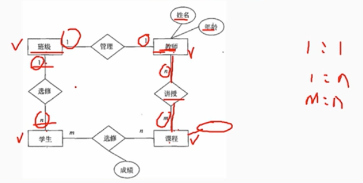
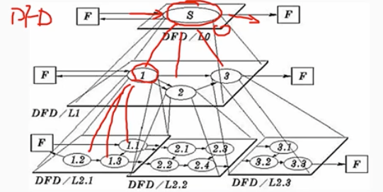
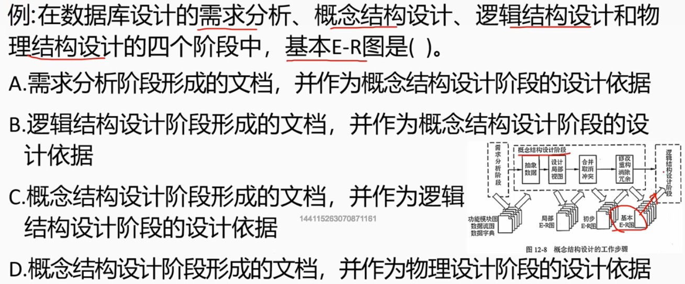
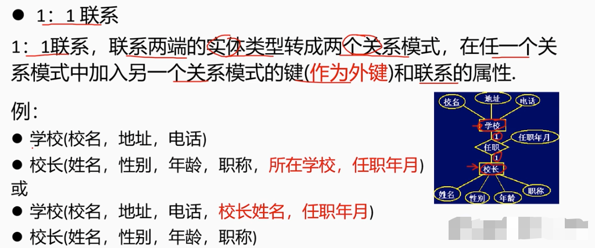
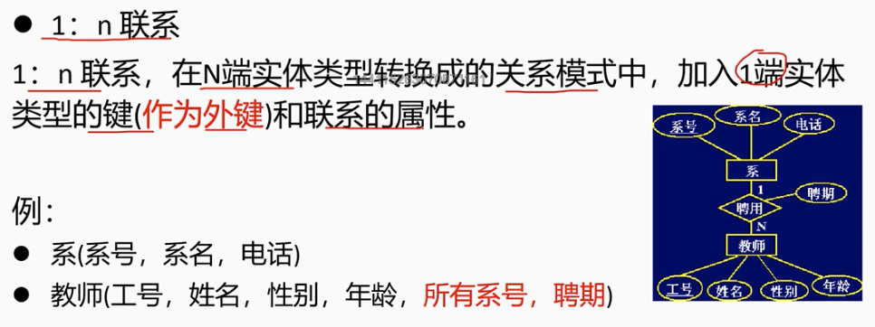
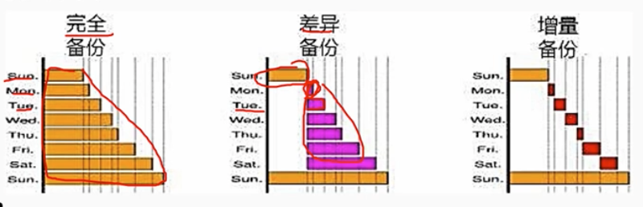
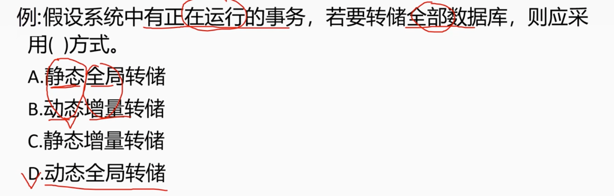

# 6.3 数据库基础知识-数据库设计

# 1. 数据库设计的基本步骤

        1. 需求分析
        2. 概念结构设计
        3. 逻辑结构设计
        4. 物理结构设计
        5. 数据库实施
        6. 数据库运行和维护

# 2. 数据需求分析

        是项目需求确认后，用户和设计人员对数据库应用系统索要涉及的内容和功能的整理和描述，是以用户的角度来认识系统。
        这一过程是后续开发的基础，因为逻辑设计、物理设计以及应用程序的设计都会依次为依据，是最困难、最耗费时间的一步。

# 3. 概念结构设计

        概念结构设计的目标是产生反应系统信息需求的数据库概念结构，即概念模式。概念结构是独立于支持数据库的DBMS和使用的硬件环境的。
        设计人员从用户的家督看待数据以及数据处理的要求和约束，产生一个返佣用户观点的概念模式，然后再把概念模式转换为逻辑模式。
        我们采用E-R模型将现实世界的信息加以抽象，由实体属性，以及实体之间的联系（E-R图）来描述。

## 3.1 E-R模型

- 实体 用矩形框表示，框内标注实体名称。
- 属性 用椭圆形表示，并用连线与实体联系起来。
- 实体间的联系 用菱形表示，并用连线与实体联系起来。

## 3.2 联系的类型

- 一对一联系 (1:1)
- 一对多联系 (1:N)
- 多对多联系 (M:N)

## 3.3 E-R图建立概念模型

        （1）选择局部应用
        数据流图是对业务处理过程从高层到底层一级级抽象。高层的数据流图描述的是业务处理的总体流程，而低层的数据流图描述的是业务处理的具体细节。
        要选择适当层次，让这一层次的每一部分对应一个局部应用，实现某一项功能。从这一层入手，就能很好的地设计出局部应用的E-R图。

        （2）设计局部应用的E-R图
        对于每一局部应用，其所用到的数据都应手残在数据字典中了，依照该局部用用的数据流图，从数据字典中提取出数据，使用抽象机制，确定局部应用中的实体、实体的属性、实体标识符及实体间的联系和其类型，设计出局部应用的E-R图。

        （3）合并局部应用的E-R图
        合并过程中解决的主要问题是实体标识符的冲突问题。在合并过程中，要注意实体标识符的冲突问题，如果冲突，就要重新设计实体标识符。

        （4）合并E-R图冲突
        - 属性冲突：属性的类型、取值范围、数据单位的不一致
        - 命名冲突：相同意义的属性，在不同的局部E-R图上有着不同的命名,异名同意，或是名称相同的属性在不同的局部E-R图上有着不同的意义，同名异义。
        - 结构冲突：同一实体在不同的局部E-R图上有着不同的结构，有时为实体，有时为属性

> 例题

# 4 逻辑结构设计

        逻辑结构设计就是在概念结构设计的基础上进行的数据模型设计。
        层次模型、网状模型和关系模式。
        逻辑结构设计的步骤：
        （1）确定数据模型
        （2）将E-R图转换为数据模型
        （3）确定数据模型的完整性约束条件
        （4）确定用户视图

## 4.1 E-R图向关系模式的转换

        E-R图是由实体、属性、联系三要素构成。而关系模式中只有唯一的结构-关系模式。
        采用以下方法加以转换：
        （1）实体向关系模式的转换
        （2）联系向关系模式的转换

### 4.1.1 实体向关系模式的转换
        
        实体向关系模式的转换是指将E-R图中的实体转换为关系模式的过程。
        实体转换为关系模式的方法：
        - 每个实体转换为一个关系模式
        - 每个属性即为关系模式的属性
        - 实体标识符为关系模式的主键

### 4.1.2 联系向关系模式的转换

        联系向关系模式的转换是指将E-R图中的联系转换为关系模式的过程。
        联系转换为关系模式的方法：

        (1) 一对一联系

        
        (2) 一对多联系

        (3) 多对多联系

## 4.2 关系模式的规范化

        由E-R图转换得来的初始关系模式并不完全符合要求，还会有数据冗余和更新异常存在，需要经过进一步的规范化处理。
        步骤如下：
        （1）根据语义确定各关系模式的数据依赖。
        （2）根据数据依赖确定关系模式的范式。
        （3）如果关系模式不符合要求，要根据关系模式的分解算法对其进行分解，达到 3NF、BCNF、4NF 等范式要求。
        （4）关系模式的评价及修正。

## 4.3 确定完整性约束

        对关系模式加以约束：
        数据项的约束、表级约束、表间约束
        参考sql标准来确定不同的约束，如检查约束、主码约束以及参照完整性约束，以保证数据的正确性。

## 4.4 确定用户视图

        根据用户流图及用户嘻嘻简历视图模式，提高数据的安全性和独立性。
        - 根据数据流图确定处理过程使用的视图
        - 根据用户类别确定不同用户使用的视图

## 4.5 反规范化

        反规范化是加速读操作性能的方法，通过有选择地在数据结构标准化后添加特定的冗余数据来增加查询效率。
        常见的反规范化操作有：冗余列、派生列、表冲突和表分割。其中表分割又分为水平分割和垂直分割。
        反规范化带来冗余数据不一致问题，长采用数据同步的方法来解决。
        方法有：应用程序同步、批量处理同步和触发器同步等。

# 5 物理结构设计

        物理结构设计就是逻辑数据模型选取一个最适合应用环境的物理结构（包括存储结构和存取方法）。
        物理结构设计的主要工作步骤：
        （1）确定数据同步
        （2）存储结构
        （3）访问方法

# 6. 数据库实施

        运用DBMS提供的数据库语言及宿主语言，根据逻辑设计和物理设计的结果，在计算机上建立起设计的数据库结构，数据加载（载入），进行试运行和评价的过程，叫数据库的实施。
        三个步骤
        （1）建立数据库结构
        （2）数据加载（组织结构入库）
        （3）试运行和评价

# 7. 数据库的运行和维护

        主要内容：
        （1）性能的检测和改善
        （2）备份和故障恢复
        （3）重组和重构

## 7.1 数据库备份和故障恢复

        暑假备份是指为防止系统出现操作失误或系统故障导致数据丢失，而将全部或部分数据集合从应用主机的以后光盘或阵列恢复到其它的存储介质的过程。

        备份分为：
        - 冷备份（静态备份）关闭数据库的情况下进行的，不允许对数据进行存取、修改活动。
        - 热备份（动态备份）数据备份期间允许对数据库进行存取或修改，即备份和用户失误可以并发执行。

        备份内容分来：
        - 完全备份：备份全部文件，并不依赖文件的存档属性来确定备份哪些文件
        - 增量备份：备份自上次完全备份或增量备份以来发生的所有变化
        - 差异备份：备份自上次完全备份以来发生的所有变化

        日志文件的作用：
        - 故障恢复必须用日志文件
        - 在动态备份文件中必须建立日志文件，备份和日志文件综合起来才能有效地恢复数据库

> 例题
 