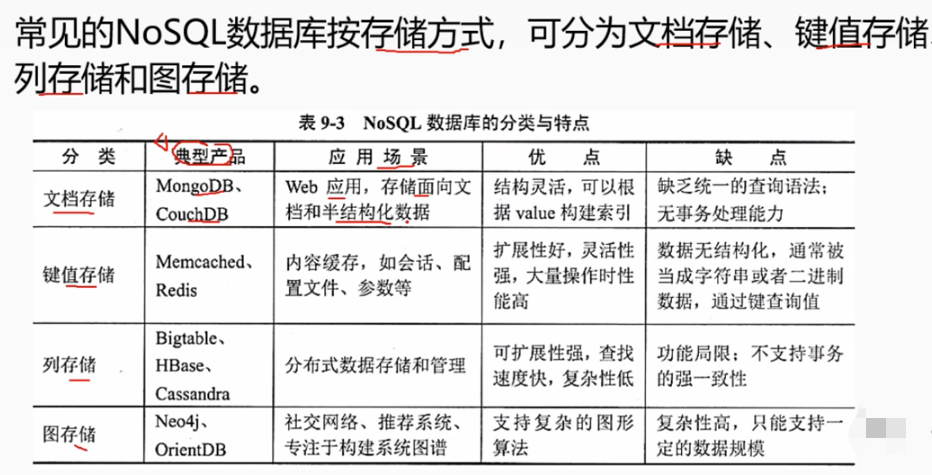
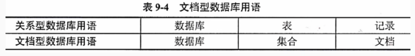
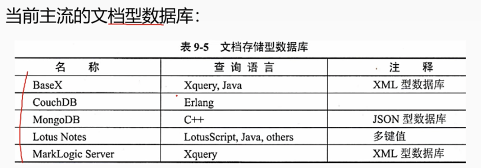
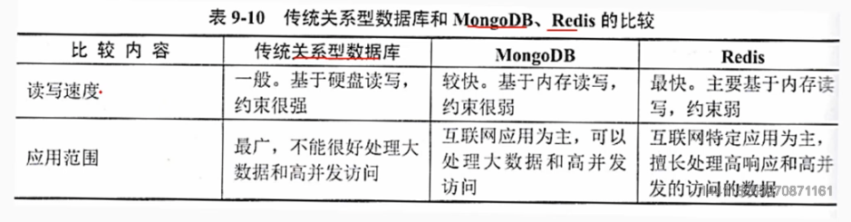
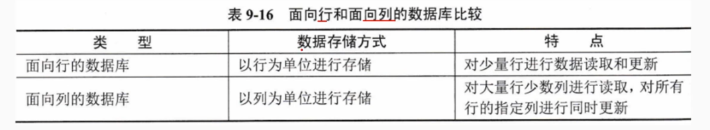
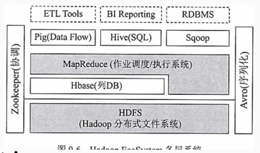
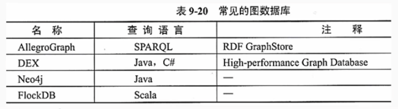

# 6.5 数据库基础知识-NoSQL数据库

        Not Only SQL，泛指非关系型的数据库。

# 1. 文档存储

        文档存储中，文档可以很长，很复杂，无结构，可以是任意结构的字段，并且数据具有物理和逻辑上的独立性，这就和具有高度结构化的表存储（关系型数据库的主要存储结构）有很大的不同，而最大的不同则在于它不提供对参数完整性和分布事务的支持。

## 1.1 文档型数据库MongoDB

        MongoDB是一个基于分布式文件存储的数据库，由C++语言编写，旨在为WEB应用提供可扩展的高性能数据存储解决方案。.
        对打特点就在于是无表结构，在保存数据和数据结构的时候，会把数据和数据结构都完整的以BSON的形式保存起来，并把它作为值和特定的键进行关联，真是由于这种设计，使得它不需要表结构，而被称为文档型数据库。

        特征：
        - 高性能：提供JSON/XML等可嵌入数据快速处理功能，提供文档的索引功能，大大提高了查询速度。
        - 丰富的查询语言：为数据聚合、结构文档，地理空间查询提供了丰富的查询功能。
        - 高可用性：提供数据冗余处理和故障自动转移的功能。
        - 水平扩展能力：通过集群将数据分布到多台机器，而不是只提升单个节点的性能。具体分为主从和权衡两种处理模式。

## 2 键值存储

        键值存储使用简单的键值方法来存储数据。键值数据库将数据存储为键值对集合，其中键作为唯一标识符。

### 2.1 数据操作方式

        - PUT：存储数据
        - GET：获取数据
        - DELETE：删除数据

### 2.2 数据保存方式

        - 临时性保存类型：数据保存在内存中，读写速度快，但是断电后数据丢失。
        - 永久性保存类型：永久保存在硬盘中，读写速度慢，但是断电后数据不丢失。
        - 两者兼具:兼具临时保存和永久保存的特点，数据先保存在内存中，然后再定期或者在特定条件下将数据保存到硬盘中。

### 2.3 键值存储产品

        亚马逊的 Memcached、Redis、Tokyo Tyrant、Berkeley DB、Voldemort、Oracle BDB、Riak、Scalaris、Project Voldemort

        （1）Memcached
        临时保存数据类型，内存存储数据。缓存数据查询结果，尖山数据库访问次数，提高动态web应用速度，提高可扩展性。
        常作为数据库前端的缓存系统，减轻数据库负载。

        （2）Redis
        内存存储，支持持久化，支持多种数据类型，支持主从复制，支持事务，支持多种语言，性能极高。
        每秒可执行10万次读写操作，是已知性能最快的键值存储之一。
        缺点是数据容易受到物理内存限制，数据量不能太大。
        依赖客户端进行读写，适合小数据量高性能操作和运算上。
        没有原生可扩展机制，没有扩展能力。

## 3 列存储

        列存储数据库将数据存储在列中而不是行中。
        主要有：Goolge的 Bittable，由Bigtable衍生的Hypertalbe 和 Hbase、Casandra.

        (1)Hbse
        Hbase（Hadoop Databaase）是一个开源的分布式列存储系统，基于Hadoop的HDFS文件系统，运行在HDFS之上。
        高可靠性、高性能、面向列、可伸缩的分布式存储系统，利用HBase技术可在廉价Pc Server上搭建起大规模结构化存储集群。

# 4. 图存储

        图存储数据库是一种基于图论的存储系统，包含一连串的节点和关系的系统。三个字段：节点、关系、属性。
        它使用图结构来存储数据，图中的每个节点表示实体，图中的每条边表示实体间的关系。

# 5. 其它存储模式

## 5.1 多值数据库

        多值数据库提供了一种通用的数据集成与访问平台，屏蔽了现有各数据库系统不同的访问方法和用户界面，给用户呈现出一个访问多种数据库的公共接口。
        常见的数据库有：
        Rocket U2
        Extensible Storage Engine
        Openlnsight
        Open QM

## 5.2 时间序列与流数据库

        时间序列数据是指具有处理时间序列的数据，嫩对时间数据组建里索引的优化数据库系统。
        流数据库又称为实时数据库，是一种使用实时处理数据的方式来处理状态不断变化的数据库系统。对时间序列的数据库提出实时的处理要求，那么时间数据就是留数据库。
        例如：传感器数据、股票数据、气象数据、交通数据等都需要实时计算数据，这就需要流数据库。
        常见的时间序列数据库：InfluxDB、OpenTSDB.

## 5.3 网格和云数据库

        网格和云数据库是基于网路计算或者云计算的数据库。
        - 云计算是一种随需计算或者效用计算，允许用户无需了解底层IT基础设施，通过互联网访问各种IT资源的服务。
        - 网格计算可以理解为“虚拟超级计算机”，以松耦合的方式将大量的计算资源连接在一起提供单个计算资源无法完成的计算能力。
        主流数据库产品：GridGain , CreateDB.