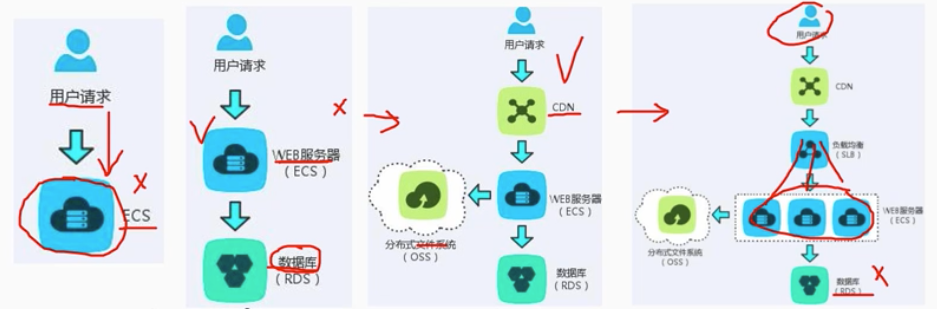

# 7.1 系统架构设计基础知识-软件架构概念

## 1. 软件架构的定义

        软件架构是指在一定设计原则基础上，从不同角度对组成系统的各部分进行搭配组合，形成系统的多个结构而组成架构，它包括该系统的各个构件，构件的外部可见属性及构件之间的相互关系。

- 软件架构是保证软件质量的根本措施。

 

## 2. 软件架构设计和生命周期

        （1）需求分析阶段
        （2）设计阶段
        （3）实现阶段
        （4）构件组装阶段
        （5）部署阶段
        （6）后开发阶段

## 3. 软件架构的作用

- 满足系统的品质
- 是受益人达成一致的目标
- 能欧支持计划编制过程
- 对系统开发的指导性
- 能有效地管理复杂性
- 为复用奠定基础
- 能够降低维护费用
- 能够支持冲突分析