# 7.3系统架构设计基础知识-软件架构风格

## 1 架构风格概述

        架构风格是描述某一特定应用领域中系统组织方式的管用模式。
        架构风格定义一个系统家族，即一个框架定义一个词汇和一组约束。词汇表包含一些构件和连接件类型，约束指出系统是如何将这些构件和连接件组合起来的。
        架构风格反映了领域中众多系统所共有的结构和语义特性，并指导如何将各个模块和子系统有效地组织成一个完整的系统。

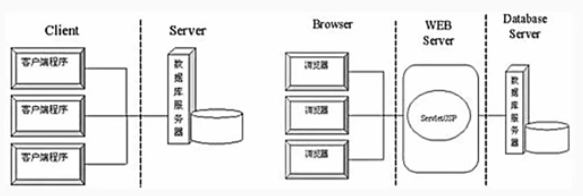

        通用的架构风格的分类如下：
        （1）数据流风格：批处理序列；管道/过滤器
        （2）调用/返回风格：主程序/子程序；面相对象风格；层次结构；客户端/服务器
        （3）独立构件风格：进程通信；事件系统。
        （4）虚拟机风格：解释器；基于规则的系统。
        （5）仓库风格：数据库系统；超文本系统；黑板系统。

## 2 数据流体系架构风格

### 2.1 批处理体系架构风格

        在批处理风格的软件体系架构中，每个处理步骤是一个单独的程序，每一步必须在前一步结束后才能开始，并且数据必须是完整的，以整体的方式传递。
        它的基本构件是独立的应用程序，连接件是某种类型的媒介。
        连接件定义了相应地数据流图，表达拓扑结构。

> 例题
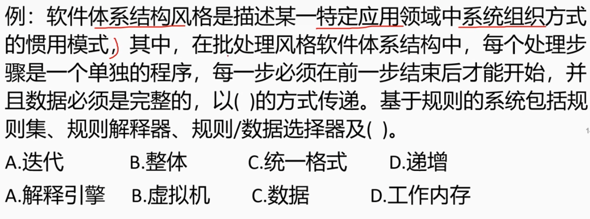

### 2.2 管道/过滤器体系架构风格

        当数据源源不断地产生，系统就需要对这些数据惊醒若干处理（分析、计算、转换）。解决方案是把系统分解为几个序列的处理步骤，步骤之间通过数据流连接。
        一个步骤的输出是另一个步骤的输入，将一个系统分解为一系列处理步骤，每个步骤都是一个过滤器，过滤器之间通过管道连接。
        管道是一种连接件，它定义了数据流图，表达拓扑结构。
        管道/过滤器体系架构风格的基本构件是过滤器，连接件是管道。
        典型的管道/过滤器体系架构例子：
        - unix/linux shell 编写的管道命令
        - 传统的编辑器

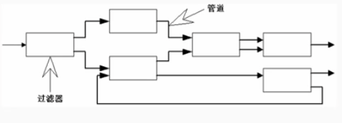

## 3 调用/返回体系架构风格

        调用/返回风格是指在系统中采用了调用与返回机制。利用调用-返回实际上是一种分儿治之策略，将一个大的系统分解为若干个子系统，降低复杂度，并且增加可修改性。
        - 主程序/子程序体系架构风格
        - 面向对象体系架构风格
        - 层次结构体系架构风格
        - 客户端/服务器体系架构风格

### 3.1 主程序/子程序风格

        主程序/子程序风格一般采用单线程控制，把问题划分为若干处理步骤，构件即为主程序和子程序。
        子程序通常可合称为模块。过程调用作为交互机制，即充当连接件。
        调用关系具有层次性，其语义逻辑表现为主程序的正确性取决于他调用的子程序的正确性。

### 3.2 面向对象风格

        面相对象风格建立在数据抽象和面向对象的基础上，数据的表示方法和他们的相应操作封装在一个抽象数据类型或对象上。
        这种风格的构件是对象，或者说是抽象数据类型的实例。

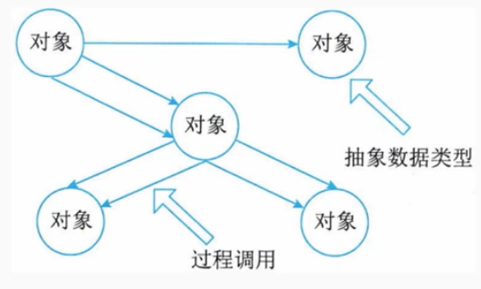

### 3.3 层次结构风格

        层次结构风格是指将系统分解为若干层次,每一层为上层提供服务，并作为下层的客户。
        在一些层次系统中，除了一些精心挑选的输出函数外。内部的层接口只对相邻的层可见。
        由于每一层最多只影响两层，只要给相邻层提供相同的接口，允许每层用不同的方法实现，这同样为软件重用提供了强大的支持。
    
        这样的系统中构件在层上实现了虚拟机。连接件通过决定层间如何交互的协议来定义，拓扑约束包括相邻层间交互的约束。

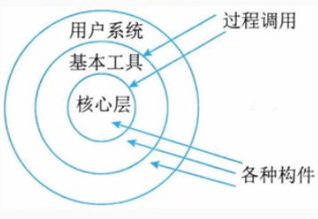

> 例题
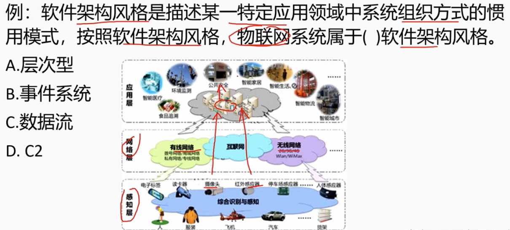

### 3.4 客户端/服务器体系架构

        C/S软件体系架构是基于资源不对等，且为实现共享而提出的，

        C2 两层的 C/S体系架构有3个主要组成部分：数据库服务器、客户应用程序和网络。
        服务器（后台）负责数据管理，客户机（前台）完成与用户的交互任务，称为“胖客户机，瘦服务器”

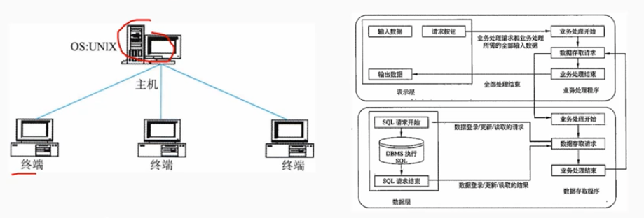

        三层C/S结构增加了应用服务器，整个应用逻辑主流在应用服务器上，只有表示层位于客户机上，称为“瘦客户机”。应用功能分为表示层、功能层和数据层三层。

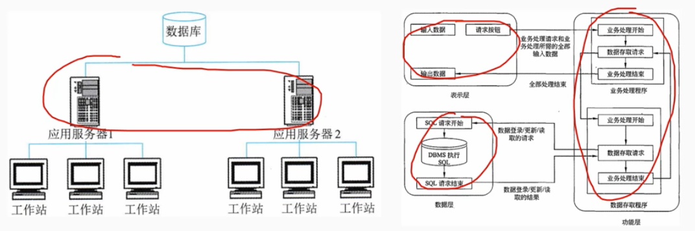

## 4 以数据为中心的【仓库体系架构风格】

### 4.1 仓库体系架构风格

        仓库是存储和维护数据的中心场所。在仓库体系风格中，由两种不同的构件：
        - 中央数据结构（仓库），说明当前数据的状态。
        - 独立构件，他对中央数据进行操作，从而改变数据的状态。

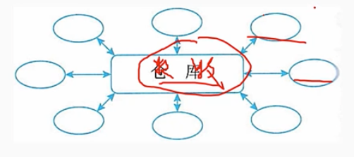

### 4.2 黑板体系架构风格

        为了解决负载的非结构化问题，能在求解过程中综合运用多种不同的知识源，使得问题的表达、组织和求解变的比较容易。
        黑板问题是一种求解模型，是组织推理步骤、控制状态数据和问题求解之领域知识的概念框架。
        黑板系统的传统应用是信号处理领域，如语言和模式识别。另一应用是松耦合代理数据共享存取。

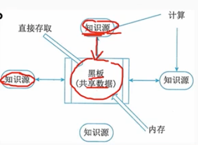

        黑板系统主要由3三部分组成：
        （1）知识源，是一个包含独立的与应用程序宣贯的知识、知识源之间不直接通讯，他们之间的交互只能通过黑板来完成。
        （2）黑板数据结构。黑板数据是按照与应用程序相关的层次来组织的解决问题的数据，知识源通过不断地改变黑板数据来解决问题。
        （3）控制。控制完全由黑板的状态驱动，黑板状态的改变决定使用的特定知识。

## 5 虚拟机体系架构风格

        虚拟机体系架构风格的基本思想是认为构件一个运行环境，
        在这个环境之上，可以解析与运行自定义的一些语言，这样来增加架构的灵活性。
        虚拟机体系架构风格主要包括解释器风格和规则系统风格。

### 5.1 解释器体系架构风格

        一个解释器通常包括完成解释工作的解释引擎，一个包含将被解释的代码的存储区，一个记录解释引擎当前状态的数据结构，以及一个记录代码被解释执行进度的数据结构。
        解释器通常被用来建立一种虚拟机以弥合程序语义与硬件语义之间的差异。其确定是执行效率较低。
        典型的例子是专家系统：

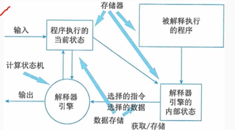

### 5.2 规则体系架构风格

        基于规则的系统包括：
        - 规则集
        - 规则解释器
        - 规则/数据选择器
        - 工作内存

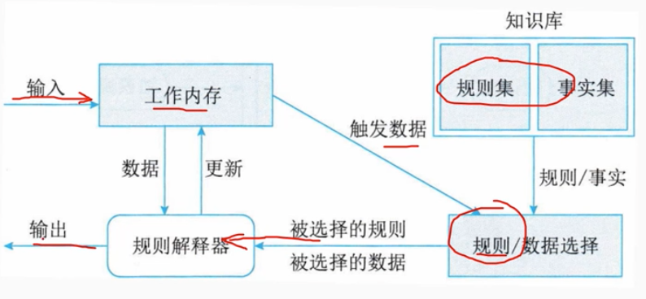

> 例题
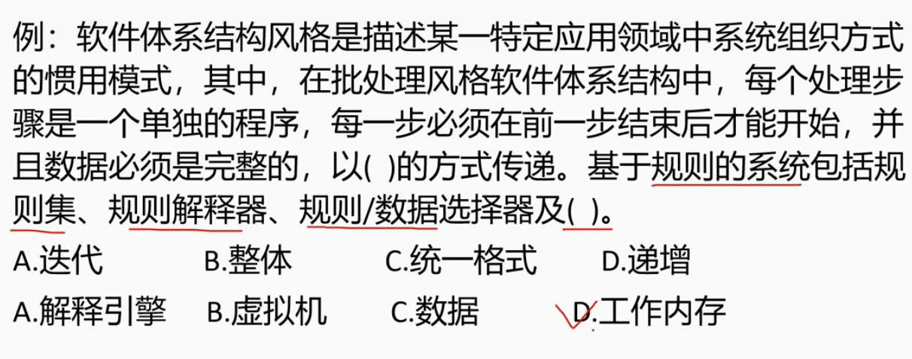

## 6 独立构件体系架构风格

        独立构件风格主要强调系统中的每个构件都是相对独立的个体，他们之间不直接通信，以降低耦合度，提升灵活性。
        独立构件风格主要包括进程通信和事件系统风格。

### 6.1 进程通信体系架构风格

        进程通信体系架构风格是指系统中: 构件是独立的过程，连接件是消息传递。
        这种风格的特定是构件通常是命名过程，消息传递的方式可以是点到点、异步、同步方式及远程过程调用等。

### 6.2 事件系统体系架构风格

        事件系统体系架构风格的思想是构件不直接调用一个过程，而是触发或广播一个或多个事件。
        系统中的其他构件中的过程在一个或多个事件中注册，当一个事件被触发，系统自动调用杂这个事件中注册的所有过程，这样一个时间的触发就导致了另一模块中的过程的调用。
        特点是事件的触发者并不知道哪些构件会被这些事件影响，这使得不能假定构件的处理顺序，甚至不知道哪些构成会被调用，因此，许多隐式调用的系统也需要包含显示调用作为构件交互的补充形式。
