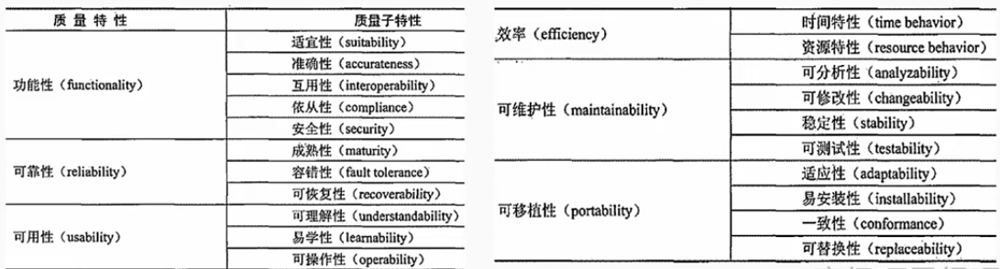
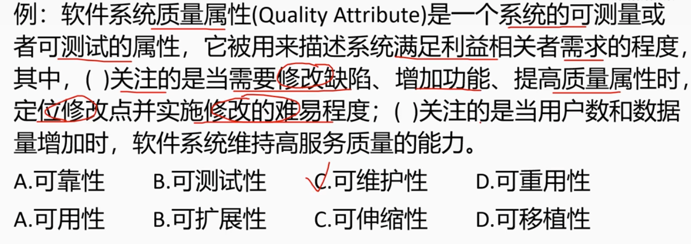
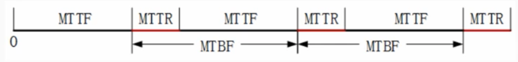
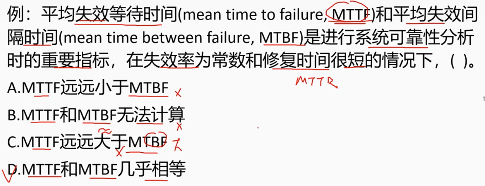
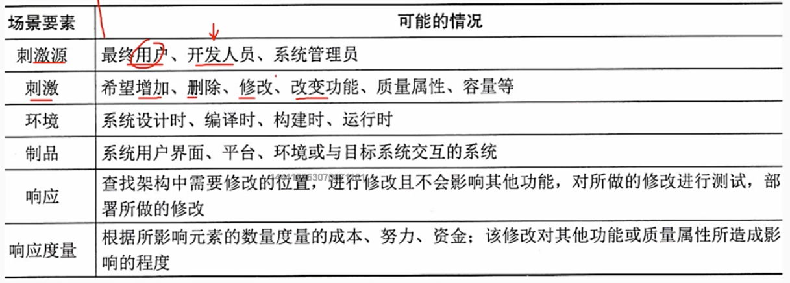
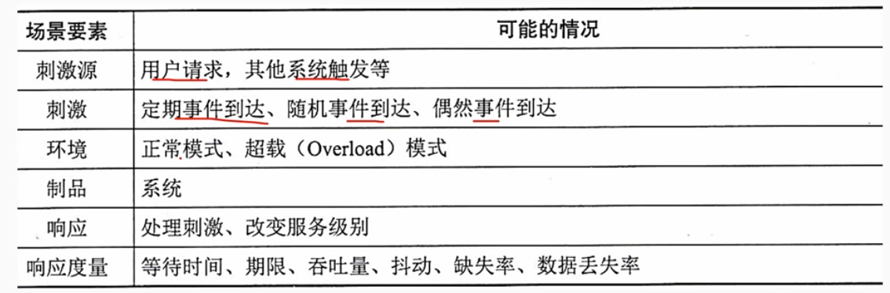
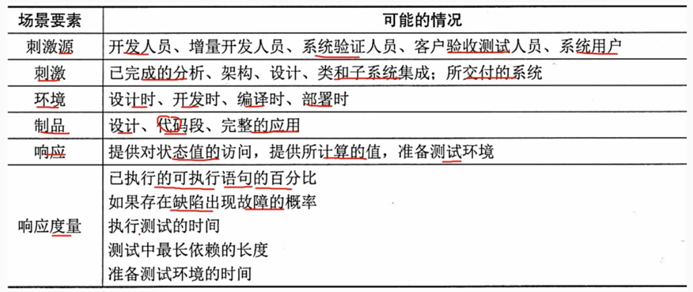
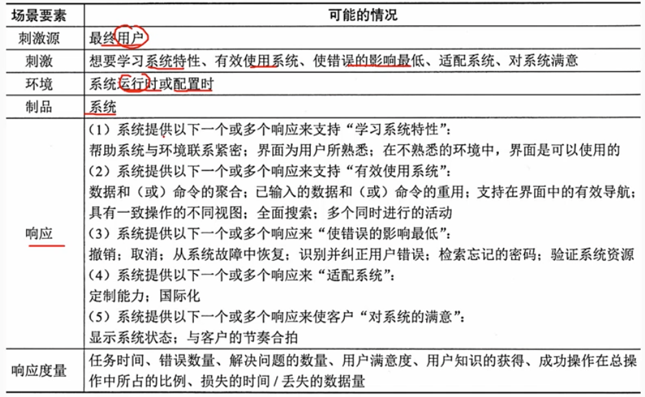
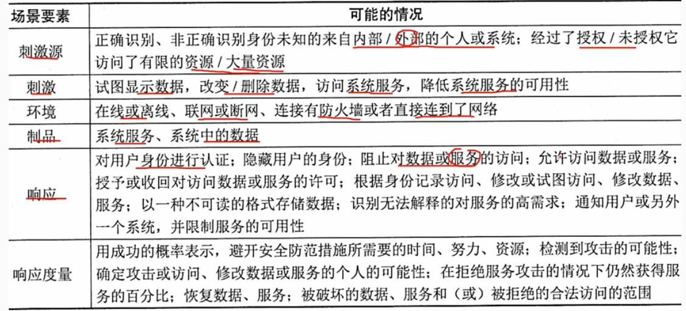
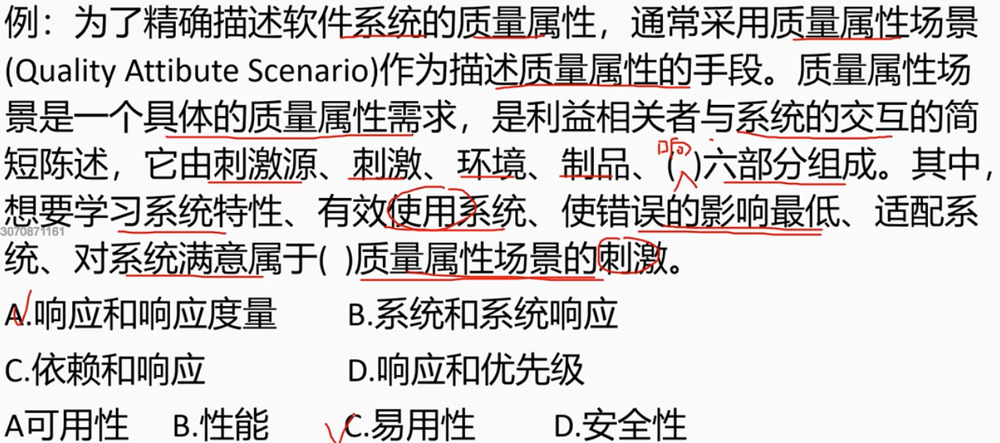

# 8.1 系统质量属性与架构评估-软件系统质量属性

## 1. 质量属性概念

        软件系统的质量就是“软件系统与明确地和隐含地定义的需求相一致的程度”。
        影响软件质量的主要因素划分为6个维度特性：

        1. 功能性：软件系统提供的功能是否满足用户的需求。
        2. 可靠性：软件系统在规定的时间内，能够正常运行，不出现故障。
        3. 易用性：软件系统是否容易使用，是否容易学习。
        4. 效率性：软件系统在规定的时间内，能够完成预期的功能。
        5. 可维护性：软件系统是否容易维护，是否容易修改。
        6. 可移植性：软件系统是否容易移植到其他的平台。

        基于软件系统的生命周期，可以将软件系统的质量属性分为开发其质量属性和运行期质量属性。

### 1.1 开发期质量属性 

        开发期质量属性是指在软件系统的开发过程中，对软件系统的质量属性的要求。
        开发期质量属性主要包括：
        （1）易理解性：指设计呗开发人员理解的难以程度。
        （2）可扩展性：软件因适应新需求或需求变化而增加新功能的能力，也称为灵活性。
        （3）可重用性：指重用软件系统或某一部分的难易程度。
        （4）可测试性：对软件测试易证明其满足需求规范的难易程度。
        （5）可维护性：当需要修改缺陷、增加功能、提高质量属性是，是别修改点并实施修改的难易程度。
        （6）可移植性：将软件系统或某一部分移植到其他环境的难易程度。

### 1.2 运行期质量属性

        软件在运行阶段关注的质量属性，主要包括：
        （1）性能：软件系统在规定的时间内，能够完成预期的功能、速度、吞吐量、容量等要求。
        （2）安全性：软件系统同时兼顾向合法用户提供服务，以及组织非授权使用的能力。
        （3）可伸缩性：当用户数和数据量增加是，软甲系统维持高服务质量的能力。例如增加服务器来提高能力。
        （4）互操作性：软件系统与其他系统交互的能力难易程度。
        （5）可靠性：软件系统在规定的时间内，能够正常运行，不出现故障的能力。
        （6）可用性：软件系统在规定的时间内，能够正常运行的时间所占的比例。可用性收到系统错误、恶意攻击、高负载等问题影响。
        （7）鲁棒性：软件系统在面对异常或非法输入时，能够正常运行的能力。也称健壮性和容错性。

> 例题

## 2. 面向架构评估的质量属性

        为了评估一个软件系统，特别是软件系统的架构，需要进行架构评估。
        主要关注的质量属性有以下几种：
        1. 性能
        2. 可靠性
        3. 可用性
        4. 安全性
        5. 可修改性
        6. 功能性
        7. 可变性
        8. 互操作性

### 2.1 可靠性

        可靠性是软件系统在应用或系统错误面前，在以外或错误使用的情况下维持软件系统的功能特性的基本能力。通常用来衡量再规定的条件和时间内，软件完成规定功能的能力。
        （1）容错：错误发生时确保系统正确的行为，并进行内部“修复”
        （2）健壮性：保护应用程序不收错误使用和错误输入的影响，在发生以外错误事件3时确保应用系统处于预先定义好的状态。
        - 平均失效间隔时间（MTBF）：平均无故障时间，是指系统在正常运行相邻两次故障之间的平均时间。
        - 平均失效等待时间（MTTF）：也称平均无故障时间，是指某个元件预计的可运作平均时间。
        - 平均修复时间（MTTR）：是指系统从发生故障到恢复正常运行所需的平均时间。表示计算机的可维护性。
        平均失效间隔时间（MTBF）常与 平均失效等待时间（MTTF）混淆，但是两者是不同的概念。因为两次故障之间必有修复行为，因此MTBF包含了MTTF和MTTR。
        MTBF = MTTF + MTTR 实际应用中MTTR很小，因此MTBF ≈ MTTF

> 例题

### 2.2 可修改性

        可修改性（Modiability）是指能够快速的以较高的性价比对系统进行变更的能力。通常以某种具体的变更为基准，通过考察变更的待见来衡量可修改性。可修改性包含以下4个方面：
        （1）可维护性
        （2）可扩展性
        （3）结构重组
        （4）可移植性

### 2.3 可变性

        架构经扩充和变更而成为新架构的能力。这种新架构应该符合预定的规则，在某些具体方面不用于原有的架构。当要讲某个架构作为一系列相关产品的基础时，可变性是很重要的。

## 3 质量属性场景描述

        为了精确的描述软件系统的质量属性，通常采用质量属性场景作为描述质量属性的手段，质量属性场景是一个具体的质量属性需求，是李毅相关者与系统的交互的简短陈述。
        6部分组成：
        - 刺激源：这是某个生成该刺激的实体（人、计算机系统或者任何其它刺激器）
        - 刺激：这是一个事件，它会引起系统的一个响应
        - 环境：该刺激在某些条件内发生。当刺激发生时，系统可能处于过载、运行或者其他情况。
        - 制品：某个制品被激励，它可能是一个软件系统、一个组件、一个类或者一个对象。
        - 响应：系统对刺激的反应，它可能是一个事件、一个状态或者一个值。
        - 响应度量：响应的度量，当响应发生事，应当能够以某种范式对其进行度量，以对需求进行测试。

        质量属性场景主要关注可用性、可修改性、性能、可测试性、易用性和安全性等6类质量属性。

### 3.1 可用性质量属性场景

### 3.2 可修改性质量属性场景

### 3.3 性能质量属性场景

### 3.4 可测试性质量属性场景

### 3.5 易用性质量属性场景

### 3.6 安全性质量属性场景

> 例题
