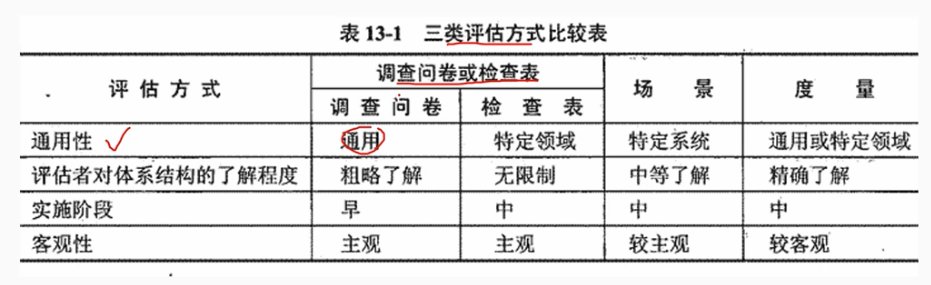
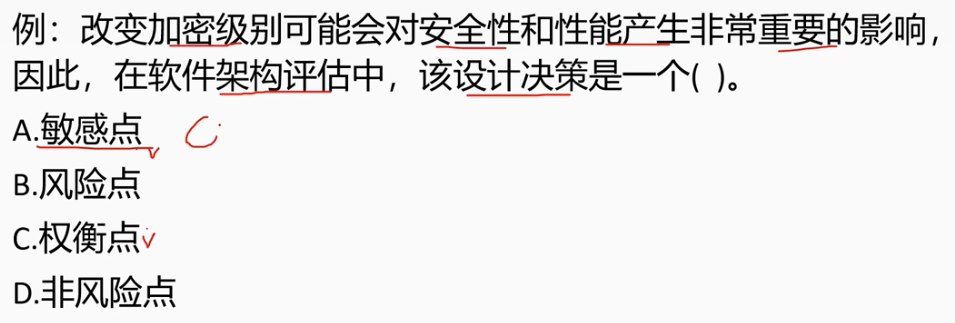
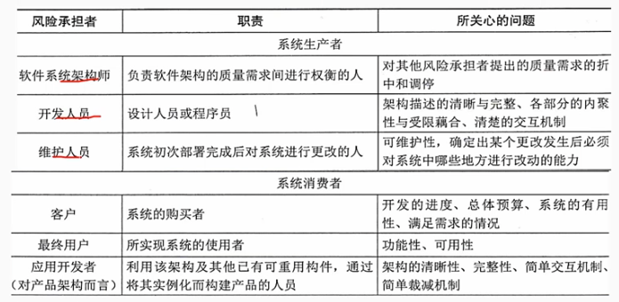
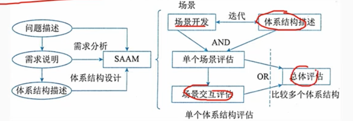
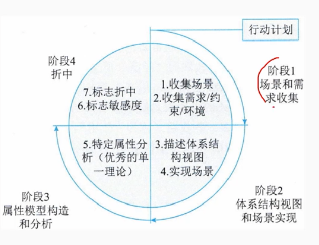
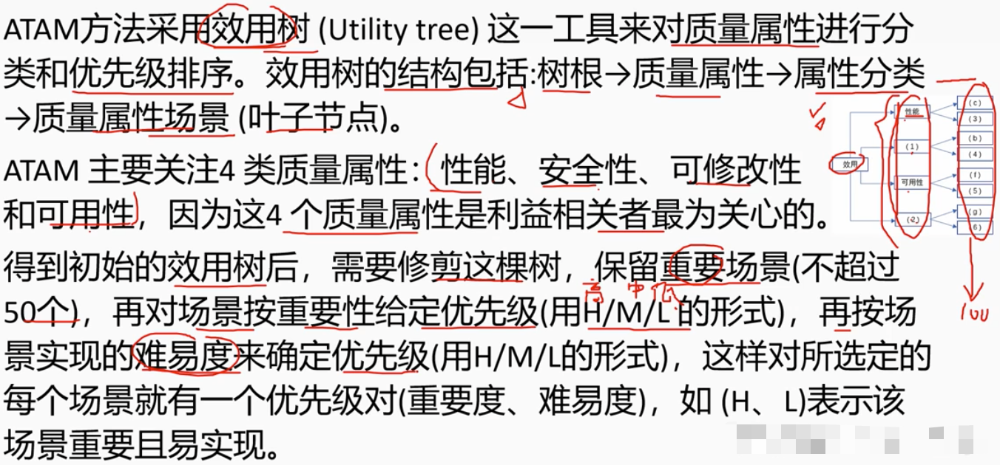
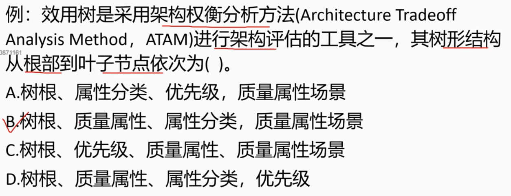

# 8.2 系统质量属性与架构评估-系统架构评估

## 1 系统架构评估的评估方法

        （1）基于调查问卷和检查表的评估方法
        （2）基于场景的方式
        （3）基于度量的方式

### 1.1 基于调查问卷和检查表的方式

        设计好问卷和检查表，充分利用系统相关人员的经验和知识，获取度架构的评估。

        优点：自由灵活，可评估多种质量属性，可在架构设计的多个阶段进行。
        缺点：评估结果主观性强，评估结果不可重复，评估结果不可量化。

### 1.2 基于场景的方式

        通过分析软件架构对场景（对系统的使用和修改活动）的支持程度，从而判断该架构对这一场景所代表的质量需求的满足程度。

        在体系结构评估中，采用刺激、环境、响应三个方面对场景进行描述。

        刺激：是场景中解释或描述项目干系人怎样引发与系统的交互。
        环境：描述刺激发生时的情况。
        响应：系统如何通过体系结构对刺激做出反应的。

### 1.3 基于度量的方式

        度量是指为软件铲平的某一属性所赋予的数值，如：代码行数、方法调用层数、构件个数

        基于度量的评估技术设计3个基本活动：
        - 建立质量属性和度量之间的映射原则，即确定怎样从度量结果推出系统具有什么样的质量属性。
        - 从软件体系结构文档中获取度量信息。
        - 根据映射原则分析推导出系统的某些质量属性。

## 2. 系统架构评估中的重要概念

### 2.1 敏感点（Sensitive Point）和权衡点（Tradeoff Point）

        1. 敏感点（Sensitive Point）：是一个或多个构件（和构件之间的关系）的特性。研究敏感点可使设计师明确在搞清楚如何实现质量目标是应注意什么。
        2. 权衡点（Tradeoff Point）：是影响多个质量属性的特征，是多个质量属性的敏感点。
        例如：改变加密级别可能会对安全性和性能产生非常重要的影响。提高加密级别可以提高安全性，但可能要耗费更多的处理时间，影响系统性能。如果某个机密消息的处理有严格的时间延迟要求，则加密级别可能就会成为一个权衡点。

> 例题
> 

### 2.2 风险承担着（Stakeholder）

        风险承担者或者称为利益相关人。系统的架构涉及到很多人额利益，这些人都对架构施加各种影响，以保证自己的目标能够实现。这些人就是利益相关人。

### 2.3 场景

        在进行评估时，首要任务是确定系统的质量目标。质量目标是指系统的质量属性，如性能、可靠性、可用性等。为得出这些目标而采用的机制称为场景。
        场景是从风险承担者的角度对于系统的交互做的简短描述。在架构评估中，一般采用刺激、环境和响应当个方面来对场景进行描述。

## 3 系统评估方法

### 3.1 SAAM方法

        SAAM(Software Architecture Analysis Method)最早形成文档并得到广泛使用的软件架构。实践证明，SAAM方法是一种有效，通用的架构评估方法。
        SAAM方法评估架构的5个步骤：场景开发、架构描述、单个场景评估、场景交互和总体评估。

        1。 场景开发：风险承担者协商讨论，开发一些任务场景，体现系统所支持的各种活动。
        2. 架构描述：对系统的架构进行描述，包括架构的组成、架构的关系、架构的特性等。
        3. 单个场景评估：对每个场景进行评估，评估场景的敏感点和权衡点。
        4. 场景交互：对场景进行交互，评估场景之间的交互。得出场景中对系统中的构件所产生影响的列表。
        5. 总体评估: 对场景和场景间的交互做一个总体的权衡和评价。

### 3.2 ATAM方法

        架构权衡分析方法（ATAM）是评价软件架构的一种综合全面的方法。主要针对性能、可用性、安全性和可修改性，在系统开发之前，可以使用ATAT方法在多个质量属性之间进行评价和折中。
        ATAM分为4个主要的活动领域（阶段）
        - 场景和需求收集
        - 架构视图和场景实现
        - 属性模型构造和分析
        - 折中

        效能树：是一种用于描述系统的质量属性的方法。它是一种层次结构，从根节点开始，每个节点都是一个质量属性，每个节点都有一个或多个子节点，子节点是父节点的分解。效能树的叶子节点是最终的质量属性，根节点是最初的质量属性。

        树根->质量属性->属性分类->质量属性场景（叶子节点）

        主要关注4类属性：性能、安全性、可修改性、可用性

        质量场景可划分为，重要度、难易程度划分 H/M/L 高中低

        例如:HL 表示重要且单独低的质量属性场景

> 例题
> 

### 3.3 CBAM方法

        在ATAM上构建的CBAM（Cost-Benefit Analysis Method）是一种基于成本效益的架构评估方法。主要思想是架构策略影响系统的质量属性，反过来这些质量属性又会为系统的项目干系人带来一些收益（称为效用），CBAM协助项目干系人根据其投资回报（ROI）选择架构策略。
        CBAM在ATAM结束是开始，实际上使用了ATAM的评估结果。

        CBAM方法分为8个步骤：
        （1）场景整理
        （2）对场景求精
        （3）确定场景的优先级
        （4）分配效用
        （5）架构策略设计哪些质量属性及响应级别，形成：策略-场景-响应级别 的对应关系
        （6）使用内插法确定“期望的”质量属性响应级别的效用。
        （7）计算各架构策略的总收益。
        （8）根据受成本影响的ROI选择架构策略

