# 9.1 软件可靠性基础-基本概念

## 1. 软件可靠性定义

        软件可靠性是指软件在规定的条件下规定的时间区间完成规定功能的能力。

        规定的条件是指软件运行相关的使用该软件的计算机系统的状态和软件的输入条件，或统称为软件运行时的外部输入条件。

        规定的时间区间是指软件的实际运行时间区间。

        规定功能是指为提供给定的服务，软件产品所必须具备的功能。

## 2. 软件可靠性的定量描述

        软件可靠性的定义可以看到，软件的可靠性可以基于使用条件、规定时间、系统输入、系
        统使用和软件缺陷等变量构件的数学表达式。

        （1）规定时间
        规定时间有3种概念：
        - 自然时间，日历时间
        - 运行时间
        - 执行时间

        （2）失效概率
        从软件运行开始，到某一时刻t为止，出现失效的概率。可以看做是关于软件运行时间的一个随机函数。用F(t)表示。
        或指单位时间内失效的元件数与元件总数的比例。通常用λ表示。

        （3）可靠度
        软件系统在规定条件下、规定时间内不发生失效的概率。
        用R(t)表示，R(t)=1-F(t)。

        （4）失效强度

        (5) 平均失效前时间MTTF

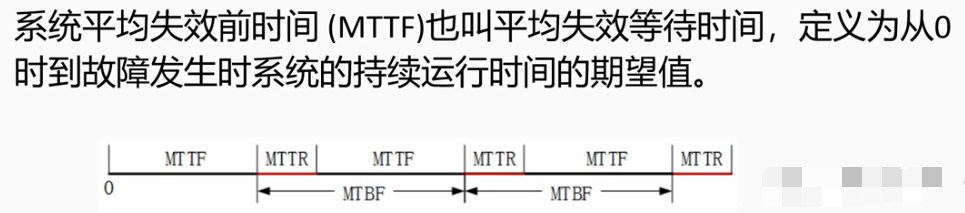

        (6) 平均恢复前时间MTTR

        也叫平均故障修复时间 MTTR，是从出现故障到修复成功中间的这段时间，它包括确认失效发生所必需的时间，记录所有任务的时间，还有将设备重新投入使用的时间。MTTR越小表示易恢复性越好。

        (7) 平均故障间隔时间MTBF
        是指相邻两次故障之间的平均时间，也称为平均故障间隔。
        MTBF=MTTF+MTTR,实际MTTR很小，所以MTBF≈MTTF

> 例题
> 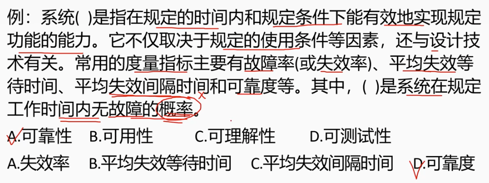

## 3 可靠性目标

        使用失效强度来表示软件缺陷对软件运行的影响程度。然而在实际情况中，对软件运行的影响程度不仅取决于软件失效发生的概率，还和软件失效的严重程度有很大关系。这里引出另外一个概念-失效严重程度。
        失效严重程度就是对用户具有相同程度影响的失效集合。

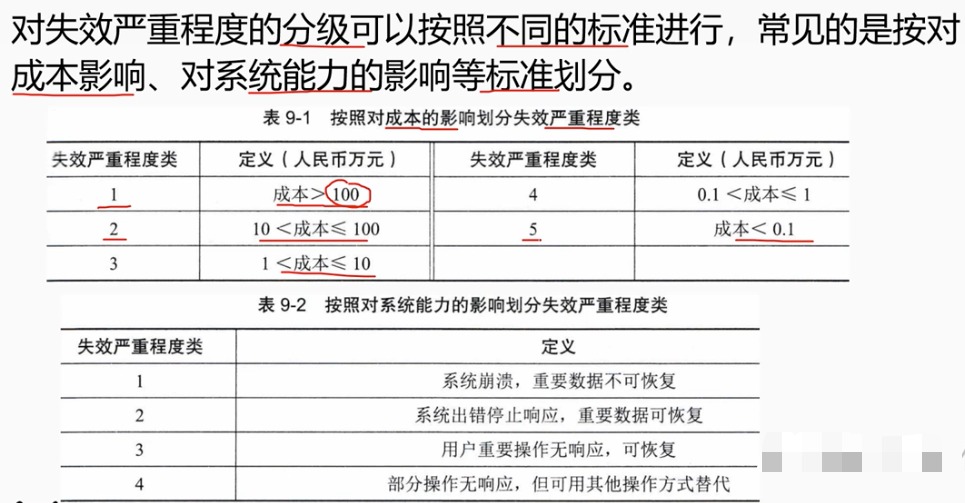

## 4 可靠性测试

        广义的软件可靠性测试是为了最终评价软件系统的可靠性而运用建模、统计、实验、分析和评价等一系列手段对软件系统实施的一种测试。一个完整的软件可靠性测试包括：

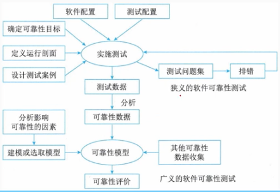

        狭义的软件可靠性测试是为了获取可靠性数据，按照预定的测试用例，在软件的预期使用环境中，对软件实施的一种测试。
        狭义的软件可靠性测试也叫：软件可靠性实验。是面向缺陷的测试。
        可靠性测试的目的可归纳为以下3个方面：
        （1）发现软件系统在需求、设计、编码、测试和实施等方面的缺陷。
        （2）为软件的使用和维护提供可靠性数据。
        （3）确认软件是否达到可靠性的定量要求。

# 9.2 软件可靠性基础-可靠性建模

## 1. 软件可靠性模型

        软件可靠性模型是指为预计或估算软件的可靠性所建立的可靠性框图和数学模型，为了将复杂系统的可靠性逐级分解为简单系统的可靠性，以便于定量预计、分配、估算和评价复杂系统的可靠性。

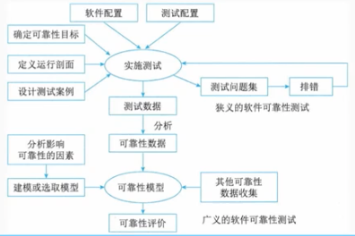

        从技术的角度来看，影响软件可靠性的因素如下：
        （1）运行剖面（环境）
        （2）软件规模
        （3）软件内部结构
        （4）软件的开发方法和开发环境
        （5）软件的可靠性投入

## 2. 软件可靠性模型分类

# 9.3  软件可靠性基础-可靠性管理

        可靠性管理是软件工程管理的一部分，它以全面提供和保证软件可靠性为目标，以软件可靠性活动为主要对象，是办现代管理理论用于软件生命周期中的可靠性保障活动的一种管理形式。
        软件可靠性活动是贯穿于软件开发全过程的。

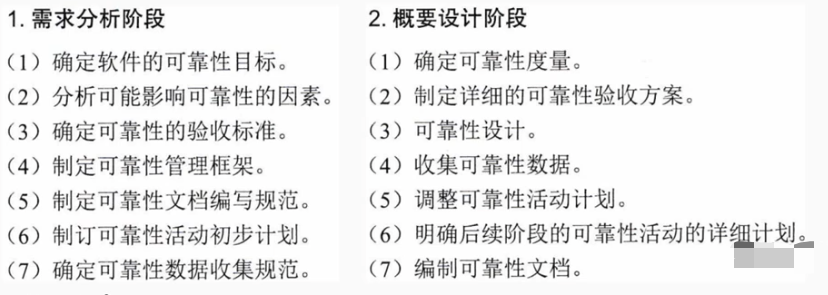
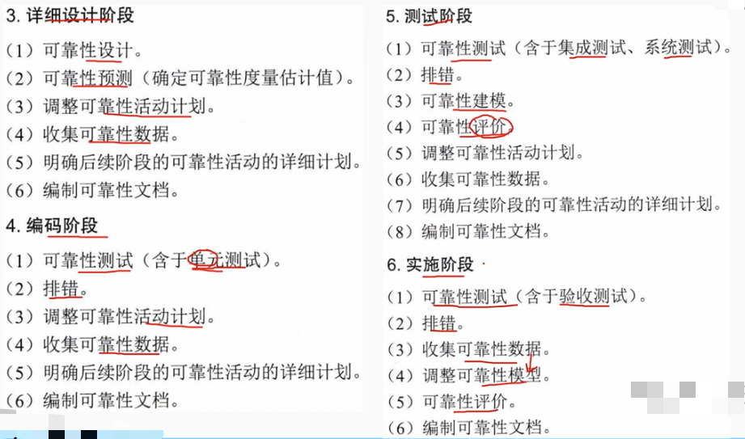

# 9.4  软件可靠性基础-可靠性设计

## 1. 设计原则

        （1）软件可靠性设计师软件设计的一部分，必须在软件的总体设计框架中使用，并且不能与其他设计原则相冲突。
        （2）软件可靠性设计是满足提高软件质量要求的前提下，以提高和保障软件可靠性为最终目标。
        （3）软件可靠性设计应确定软件的可靠性目标，不能无限扩大化，并且排在功能度、用户需求和开发费用之后考虑。

        被认可的且具有应用前景的软件可靠性设计技术主要有：
        - 容错设计技术
        - 检错设计技术
        - 降低复杂度设计技术、
        
### 1.1 容错设计技术

        常用的软件容错技术主要有：
        （1）恢复块设计

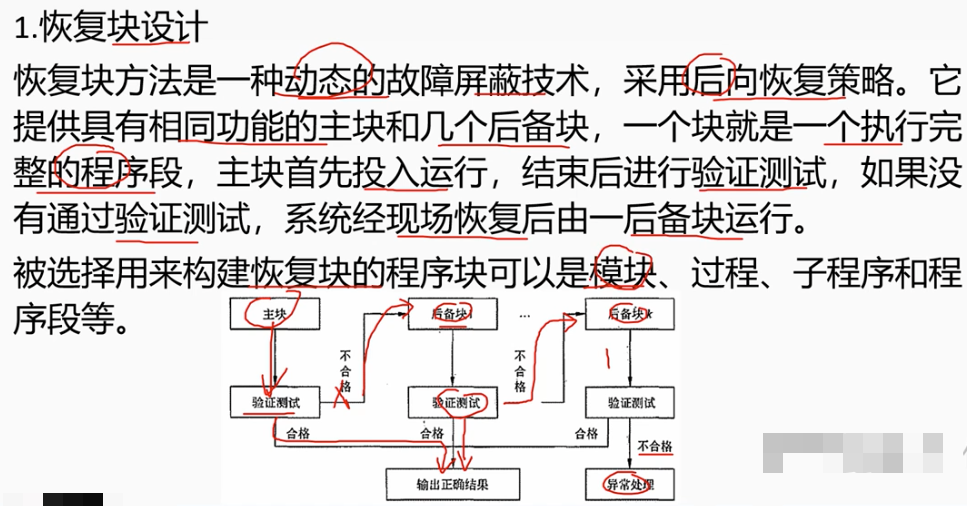

        （2）N版本程序设计

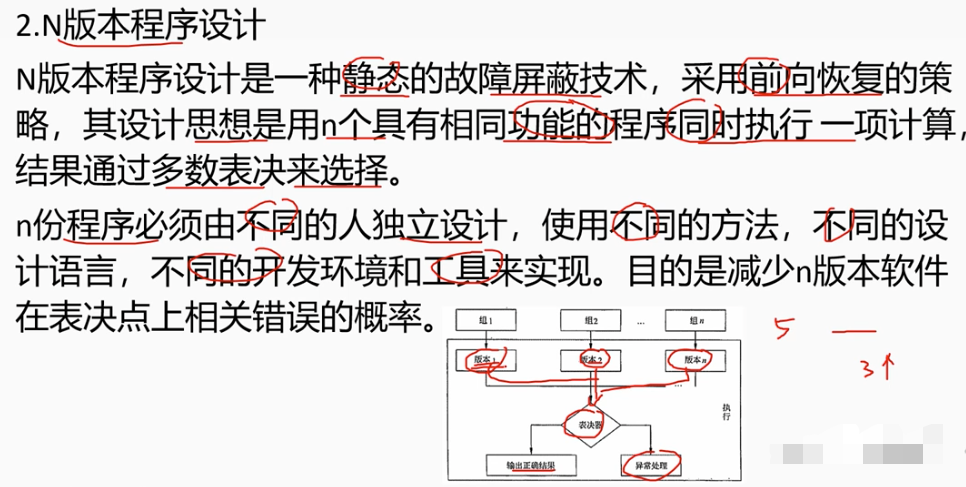

        （3）冗余设计

        软件的冗余设计技术实现的原理是在一套完整的软件系统之外，设计一种不同路径、不同算法或不同实现方法的模块或系统作为备份，在出现故障时可以使用冗余的部分进行替换，从而维持软件系统的正常运行。

## 2. 检错技术

        软件出现故障后及时发现并报警，提醒维护人员进行处理。

        检错技术实现的待见一般低于容错技术和冗余技术，但它有一个明显的缺点，就是不能自动解决故障，出现故障后如果不进行人工干预，将最终导致软件系统不能正常运行。
        采用检错技术要着重考虑几个要素：检测对象、检测延时、实现方式和处理方式。

## 3 降低复杂度

        降低复杂度设计的思想就是在保证实现软件功能的基础上，简化软件结构，缩短程序代码度，优化软件数据流向，降低软件复杂度，从而提高软件的可靠性。
        软件复杂性分为模块复杂性和结构复杂性。
        - 模块复杂性助于奥包含模块内部数据流行和程序长度两个方面
        - 结构复杂性用不同募款之间的关联程度来表示

## 4 系统配置技术

        （1）双机热备技术
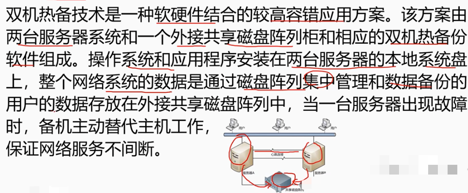
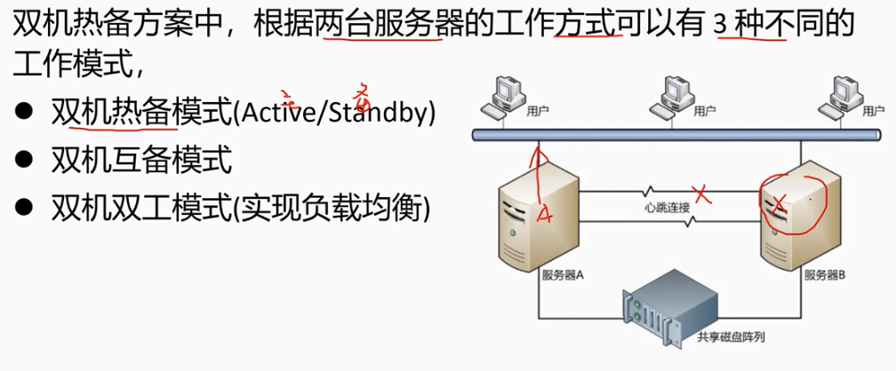

        （2）服务器集群技术
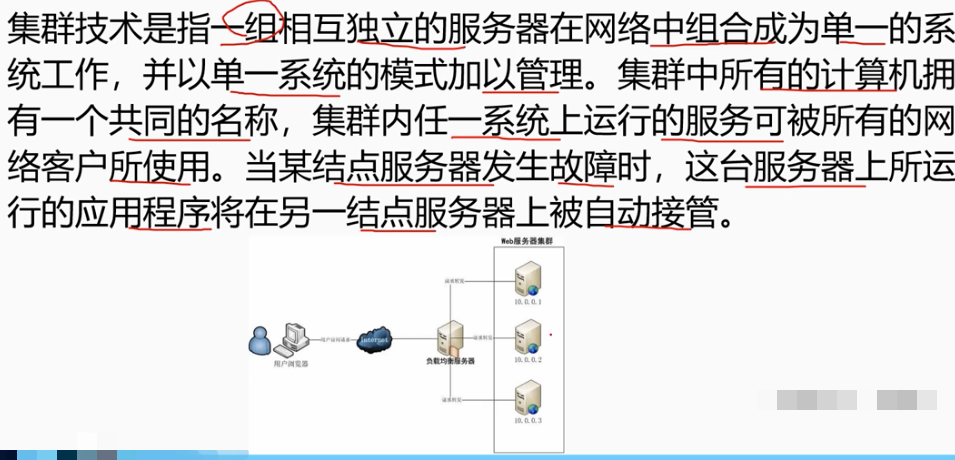